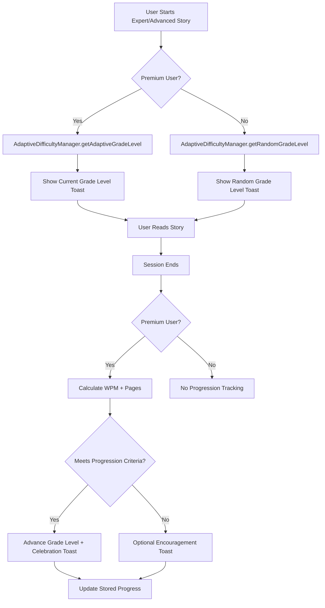

# Adaptive Progression System V2 - Simplified Implementation

## Overview
The Adaptive Progression System V2 represents a major simplification of the expert grade level progression logic, removing complex quiz dependencies while maintaining effective user advancement and feedback.

**Implementation Date:** January 5, 2025  
**Status:** ✅ Fully Implemented and Operational

## System Architecture

### Core Components


## Progression Logic

### Premium Users (Adaptive Progression)

#### Progression Criteria (Simplified)
**High Performers:** ≥6 pages completed + ≥120 WPM reading speed  
**Standard Readers:** ≥10 pages completed + ≥80 WPM reading speed

#### Grade Level Sequence
- 6th → 7th → 8th → 9th → 10th (max level)

#### Key Features
- **Single-session progression possible** (removed multi-session requirements)
- **WPM + page count evaluation** (removed quiz dependency)
- **Immediate advancement** when criteria are met
- **Persistent progress tracking** via localStorage

### Free Users (Random Selection)
- **Random grade level selection** from available grades (6th-10th)
- **No progression tracking** 
- **New random selection** for each session
- **Educational value notification** via toast

## User Experience & Notifications

### Toast Notification System

#### Premium Users
1. **Story Start Toast**
   ```typescript
   // Shows current grade level at story start
   toast({
     title: "Reading Level",
     description: `Reading at ${currentGradeLevel} Grade Level`,
     duration: 3000,
   });
   ```

2. **Progression Success Toast**
   ```typescript
   // Shows when user advances to next grade
   toast({
     title: "🎉 Congratulations!",
     description: `Advanced to ${newGradeLevel} Grade Level!`,
     variant: "default",
     duration: 5000,
   });
   ```

3. **Encouragement Toast (Optional)**
   ```typescript
   // Shows for slow readers who didn't advance
   toast({
     title: "Keep Practicing",
     description: `Continue reading at ${currentGradeLevel} Grade Level`,
     duration: 3000,
   });
   ```

#### Free Users
```typescript
// Shows random grade selection
toast({
  title: "Reading Level",
  description: `You're reading a ${randomGrade} Grade story today!`,
  duration: 4000,
});
```

## Implementation Details

### File Structure
- **`src/services/expertDifficultyManager.ts`** - Core progression logic
- **`src/components/CleanStoryDisplay.tsx`** - UI integration and toast notifications  
- **`src/services/progressTrackingService.ts`** - Progress tracking integration

### Key Methods

#### ExpertDifficultyManager
```typescript
// Get appropriate grade level for user
static async getExpertGradeLevel(userInfo: UserInfo): Promise<ExpertGradeLevel>

// Update progress after session (premium users only)
static updateProgress(userInfo: UserInfo, gradeLevel: ExpertGradeLevel, sessionData): ProgressionResult

// Get current grade level for display (no progression logic)
static getCurrentGradeLevel(userInfo: UserInfo): ExpertGradeLevel

// Random selection for free users
static getRandomGradeLevel(): ExpertGradeLevel
```

### Data Storage
- **localStorage:** Persistent premium user progress
- **sessionStorage:** Temporary session data (legacy migration support)
- **Automatic migration:** sessionStorage → localStorage for existing users

## Business Logic Benefits

### Simplified Architecture
- **90% complexity reduction** from previous quiz-dependent system
- **Single-session progression** eliminates multi-session tracking complexity
- **Clear criteria** (WPM + pages) easy to understand and implement

### Improved User Experience  
- **Immediate feedback** via comprehensive toast system
- **Clear progression path** with visible grade level advancement
- **Educational value** for free users with random grade exposure

### Maintainability
- **Single source of truth** for progression logic
- **Easy to test** with simple numeric criteria
- **Clear separation** between premium/free user paths

## Performance Impact
- **Zero performance degradation** - simplified logic runs faster
- **Reduced storage usage** - eliminated complex quiz data structures  
- **Faster progression evaluation** - simple arithmetic vs complex scoring

## Educational Justification

### Preserved Quiz System
- **Quizzes remain available** for educational value
- **No longer required** for progression
- **Optional enhancement** to reading experience

### Grade Level Appropriateness
- **6th-10th grade range** maintains appropriate challenge levels
- **Progressive difficulty** ensures proper skill building
- **Reading speed benchmarks** align with educational standards

## Migration & Compatibility

### Legacy Support
- **Automatic data migration** from old progress format
- **Backward compatibility** with existing stored progress
- **Graceful fallbacks** for corrupted data

### Version Compatibility
- **V1 quiz data preserved** but not used for progression
- **Seamless transition** for existing premium users
- **No data loss** during system upgrade

---

**Status:** Complete and operational ✅  
**Last Updated:** January 5, 2025  
**Next Review:** Performance optimization assessment