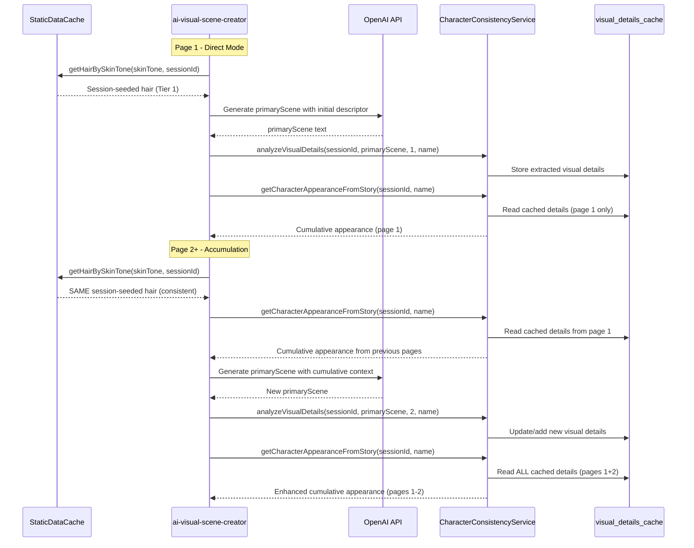
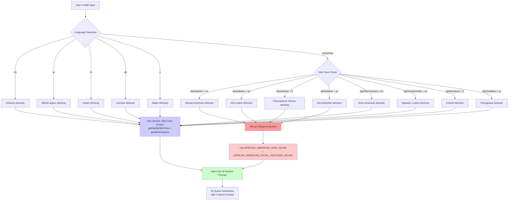

# CURRENT CULTURAL INTELLIGENCE SYSTEM

## System Status: ACTIVE ✅
**Primary Implementation**: `UnifiedPlaceholderResolver.js`  
**Integration Point**: `runware-template-ab/index.js`  
**Cultural Arrays**: `StaticDataCache.js` (moved from tier25Vocabulary.js)

## Core Architecture

### Cultural Detection Logic
```javascript
detectCulturalContext(userInfo) {
  const skinTone = userInfo?.skinTone || userInfo?.avatarIdentity?.skinTone;
  
  if (skinTone === 'dark' || skinTone === 'darker') {
    return 'african'; // ALL dark skin users get African cultural features
  }
  
  return 'none'; // Light skin users get no cultural enhancements
}
```

**CRITICAL**: Cultural enhancements are SKIN-TONE BASED, not language-based.

### Enhancement Generation with Character Consistency
Dark-skinned users receive:
- **Cultural Hair**: Afro, cornrows, braids, dreadlocks, protective styles
- **Facial Features**: Full lips, broad nose, high cheekbones, warm brown eyes
- **Character-Seeded Consistency**: Same character gets same enhancements across all pages in a session

### Implementation Flow
1. **Skin Tone Check**: `skinTone === 'dark'` or `'darker'`
2. **Character Seed**: Generated from character consistency service using `characterName + avatarIdentity`
3. **Feature Selection**: Seeded random from `StaticDataCache.getCulturalBundle()` using character seed
4. **Template Integration**: `{bundle.culturalEnhancements}` placeholder
5. **Consistency**: Same features for same character across all pages, different across characters/sessions

### Cultural Bundle Integration
**CORRECTED FLOW**: `CharacterConsistencyService.getCulturalEnhancements(userInfo, sessionId, characterName)`
- Retrieves/creates character data with database persistence
- Calls `StaticDataCache.getCulturalBundle()` with character seed (not session seed)
- Caches cultural selections in character consistency database
- Returns consistent cultural bundle across all story pages
- **FIXED**: Direct import from StaticDataCache.js eliminates import chain dependencies

### Cultural Arrays Structure
```javascript
// NOW IN StaticDataCache.js (not tier25Vocabulary.js)
CULTURAL_ARRAYS = {
  african: {
    hair: ['beautiful afro', 'elegant braids', 'stylish cornrows', ...],
    features: ['warm brown eyes', 'full lips', 'high cheekbones', ...]
  },
  // Other cultural arrays exist but are currently unused
  european: { ... },
  asian: { ... },
  hispanic: { ... }
}
```

### Template Integration
**Placeholder**: `{bundle.culturalEnhancements}`  
**Example Output**: `"with beautiful braids, warm brown eyes"`  
**Usage in Templates**: Added to all premium and basic prompt templates

### Monitoring & Logging
- Cultural enhancement level: `UNIVERSAL_CULTURAL_INTELLIGENCE`
- Enhancement decisions logged with user context
- Seeded random ensures reproducible results

## Business Logic
- **Guest Users**: 6-page stories with cultural enhancements if dark-skinned
- **Premium Users**: Unlimited stories with cultural enhancements if dark-skinned
- **Light-Skinned Users**: No cultural enhancements regardless of premium status
- **Consistency**: Same enhancements within a session, different across sessions

## Direct Mode Initial Descriptor Flow (September 2025)

**Location**: `ai-visual-scene-creator/index.ts` (Direct Mode path)  
**Purpose**: StaticDataCache-first approach for initial character descriptors in Direct Mode

### Direct Mode Architecture

Direct Mode uses a **2-tier fallback** system for initial character descriptors (before primary scene generation):

#### Tier 1: StaticDataCache (Session-Seeded)
- `getCulturalBundle('african', sessionId)` for dark/darker skin tones
- `getHairBySkinTone(skinTone, sessionId)` for other skin tones
- Provides session-seeded consistency with full 73-hair mapping
- Same hair within session, different across sessions

#### Tier 2: Emergency Hardcoded (Fallback Only)
- Only used if StaticDataCache import/call fails
- "photorealistic detailed textured 4C African American hairstyle" for dark skin
- Generic fallbacks for other skin tones

### After Primary Scene Analysis

After OpenAI generates the primary scene, Direct Mode immediately runs:

```javascript
characterConsistencyService.analyzeVisualDetails(
  sessionId, 
  visualSchema.primaryScene, 
  pageNumber, 
  characterName
)
```

This analyzes and caches visual details from the scene text for:
- `getCharacterAppearanceFromStory(sessionId, characterName)` - cumulative appearance across pages
- `getColoredObjects(sessionId)` - colored objects for visual consistency

### Multi-Page Accumulation in Direct Mode

- **Page 1**: 
  1. StaticDataCache → Initial descriptor (session-seeded)
  2. OpenAI → Generate primary scene
  3. CharacterConsistencyService → `analyzeVisualDetails()` (extract & cache)
  4. CharacterConsistencyService → `getCharacterAppearanceFromStory()` (read cached details from page 1)

- **Page 2+**: 
  1. StaticDataCache → Same initial descriptor (session-seeded, consistent)
  2. CharacterConsistencyService → Read cumulative appearance from all previous pages
  3. OpenAI → Generate new primary scene with cumulative context
  4. CharacterConsistencyService → `analyzeVisualDetails()` (extract & cache new details)
  5. CharacterConsistencyService → `getCharacterAppearanceFromStory()` (read ALL pages 1-N)

### Direct Mode Flow Diagram



### Key Differences: Direct Mode vs Tier 1 Orchestrator

| Feature | Direct Mode | Tier 1 (Orchestrator) |
|---------|-------------|----------------------|
| Initial Descriptor Source | StaticDataCache first | CharacterConsistencyService |
| Character Foundation | Built during generation | Built before generation |
| analyzeVisualDetails() | After primary scene | Before AI scene call |
| Accumulation | Page-by-page via analyzeVisualDetails | All at once in Phase 1 |
| Tier System | 2-tier (StaticDataCache → hardcoded) | Full character-first flow |

## Granular Ethnicity Detection System (October 2025)

### System Status: ACTIVE ✅
**Deployment Marker**: `2025-10-06T04:20:00Z`  
**Primary Purpose**: Provide culturally authentic ethnicity labels for AI prompt context enrichment  
**Implementation Locations**:
- `CharacterConsistencyService.js` (lines 2241-2264, 2362)
- `CharacterConsistencyServiceInline.js` (lines 658, 666, 879-902)
- `ai-visual-scene-creator/index.ts` (lines 715-728, 344, 421, 438, 518)

### Critical Design Principle

**ETHNICITY LABELS ≠ CULTURAL ARRAYS**

Ethnicity labels are **AI prompt context only**. They provide cultural authenticity to AI-generated scene descriptions but **DO NOT** trigger new hair/features arrays.

**ONLY African diaspora ethnicities** (dark/darker skin + en/es/fr/pt languages) use specialized arrays:
- `AFRICAN_AMERICAN_HAIR_INLINE` (100+ styles)
- `AFRICAN_AMERICAN_FACIAL_FEATURES_INLINE` (20+ features)

**All other ethnicities** (Indian, Chinese, MENA, Euro-American, etc.) use **generic skin-tone-based arrays** from `getHairBySkinTone()` and `getSkinFeatures()`.

### Ethnicity Mapping Table

| Ethnicity Label | Language | Skin Tone | Hair Array Used | Features Array Used |
|-----------------|----------|-----------|-----------------|---------------------|
| **African American** | en | dark/darker | `AFRICAN_AMERICAN_HAIR_INLINE` | `AFRICAN_AMERICAN_FACIAL_FEATURES_INLINE` |
| **Afro-Latino** | es | dark/darker | `AFRICAN_AMERICAN_HAIR_INLINE` | `AFRICAN_AMERICAN_FACIAL_FEATURES_INLINE` |
| **Francophone African** | fr | dark/darker | `AFRICAN_AMERICAN_HAIR_INLINE` | `AFRICAN_AMERICAN_FACIAL_FEATURES_INLINE` |
| **Afro-Brazilian** | pt | dark/darker | `AFRICAN_AMERICAN_HAIR_INLINE` | `AFRICAN_AMERICAN_FACIAL_FEATURES_INLINE` |
| **Indian** | en | medium/tan | Generic skin-tone array | Generic skin-tone array |
| **Chinese** | zh | light/medium | Generic skin-tone array | Generic skin-tone array |
| **MENA region** | ar | medium/tan | Generic skin-tone array | Generic skin-tone array |
| **French** | fr | light/fair | Generic skin-tone array | Generic skin-tone array |
| **Spanish / Latino** | es | light/medium/tan | Generic skin-tone array | Generic skin-tone array |
| **Portuguese** | pt | light/medium | Generic skin-tone array | Generic skin-tone array |
| **German** | de | light/fair | Generic skin-tone array | Generic skin-tone array |
| **Italian** | it | light/medium | Generic skin-tone array | Generic skin-tone array |
| **Euro-American** | en | light/fair/medium | Generic skin-tone array | Generic skin-tone array |

### Detection Logic Flow

```javascript
// Pseudocode representation
function detectEthnicity(userInfo) {
  const lang = userInfo?.language || 'en';
  const skin = userInfo?.skinTone || userInfo?.avatarIdentity?.skinTone || 'medium';
  
  // Language-first detection
  switch(lang) {
    case 'zh': return 'Chinese';
    case 'ar': return 'MENA region';
    case 'hi': return 'Indian';
    case 'de': return 'German';
    case 'it': return 'Italian';
    
    // African diaspora detection (dark skin + Western languages)
    case 'en':
      if (skin === 'dark' || skin === 'darker') return 'African American';
      return 'Euro-American';
    
    case 'es':
      if (skin === 'dark' || skin === 'darker') return 'Afro-Latino';
      return 'Spanish / Latino';
    
    case 'fr':
      if (skin === 'dark' || skin === 'darker') return 'Francophone African';
      return 'French';
    
    case 'pt':
      if (skin === 'dark' || skin === 'darker') return 'Afro-Brazilian';
      return 'Portuguese';
    
    default:
      return 'Euro-American';
  }
}
```

### AI Prompt Integration

Ethnicity labels are injected into AI system prompts for richer cultural context:

```javascript
// From ai-visual-scene-creator/index.ts (line 344, 421, 438, 518)
const characterDataString = `${characterName}, age ${age}, ${hairColor}, ${skinFeatures}, ${ethnicity} ethnicity`;

// Example output in AI prompt:
// "Maria, age 8, long curly dark brown hair, warm brown skin with bright brown eyes, Afro-Latino ethnicity"
// "Raj, age 10, short black hair, warm tan skin, Indian ethnicity"
```

### 1000-Foot View: Complete Ethnicity System Flow



### Implementation Details by Location

#### 1. CharacterConsistencyService.js (Shared Service)
**Lines 2241-2264**: `detectEthnicity()` method
**Line 2362**: `ethnicity` field added to `getStructuredAvatarData()` return object

```javascript
// Used by: Tier 1 (Orchestrator), Tier 2, Tier 3
detectEthnicity(userInfo) {
  const language = userInfo?.language || 'en';
  const skinTone = userInfo?.skinTone || userInfo?.avatarIdentity?.skinTone || 'medium';
  // ... language-first detection logic
}
```

#### 2. CharacterConsistencyServiceInline.js (Tier 2.5 Inline Copy)
**Lines 879-902**: Static `detectEthnicity()` method
**Lines 658, 666**: `ethnicity` field detection and inclusion

```javascript
// Used by: Tier 2.5 (runware-generate-image fallback)
static detectEthnicity(userInfo) {
  // ... identical logic to shared service
}
```

#### 3. ai-visual-scene-creator/index.ts (Direct Mode)
**Lines 715-728**: `generateCharacterSeed()` ethnicity detection
**Lines 344, 421, 438, 518**: `ethnicity` injected into AI system prompt

```typescript
// Used by: Direct Mode (Tier 0), Tier 1 primary scene generation
function generateCharacterSeed(userInfo, sessionId) {
  // ... ethnicity detection
  return { ethnicity, hairColor, skinFeatures, ... };
}
```

### Anti-Regression Checklist

**CRITICAL RULES TO PREVENT OVER-ENGINEERING:**

1. ✅ **DO**: Add new ethnicity labels for AI prompt context
2. ✅ **DO**: Use language-first detection for all users
3. ✅ **DO**: Keep African diaspora detection (dark skin + en/es/fr/pt)
4. ❌ **DO NOT**: Create new hair/features arrays for non-African diaspora
5. ❌ **DO NOT**: Modify existing `AFRICAN_AMERICAN_HAIR_INLINE` or `AFRICAN_AMERICAN_FACIAL_FEATURES_INLINE`
6. ❌ **DO NOT**: Change `getHairBySkinTone()` or `getSkinFeatures()` logic
7. ❌ **DO NOT**: Add skin-tone-based detection for non-Western languages

**If adding a new ethnicity label:**
- Add to `detectEthnicity()` language switch statement
- **DO NOT** create new arrays unless African diaspora
- Document in ethnicity mapping table above
- Verify it uses generic skin-tone arrays

### Example Outputs

**Example 1: African American User**
```javascript
userInfo = { language: 'en', skinTone: 'dark' }
// Output:
// ethnicity: 'African American'
// hairColor: from AFRICAN_AMERICAN_HAIR_INLINE (e.g., "4C textured afro")
// skinFeatures: from AFRICAN_AMERICAN_FACIAL_FEATURES_INLINE (e.g., "warm dark brown skin with full lips")
// AI Prompt: "Maya, age 7, 4C textured afro, warm dark brown skin with full lips, African American ethnicity"
```

**Example 2: Indian User**
```javascript
userInfo = { language: 'en', skinTone: 'medium' }
// Output:
// ethnicity: 'Indian'
// hairColor: from getHairBySkinTone('medium') (e.g., "straight black hair")
// skinFeatures: from getSkinFeatures('medium') (e.g., "warm tan skin")
// AI Prompt: "Raj, age 10, straight black hair, warm tan skin, Indian ethnicity"
```

**Example 3: Chinese User**
```javascript
userInfo = { language: 'zh', skinTone: 'light' }
// Output:
// ethnicity: 'Chinese'
// hairColor: from getHairBySkinTone('light') (e.g., "silky black hair")
// skinFeatures: from getSkinFeatures('light') (e.g., "fair skin")
// AI Prompt: "Li Wei, age 9, silky black hair, fair skin, Chinese ethnicity"
```

**Example 4: Euro-American User**
```javascript
userInfo = { language: 'en', skinTone: 'fair' }
// Output:
// ethnicity: 'Euro-American'
// hairColor: from getHairBySkinTone('fair') (e.g., "blonde wavy hair")
// skinFeatures: from getSkinFeatures('fair') (e.g., "fair skin with freckles")
// AI Prompt: "Emma, age 8, blonde wavy hair, fair skin with freckles, Euro-American ethnicity"
```

### Deployment Verification

**Status**: ✅ **DEPLOYED AND VERIFIED**  
**Marker**: `2025-10-06T04:20:00Z`  
**Production Logs**: Ethnicity labels appearing in AI prompts (e.g., "Euro-American ethnicity")  
**Backward Compatibility**: ✅ All existing hair/features logic intact

## Technical Notes
- Uses seeded random for character consistency
- Integrates with `CharacterConsistencyService` for secondary character handling
- Fallback to empty string if resolution fails
- No performance impact on light-skinned users (empty string resolution)
- **Direct Mode Fix (Sept 2025)**: StaticDataCache-first prevents premature CharacterConsistencyService calls
- **Granular Ethnicity Detection (Oct 2025)**: Language-first ethnicity labels for AI prompt context; African diaspora only for special arrays
