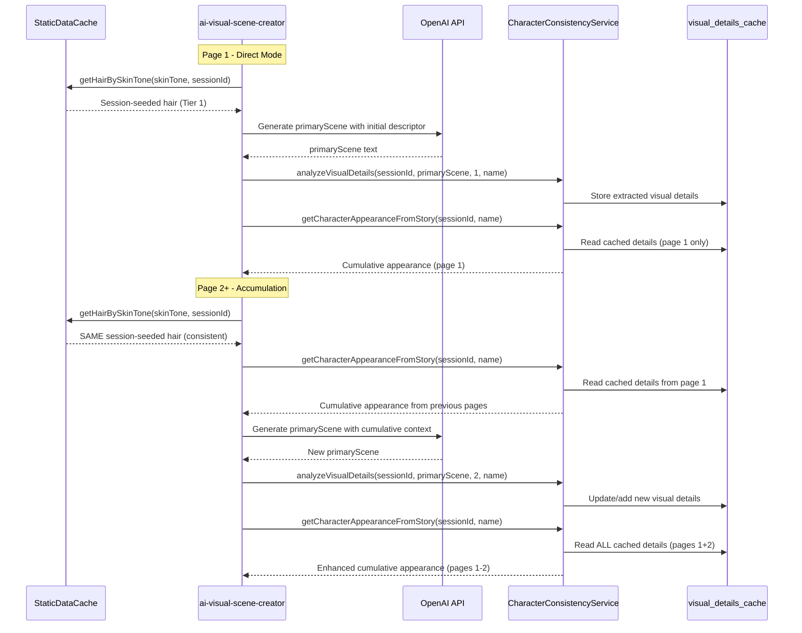

# CURRENT CULTURAL INTELLIGENCE SYSTEM

## System Status: ACTIVE ✅
**Primary Implementation**: `UnifiedPlaceholderResolver.js`  
**Integration Point**: `runware-template-ab/index.js`  
**Cultural Arrays**: `StaticDataCache.js` (moved from tier25Vocabulary.js)

## Core Architecture

### Cultural Detection Logic
```javascript
detectCulturalContext(userInfo) {
  const skinTone = userInfo?.skinTone || userInfo?.avatarIdentity?.skinTone;
  
  if (skinTone === 'dark' || skinTone === 'darker') {
    return 'african'; // ALL dark skin users get African cultural features
  }
  
  return 'none'; // Light skin users get no cultural enhancements
}
```

**CRITICAL**: Cultural enhancements are SKIN-TONE BASED, not language-based.

### Enhancement Generation with Character Consistency
Dark-skinned users receive:
- **Cultural Hair**: Afro, cornrows, braids, dreadlocks, protective styles
- **Facial Features**: Full lips, broad nose, high cheekbones, warm brown eyes
- **Character-Seeded Consistency**: Same character gets same enhancements across all pages in a session

### Implementation Flow
1. **Skin Tone Check**: `skinTone === 'dark'` or `'darker'`
2. **Character Seed**: Generated from character consistency service using `characterName + avatarIdentity`
3. **Feature Selection**: Seeded random from `StaticDataCache.getCulturalBundle()` using character seed
4. **Template Integration**: `{bundle.culturalEnhancements}` placeholder
5. **Consistency**: Same features for same character across all pages, different across characters/sessions

### Cultural Bundle Integration
**CORRECTED FLOW**: `CharacterConsistencyService.getCulturalEnhancements(userInfo, sessionId, characterName)`
- Retrieves/creates character data with database persistence
- Calls `StaticDataCache.getCulturalBundle()` with character seed (not session seed)
- Caches cultural selections in character consistency database
- Returns consistent cultural bundle across all story pages
- **FIXED**: Direct import from StaticDataCache.js eliminates import chain dependencies

### Cultural Arrays Structure
```javascript
// NOW IN StaticDataCache.js (not tier25Vocabulary.js)
CULTURAL_ARRAYS = {
  african: {
    hair: ['beautiful afro', 'elegant braids', 'stylish cornrows', ...],
    features: ['warm brown eyes', 'full lips', 'high cheekbones', ...]
  },
  // Other cultural arrays exist but are currently unused
  european: { ... },
  asian: { ... },
  hispanic: { ... }
}
```

### Template Integration
**Placeholder**: `{bundle.culturalEnhancements}`  
**Example Output**: `"with beautiful braids, warm brown eyes"`  
**Usage in Templates**: Added to all premium and basic prompt templates

### Monitoring & Logging
- Cultural enhancement level: `UNIVERSAL_CULTURAL_INTELLIGENCE`
- Enhancement decisions logged with user context
- Seeded random ensures reproducible results

## Business Logic
- **Guest Users**: 6-page stories with cultural enhancements if dark-skinned
- **Premium Users**: Unlimited stories with cultural enhancements if dark-skinned
- **Light-Skinned Users**: No cultural enhancements regardless of premium status
- **Consistency**: Same enhancements within a session, different across sessions

## Direct Mode Initial Descriptor Flow (September 2025)

**Location**: `ai-visual-scene-creator/index.ts` (Direct Mode path)  
**Purpose**: StaticDataCache-first approach for initial character descriptors in Direct Mode

### Direct Mode Architecture

Direct Mode uses a **2-tier fallback** system for initial character descriptors (before primary scene generation):

#### Tier 1: StaticDataCache (Session-Seeded)
- `getCulturalBundle('african', sessionId)` for dark/darker skin tones
- `getHairBySkinTone(skinTone, sessionId)` for other skin tones
- Provides session-seeded consistency with full 73-hair mapping
- Same hair within session, different across sessions

#### Tier 2: Emergency Hardcoded (Fallback Only)
- Only used if StaticDataCache import/call fails
- "photorealistic detailed textured 4C African American hairstyle" for dark skin
- Generic fallbacks for other skin tones

### After Primary Scene Analysis

After OpenAI generates the primary scene, Direct Mode immediately runs:

```javascript
characterConsistencyService.analyzeVisualDetails(
  sessionId, 
  visualSchema.primaryScene, 
  pageNumber, 
  characterName
)
```

This analyzes and caches visual details from the scene text for:
- `getCharacterAppearanceFromStory(sessionId, characterName)` - cumulative appearance across pages
- `getColoredObjects(sessionId)` - colored objects for visual consistency

### Multi-Page Accumulation in Direct Mode

- **Page 1**: 
  1. StaticDataCache → Initial descriptor (session-seeded)
  2. OpenAI → Generate primary scene
  3. CharacterConsistencyService → `analyzeVisualDetails()` (extract & cache)
  4. CharacterConsistencyService → `getCharacterAppearanceFromStory()` (read cached details from page 1)

- **Page 2+**: 
  1. StaticDataCache → Same initial descriptor (session-seeded, consistent)
  2. CharacterConsistencyService → Read cumulative appearance from all previous pages
  3. OpenAI → Generate new primary scene with cumulative context
  4. CharacterConsistencyService → `analyzeVisualDetails()` (extract & cache new details)
  5. CharacterConsistencyService → `getCharacterAppearanceFromStory()` (read ALL pages 1-N)

### Direct Mode Flow Diagram



### Key Differences: Direct Mode vs Tier 1 Orchestrator

| Feature | Direct Mode | Tier 1 (Orchestrator) |
|---------|-------------|----------------------|
| Initial Descriptor Source | StaticDataCache first | CharacterConsistencyService |
| Character Foundation | Built during generation | Built before generation |
| analyzeVisualDetails() | After primary scene | Before AI scene call |
| Accumulation | Page-by-page via analyzeVisualDetails | All at once in Phase 1 |
| Tier System | 2-tier (StaticDataCache → hardcoded) | Full character-first flow |

## Technical Notes
- Uses seeded random for character consistency
- Integrates with `CharacterConsistencyService` for secondary character handling
- Fallback to empty string if resolution fails
- No performance impact on light-skinned users (empty string resolution)
- **Direct Mode Fix (Sept 2025)**: StaticDataCache-first prevents premature CharacterConsistencyService calls
