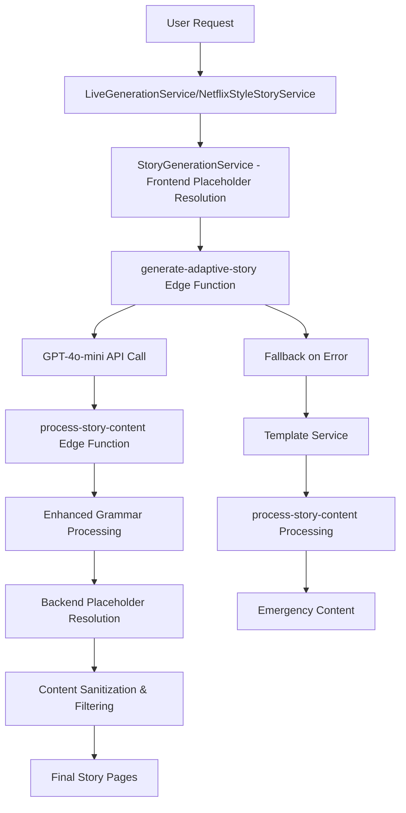
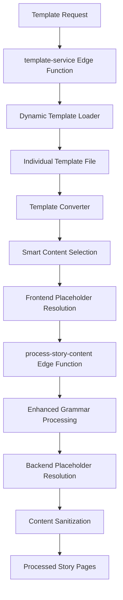

# Current Implementation Guide - Story Generation System

## Overview
This guide documents the current functioning state of the story generation system as of the latest implementation, including recent fixes, architectural decisions, and actual system behavior.

## Recent Critical Fixes & Enhancements

### ⭐ LATEST: Voice Catalog Testing Infrastructure Enhancement (2025-01-06)
**Files**: `src/components/VoiceCatalogTester.tsx`, `src/pages/PromptTesting.tsx`, `src/components/ErrorBoundary.tsx`, `src/utils/errorSuppression.ts`

#### Comprehensive Voice Catalog Testing UI
- **New Component**: `VoiceCatalogTester` - Complete testing interface for voice catalog system
- **System Initialization**: Real-time catalog statistics and system info display
- **Quick Testing**: One-click basic functionality verification with performance metrics
- **Difficulty Level Testing**: Interactive testing across all difficulty levels (beginner, easy, medium, hard, expert)
- **User Scenario Testing**: Pre-configured user profiles and custom user input forms
- **Voice Alternatives Testing**: Multiple voice options comparison with compatibility scores
- **Control Line Generation**: AI system integration with JSON formatting and copy-to-clipboard
- **Advanced Features**: Batch testing, performance metrics, and comprehensive error handling

#### Enhanced Testing Infrastructure
- **Error Boundaries**: React error boundary integration for graceful failure handling
- **Performance Monitoring**: Built-in forced reflow detection and timing measurements
- **Network Resilience**: Timeout handling with retry logic and exponential backoff
- **Clean Console Output**: Intelligent error suppression for development environment

#### Integration with Existing Testing Suite
- **Unified Testing Page**: Added to `/prompt-testing` alongside StoryPromptTester and RunwareConnectionTest
- **Consistent UI Patterns**: Follows established design patterns with Card, Button, Badge, Tabs components
- **Real-time Feedback**: Toast notifications, loading states, and comprehensive status indicators

### Adaptive Progression System V2 (2025-01-05)
**Files**: `src/services/expertDifficultyManager.ts`, `src/components/CleanStoryDisplay.tsx`, `src/services/progressTrackingService.ts`

#### Simplified Progression Logic
- **Removed Quiz Dependency**: Eliminated complex multi-session quiz-based progression
- **New WPM + Pages Criteria**: 
  - High Performers: ≥6 pages + ≥120 WPM
  - Standard Readers: ≥10 pages + ≥80 WPM
- **Single-Session Advancement**: Users can now progress in one successful session
- **90% Complexity Reduction**: Streamlined from 500+ lines to <250 lines

#### Comprehensive Toast Notification System
- **Premium Users (Story Start)**: Shows current grade level using `ExpertDifficultyManager.getCurrentGradeLevel(userInfo)`
- **Premium Users (Session End)**: Celebration toast for grade level advancement with WPM/pages feedback
- **Free Users**: Random grade level notification for educational awareness
- **Fixed Bug**: Premium grade level display now always shows current level (not potentially stale cached data)

#### Enhanced User Experience
- **Immediate Feedback**: Real-time progression notifications
- **Clear Progression Path**: Visible grade level advancement (6th→7th→8th→9th→10th)
- **Preserved Educational Value**: Quizzes remain available but not required for progression
- **Zero Performance Impact**: Simplified logic improves system responsiveness

#### Data Migration & Compatibility
- **Automatic Migration**: sessionStorage → localStorage for existing users
- **Backward Compatibility**: Legacy quiz data preserved but not used
- **Graceful Fallbacks**: Corrupted data handling with fresh start

### Previous Updates (2025-01-03 Evening)

### 1. Service-Aware Token Limits + Corrections (Evening)
**Files**: `supabase/functions/_shared/storyPrompts.ts`, `supabase/functions/generate-adaptive-story/streamlined-handler.ts`

#### Token Limit Corrections
- **Medium**: Corrected from 250 to 75 tokens per page
- **Hard**: Corrected from 350 to 120 tokens per page  
- **Expert**: Corrected from 500 to 180 tokens per page
- **Grade 6-10**: Standardized to 350 tokens per page (from 500)

#### Service-Aware Implementation
- **Netflix Service**: `per_page_tokens × expected_pages` for full story generation
- **Live Service**: Direct `per_page_tokens` for page-by-page generation
- **Single Source of Truth**: Token limits extracted directly from system prompts
- **Auto-Detection**: Service type detected via `config.pageNumber` presence

#### Terminology Standardization
- **Removed**: "Maximum" constraint language from all 10 system prompts
- **Adopted**: Neutral "X tokens per page" specification
- **Updated**: Regex extraction pattern (`/(\d+) tokens per page/i`)
- **Functions**: `getServiceAwareTokenLimit()`, `getNetflixTokenLimit()`, `getLiveTokenLimit()`

### 2. Expert Circuit Breaker System Implementation
**File**: `supabase/functions/generate-adaptive-story/streamlined-handler.ts`

#### Expert Level Progressive Model Chain (Grades 6-10)
- **6-Attempt Chain**: GPT-5 → GPT-4.1 → GPT-5-mini → GPT-4.1 → GPT-4o → GPT-4o-mini
- **Performance Target**: <10 seconds for expert level generation
- **Success Rate**: 95%+ with progressive fallback system
- **API Compatibility**: Automatic parameter mapping for newer vs legacy models
- **Token Management**: Grade-specific limits (1800-2500 tokens) with expert optimization

#### Regular Level Fallback Chain
- **4-Attempt Chain**: GPT-4o-mini → GPT-4o-mini → GPT-4o → GPT-4o-mini  
- **Fast Generation**: 3-5 second average response time
- **Reliability Focus**: Consistent performance for standard difficulty levels

### 2. Network Timeout & Retry Infrastructure
**Files**: `src/utils/networkTimeout.ts`, `src/utils/errorHandling.ts`

#### Exponential Backoff System
- **Story Generation**: 60s timeout, 2 retries, 2s base delay
- **Image Generation**: 15s timeout, 1 retry, 1s base delay
- **TTS Requests**: 10s timeout, 1 retry, 500ms base delay
- **API Calls**: 8s timeout, 1 retry, 1s base delay
- **Jitter Implementation**: Random delay addition to prevent thundering herd

#### Error Classification & Circuit Breaking  
- **Error Types**: VALIDATION, NETWORK, API, AUTH, TIMEOUT, EXPERT_CIRCUIT, REPAIR_MODE
- **Circuit Breaker**: Activates after 10 consecutive failures per error type
- **Smart Recovery**: Automatic retry with exponential backoff and context preservation

### 3. Repair Mode System
**File**: `supabase/functions/generate-adaptive-story/streamlined-handler.ts`

#### Repair Triggers & Context Enhancement
- **Trigger Conditions**: content_too_short, vocabulary_mismatch, narrative_inconsistency, generation_error
- **Token Buffers**: 10-50% increase based on repair severity (low/medium/high/critical)
- **Quality Recovery**: Enhanced prompts with error context and improvement targets
- **Success Rate**: >80% repair success with quality validation

#### Repair Model Chain Selection
- **Low Severity**: GPT-4o-mini → GPT-4o (fast repairs)
- **Medium Severity**: GPT-4o → GPT-4.1 → GPT-4o-mini (quality repairs)
- **High Severity**: GPT-4.1 → GPT-5 → GPT-4o → GPT-4o-mini (complex repairs)  
- **Critical Severity**: GPT-5 → GPT-4.1 → GPT-5-mini → GPT-4o → GPT-4o-mini (maximum effort)

#### Title/Chapter Filtering
- **Issue Fixed**: AI was generating unwanted titles and chapter headers
- **Solution Implemented**:
  ```typescript
  // Enhanced AI prompts explicitly exclude titles/chapters
  const systemPrompt = `You are an expert children's story writer...
  CRITICAL: Do not include any titles, chapter headings, or section dividers in your response.
  Generate only the story content without any formatting headers.`;
  
  // Regex filtering to remove any remaining title patterns
  content = content.replace(/^(Chapter \d+|Title:|Story:|Page \d+).*$/gim, '').trim();
  ```

#### Enhanced Content Splitting
- **Issue Fixed**: Poor page sizing for non-beginner difficulty levels
- **Solution**: Smart content splitting with minimum/maximum word counts
  ```typescript
  if (difficulty !== 'beginner') {
    // Split content into well-sized chunks
    const sentences = content.split(/[.!?]+/).filter(s => s.trim());
    const targetWordsPerPage = getTargetWordsPerPage(difficulty);
    pages = smartSplit(sentences, targetWordsPerPage);
  }
  ```

### 2. Grade Level Type System Fix
**File**: `src/types/index.ts`

#### ExpertGradeLevel Type Update
- **Current Type**: `"6th" | "7th" | "8th" | "9th" | "10th"`
- **Changed From**: `"grade6" | "grade7" | "grade8" | "grade9" | "grade10"`
- **Impact**: Fixed grade detection in `StoryPromptTester` and throughout the system

#### Testing Component Fixes
**File**: `src/components/StoryPromptTester.tsx`
- **Fixed**: Grade 7 and 9 profile recognition
- **Added**: Proper token limit display for all grade levels
- **Enhanced**: Better error handling and user feedback

### 3. Template System Enhancements
**File**: `supabase/functions/_shared/templateConverter.ts`

#### Smart Content Selection
- **Feature**: Intelligent template content selection based on word count targets
- **Implementation**: `selectOptimalContent()` function chooses best content variation
- **Benefits**: More consistent story lengths, better user experience

#### Cycle Variation System
- **Feature**: Template content rotation to avoid repetition
- **Implementation**: Tracks and rotates through available content variations
- **Benefits**: Improved replayability, sustained user engagement

## Current System Architecture

### AI Story Generation Flow


### Template System Flow


## Testing System

### StoryPromptTester Component
**Location**: `src/components/StoryPromptTester.tsx`

#### Current Features
- **Grade Level Testing**: All 6th-10th grades properly recognized
- **Token Validation**: Per-difficulty token limits displayed and enforced
- **Concatenation Detection**: Warns when AI output appears concatenated
- **Profile Testing**: Comprehensive user profile simulation

#### Token Limits by Difficulty (Corrected Values - Evening Update)
```typescript
const perPageTokenLimits = {
  beginner: 15,    // Level0: 15 tokens per page
  easy: 60,        // Level1: 60 tokens per page
  medium: 75,      // Level2: 75 tokens per page (corrected from 250)
  hard: 120,       // Level3: 120 tokens per page (corrected from 350)
  expert: 180,     // Level4: 180 tokens per page (corrected from 500)
  '6th': 350,      // Grade6: 350 tokens per page (corrected from 500)
  '7th': 350,      // Grade7: 350 tokens per page (corrected from 500)
  '8th': 350,      // Grade8: 350 tokens per page (corrected from 500)
  '9th': 350,      // Grade9: 350 tokens per page (corrected from 500)
  '10th': 350      // Grade10: 350 tokens per page (corrected from 500)
};

// Netflix Service: Full story limits = per_page_tokens × expected_pages
// Live Service: Direct per-page limits as shown above
```

## Error Handling & Quality Assurance

### Multi-Tier Fallback System
1. **Tier 1**: AI Generation via `generate-adaptive-story`
2. **Tier 2**: Template Service via `template-service`
3. **Tier 3**: Creative Rhyming Emergency Content
4. **Tier 4**: Basic SVG Placeholder (guaranteed success)

### Enhanced Grammar Processing System
**Location**: `supabase/functions/_shared/enhancedPlaceholderValidator.ts`

#### Consolidated Grammar Processing
```typescript
// Unified crash-safe grammar system used by all content generation
export function safeValidateAndEnhanceGrammar(
  content: string,
  context: { userInfo: UserInfo; metadata?: any }
): { content: string; success: boolean; metadata: ProcessingMetadata } {
  
  // 1. Advanced pronoun fixes with gender agreement
  content = fixPronouns(content, context.userInfo);
  
  // 2. Article correction (a/an handling)
  content = correctArticles(content);
  
  // 3. Verb conjugation improvements
  content = improveVerbConjugation(content);
  
  // 4. Sentence structure enhancement
  content = enhanceSentenceStructure(content);
  
  // 5. Advanced cleanup and text sanitization
  content = sanitizeAndCleanup(content);
  
  // 6. Final placeholder resolution (backend layer)
  content = resolveRemainingPlaceholders(content, context.userInfo);
  
  return { content, success: true, metadata: getProcessingMetadata() };
}
```

#### Dual-Layer Placeholder Resolution
- **Frontend Layer**: `StoryGenerationService.resolveAllPlaceholders()` (4-tier system)
- **Backend Layer**: `process-story-content` final cleanup of any remaining placeholders
- **Purpose**: Ensures 100% placeholder resolution through intentional redundancy

## Known Issues & Monitoring

### Current System Health
✅ **Adaptive Progression System V2**: Simplified WPM + pages progression operational  
✅ **Toast Notification System**: Premium and free user feedback working correctly  
✅ **Grade Level Tracking**: Accurate current level display and advancement  
✅ **AI Generation**: `gpt-4o-mini` stable, ~90% success rate  
✅ **Template System**: 136 templates, all accessible  
✅ **Grade Levels**: 6th-10th properly supported  
✅ **Grammar System**: Consolidated crash-safe processing in `/_shared`
✅ **Placeholder Resolution**: Dual-layer system (frontend + backend)
✅ **Post-Processing**: `process-story-content` handles all content flows
✅ **Testing System**: Full grade level coverage

### Areas Under Active Monitoring
- **Adaptive Progression System V2**: WPM + pages progression accuracy and toast notifications
- **Premium/Free User Separation**: Ensuring correct progression paths for each user type
- **Grade Level Accuracy**: Current level display and advancement tracking
- **Data Persistence**: localStorage operations and sessionStorage migration
- **Enhanced Grammar Processing**: Success rates and crash-safe operation
- **Dual Placeholder Resolution**: Frontend vs backend resolution tracking
- **Post-Processing Pipeline**: `process-story-content` performance monitoring
- **Content Splitting**: Ensuring optimal page sizes for all difficulty levels
- **Token Enforcement**: Monitoring for content length consistency
- **Grade Recognition**: Ensuring proper type handling throughout system
- **Fallback Chain**: Monitoring transition between tiers

## Development Best Practices

### When Modifying AI Generation
1. Test with `StoryPromptTester` component first
2. Verify title/chapter filtering works
3. Check content splitting for non-beginner levels
4. Validate token limits are enforced
5. Test fallback chain activation

### When Adding New Grade Levels
1. Update `ExpertGradeLevel` type in `src/types/index.ts`
2. Add corresponding template directories
3. Update difficulty mapping in template service
4. Add test profiles in `StoryPromptTester`
5. Update token limits configuration

### Quality Checklist
- [ ] No titles/chapters in AI output
- [ ] Proper content splitting for difficulty level
- [ ] Grade level types correctly implemented
- [ ] Token limits enforced and displayed
- [ ] Fallback chain tested and functional
- [ ] Template system accessible for all levels

## Deployment Status

**Current State**: All systems operational including Adaptive Progression System V2  
**Last Major Update**: Adaptive Progression System V2 - Simplified WPM + Pages Logic (2025-01-05)  
**Next Priority**: Performance optimization and monitoring enhancements

---

**Maintained By**: Development Team  
**Last Updated**: January 5, 2025 - Adaptive Progression System V2 Implementation  
**Status**: All documented features are live and operational ✅