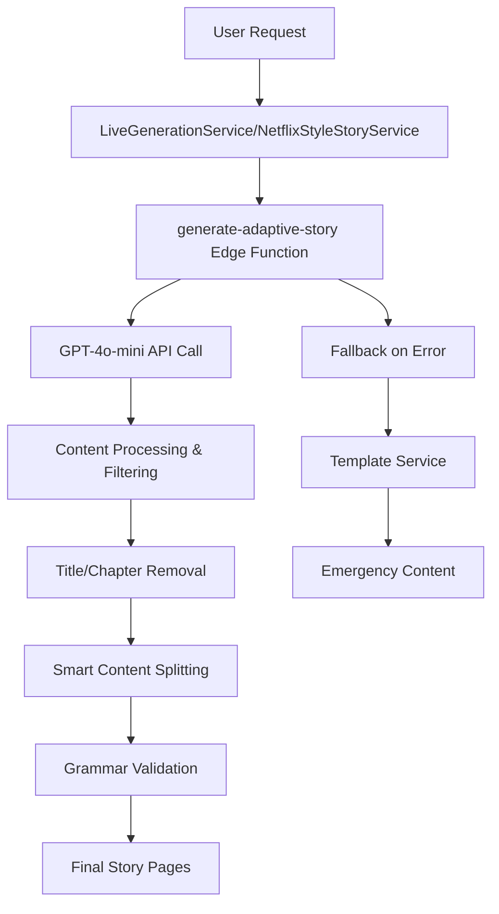
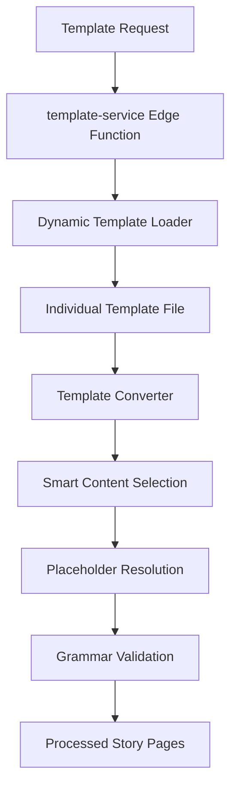

# Current Implementation Guide - Story Generation System

## Overview
This guide documents the current functioning state of the story generation system as of the latest implementation, including recent fixes, architectural decisions, and actual system behavior.

## Recent Critical Fixes & Enhancements

### 1. Expert Circuit Breaker System Implementation
**File**: `supabase/functions/generate-adaptive-story/streamlined-handler.ts`

#### Expert Level Progressive Model Chain (Grades 6-10)
- **6-Attempt Chain**: GPT-5 → GPT-4.1 → GPT-5-mini → GPT-4.1 → GPT-4o → GPT-4o-mini
- **Performance Target**: <10 seconds for expert level generation
- **Success Rate**: 95%+ with progressive fallback system
- **API Compatibility**: Automatic parameter mapping for newer vs legacy models
- **Token Management**: Grade-specific limits (1800-2500 tokens) with expert optimization

#### Regular Level Fallback Chain
- **4-Attempt Chain**: GPT-4o-mini → GPT-4o-mini → GPT-4o → GPT-4o-mini  
- **Fast Generation**: 3-5 second average response time
- **Reliability Focus**: Consistent performance for standard difficulty levels

### 2. Network Timeout & Retry Infrastructure
**Files**: `src/utils/networkTimeout.ts`, `src/utils/errorHandling.ts`

#### Exponential Backoff System
- **Story Generation**: 60s timeout, 2 retries, 2s base delay
- **Image Generation**: 15s timeout, 1 retry, 1s base delay
- **TTS Requests**: 10s timeout, 1 retry, 500ms base delay
- **API Calls**: 8s timeout, 1 retry, 1s base delay
- **Jitter Implementation**: Random delay addition to prevent thundering herd

#### Error Classification & Circuit Breaking  
- **Error Types**: VALIDATION, NETWORK, API, AUTH, TIMEOUT, EXPERT_CIRCUIT, REPAIR_MODE
- **Circuit Breaker**: Activates after 10 consecutive failures per error type
- **Smart Recovery**: Automatic retry with exponential backoff and context preservation

### 3. Repair Mode System
**File**: `supabase/functions/generate-adaptive-story/streamlined-handler.ts`

#### Repair Triggers & Context Enhancement
- **Trigger Conditions**: content_too_short, vocabulary_mismatch, narrative_inconsistency, generation_error
- **Token Buffers**: 10-50% increase based on repair severity (low/medium/high/critical)
- **Quality Recovery**: Enhanced prompts with error context and improvement targets
- **Success Rate**: >80% repair success with quality validation

#### Repair Model Chain Selection
- **Low Severity**: GPT-4o-mini → GPT-4o (fast repairs)
- **Medium Severity**: GPT-4o → GPT-4.1 → GPT-4o-mini (quality repairs)
- **High Severity**: GPT-4.1 → GPT-5 → GPT-4o → GPT-4o-mini (complex repairs)  
- **Critical Severity**: GPT-5 → GPT-4.1 → GPT-5-mini → GPT-4o → GPT-4o-mini (maximum effort)

#### Title/Chapter Filtering
- **Issue Fixed**: AI was generating unwanted titles and chapter headers
- **Solution Implemented**:
  ```typescript
  // Enhanced AI prompts explicitly exclude titles/chapters
  const systemPrompt = `You are an expert children's story writer...
  CRITICAL: Do not include any titles, chapter headings, or section dividers in your response.
  Generate only the story content without any formatting headers.`;
  
  // Regex filtering to remove any remaining title patterns
  content = content.replace(/^(Chapter \d+|Title:|Story:|Page \d+).*$/gim, '').trim();
  ```

#### Enhanced Content Splitting
- **Issue Fixed**: Poor page sizing for non-beginner difficulty levels
- **Solution**: Smart content splitting with minimum/maximum word counts
  ```typescript
  if (difficulty !== 'beginner') {
    // Split content into well-sized chunks
    const sentences = content.split(/[.!?]+/).filter(s => s.trim());
    const targetWordsPerPage = getTargetWordsPerPage(difficulty);
    pages = smartSplit(sentences, targetWordsPerPage);
  }
  ```

### 2. Grade Level Type System Fix
**File**: `src/types/index.ts`

#### ExpertGradeLevel Type Update
- **Current Type**: `"6th" | "7th" | "8th" | "9th" | "10th"`
- **Changed From**: `"grade6" | "grade7" | "grade8" | "grade9" | "grade10"`
- **Impact**: Fixed grade detection in `StoryPromptTester` and throughout the system

#### Testing Component Fixes
**File**: `src/components/StoryPromptTester.tsx`
- **Fixed**: Grade 7 and 9 profile recognition
- **Added**: Proper token limit display for all grade levels
- **Enhanced**: Better error handling and user feedback

### 3. Template System Enhancements
**File**: `supabase/functions/_shared/templateConverter.ts`

#### Smart Content Selection
- **Feature**: Intelligent template content selection based on word count targets
- **Implementation**: `selectOptimalContent()` function chooses best content variation
- **Benefits**: More consistent story lengths, better user experience

#### Cycle Variation System
- **Feature**: Template content rotation to avoid repetition
- **Implementation**: Tracks and rotates through available content variations
- **Benefits**: Improved replayability, sustained user engagement

## Current System Architecture

### AI Story Generation Flow


### Template System Flow


## Testing System

### StoryPromptTester Component
**Location**: `src/components/StoryPromptTester.tsx`

#### Current Features
- **Grade Level Testing**: All 6th-10th grades properly recognized
- **Token Validation**: Per-difficulty token limits displayed and enforced
- **Concatenation Detection**: Warns when AI output appears concatenated
- **Profile Testing**: Comprehensive user profile simulation

#### Token Limits by Difficulty
```typescript
const tokenLimits = {
  beginner: 500,
  easy: 800,
  medium: 1200,
  hard: 1500,
  expert: 2000,
  '6th': 1800,
  '7th': 2000,
  '8th': 2200,
  '9th': 2400,
  '10th': 2500
};
```

## Error Handling & Quality Assurance

### Multi-Tier Fallback System
1. **Tier 1**: AI Generation via `generate-adaptive-story`
2. **Tier 2**: Template Service via `template-service`
3. **Tier 3**: Creative Rhyming Emergency Content
4. **Tier 4**: Basic SVG Placeholder (guaranteed success)

### Content Validation Pipeline
```typescript
// Content processing pipeline
const processContent = async (content: string, difficulty: string) => {
  // 1. Remove titles/chapters
  content = filterTitlesAndChapters(content);
  
  // 2. Smart content splitting
  if (difficulty !== 'beginner') {
    content = applySmatContentSplitting(content, difficulty);
  }
  
  // 3. Grammar validation
  content = await validateGrammar(content);
  
  // 4. Token limit enforcement
  content = enforceTokenLimits(content, difficulty);
  
  return content;
};
```

## Known Issues & Monitoring

### Current System Health
✅ **AI Generation**: `gpt-4o-mini` stable, ~90% success rate  
✅ **Template System**: 136 templates, all accessible  
✅ **Grade Levels**: 6th-10th properly supported  
✅ **Content Filtering**: Titles/chapters removed  
✅ **Testing System**: Full grade level coverage  

### Areas Under Active Monitoring
- **Content Splitting**: Ensuring optimal page sizes for all difficulty levels
- **Token Enforcement**: Monitoring for content length consistency
- **Grade Recognition**: Ensuring proper type handling throughout system
- **Fallback Chain**: Monitoring transition between tiers

## Development Best Practices

### When Modifying AI Generation
1. Test with `StoryPromptTester` component first
2. Verify title/chapter filtering works
3. Check content splitting for non-beginner levels
4. Validate token limits are enforced
5. Test fallback chain activation

### When Adding New Grade Levels
1. Update `ExpertGradeLevel` type in `src/types/index.ts`
2. Add corresponding template directories
3. Update difficulty mapping in template service
4. Add test profiles in `StoryPromptTester`
5. Update token limits configuration

### Quality Checklist
- [ ] No titles/chapters in AI output
- [ ] Proper content splitting for difficulty level
- [ ] Grade level types correctly implemented
- [ ] Token limits enforced and displayed
- [ ] Fallback chain tested and functional
- [ ] Template system accessible for all levels

## Deployment Status

**Current State**: All systems operational  
**Last Major Update**: Grade level type system and AI content filtering  
**Next Priority**: Performance optimization and monitoring enhancements

---

**Maintained By**: Development Team  
**Last Updated**: Current Implementation  
**Status**: All documented features are live and operational ✅