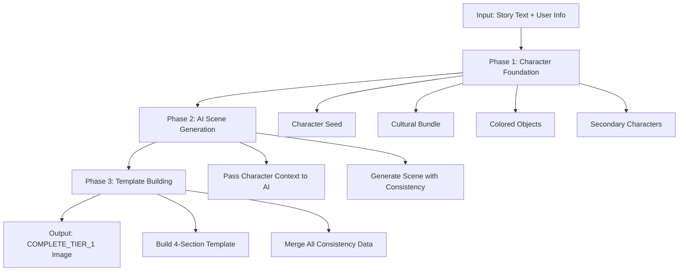

# Enhanced Character-First Flow Documentation

## Overview

The **Enhanced Character-First Flow** is a sophisticated image generation pipeline that establishes character consistency **before** generating AI scenes. This ensures that character appearance, cultural elements, and visual details remain consistent across all story pages.

**Location**: `supabase/functions/runware-generate-image/index.ts` (Lines 137-400)

**Status**: ✅ Fully Operational (Implemented 2025-09-30)

---

## Architecture: Character Consistency → AI Scene → Template

The flow operates in three distinct phases:



---

## Phase 1: Character Foundation (Lines 167-210)

**Purpose**: Establish the character consistency foundation before any AI generation occurs.

### Key Operations:

1. **Character Seed Generation** (`getCharacterSeed`)
   - Generates or retrieves a consistent character appearance description
   - Includes: hair, eyes, skin tone, facial features
   - Stored in `character_consistency_cache` for session-wide reuse

2. **Cultural Enhancement Bundle** (`getCulturalEnhancements`)
   - Applies cultural context based on `userInfo.nativeLanguage`
   - Includes: clothing styles, cultural patterns, traditional elements
   - Ensures culturally appropriate character representation

3. **Colored Objects Detection** (`getColoredObjects`)
   - Analyzes story text for colored objects (e.g., "blue backpack", "red hat")
   - Caches objects for visual consistency across pages
   - Example: "blue backpack" remains blue on every page

4. **Secondary Character Detection** (`detectAllCharacters`)
   - Identifies all characters mentioned in the story
   - Detects: names, relationships, animals, companions
   - Stores character relationships for consistent multi-character scenes

### Code Example:

```typescript
// Line 173-198: Character Foundation Establishment
const structuredAvatarData = await characterConsistencyService.getStructuredAvatarData(sessionId, userInfo);

const characterSeed = await characterConsistencyService.getCharacterSeed(
  sessionId,
  avatarIdentity,
  storyText || pageText || '',
  'continuing'
);

const culturalBundle = await characterConsistencyService.getCulturalEnhancements(userInfo, sessionId, characterName);

await characterConsistencyService.analyzeVisualDetails(sessionId, storyText || pageText, 1);
const coloredObjects = await characterConsistencyService.getColoredObjects(sessionId);

const detectedAllCharacters = await characterConsistencyService.detectAllCharacters(storyText || pageText, {
  sessionId,
  pageNumber: payload.pageNumber || 1,
  userInfo
});
```

**Output**: Complete character consistency context ready for AI generation

---

## Phase 2: AI Scene Generation with Character Context (Lines 225-275)

**Purpose**: Generate the primary scene description using AI, **with** complete character consistency context.

### Key Differences from Direct Mode:

| Aspect | Enhanced Character-First Flow (Tier 1) | Direct Mode |
|--------|----------------------------------------|-------------|
| Character Context | ✅ Full character seed, cultural bundle, colored objects built BEFORE AI | ⚠️ Initial descriptor from StaticDataCache, analysis AFTER primary scene |
| Character Foundation Timing | ✅ Phase 1: Before AI scene generation | ⚠️ Built during/after scene generation |
| Consistency | ✅ Session-wide character consistency (Phase 1) | ✅ Session-seeded hair + page-by-page accumulation via analyzeVisualDetails() |
| Cultural Awareness | ✅ Cultural bundle from CharacterConsistencyService | ✅ Cultural bundle from StaticDataCache (session-seeded) |
| Multi-Character | ✅ Secondary characters detected in Phase 1 | ⚠️ Analyzed after primary scene generation |
| Visual Analysis | ✅ analyzeVisualDetails() before AI call | ✅ analyzeVisualDetails() after primary scene generation |
| Accumulation Strategy | ✅ All character data built first, then AI generates scene | ✅ StaticDataCache initial → AI scene → analyze → accumulate |

### AI Scene Generation Call:

```typescript
// Line 225-275: AI generates scene WITH character consistency context
const aiSceneResult = await supabase.functions.invoke('ai-visual-scene-creator', {
  body: {
    storyText: storyText || pageText,
    userInfo,
    sessionId,
    pageNumber: payload.pageNumber || 1,
    characterSeed,           // ✅ Character consistency data
    culturalBundle,          // ✅ Cultural context
    coloredObjects,          // ✅ Visual consistency data
    allCharacters: detectedAllCharacters, // ✅ Secondary characters
    sessionSetting,          // ✅ Persistent setting
    sceneGenerationOnly: true // Scene-Only mode
  }
});
```

**Key Feature**: The AI receives **complete character consistency context**, ensuring the generated scene works **with** the established character appearance, not against it.

---

## Phase 3: Template Building with COMPLETE_TIER_1 (Lines 340-385)

**Purpose**: Build a structured 4-section prompt template that combines all consistency data.

### COMPLETE_TIER_1_TEMPLATE Structure:

```typescript
const COMPLETE_TIER_1_TEMPLATE = `PRIMARY SCENE: {primaryScene}.

CHARACTER DESCRIPTION: {mainCharacterDetails}.

CONSISTENCY: {secondaryCharacters}{coloredObjects}{settingContext}.

BRAND SUFFIX: {styleFramework}.`;
```

### Four Sections Explained:

1. **PRIMARY SCENE** (`{primaryScene}`)
   - The AI-generated scene description
   - Example: "Emma explores a magical forest filled with glowing mushrooms"

2. **CHARACTER DESCRIPTION** (`{mainCharacterDetails}`)
   - Complete character seed from Phase 1
   - Example: "8-year-old girl with long brown hair, hazel eyes, light skin tone, wearing a blue dress"

3. **CONSISTENCY** (`{secondaryCharacters}{coloredObjects}{settingContext}`)
   - Secondary characters: "with her friend Max the golden retriever"
   - Colored objects: "carrying her blue backpack"
   - Setting context: "in the afternoon sunlight"

4. **BRAND SUFFIX** (`{styleFramework}`)
   - Consistent style across all images
   - Example: "Pixar-style 3D animation, warm lighting, child-friendly"

### Template Building Code:

```typescript
// Line 340-385: Build COMPLETE_TIER_1_TEMPLATE
const enhancedPrompt = COMPLETE_TIER_1_TEMPLATE
  .replace('{primaryScene}', primaryScene)
  .replace('{mainCharacterDetails}', mainCharacterDetails)
  .replace('{secondaryCharacters}', secondaryCharsText)
  .replace('{coloredObjects}', coloredObjects)
  .replace('{settingContext}', settingContext)
  .replace('{styleFramework}', styleFramework);
```

**Result**: A comprehensive, structured prompt that ensures character consistency, cultural appropriateness, and visual coherence.

---

## Key Differentiators vs Direct Mode

### Enhanced Character-First Flow:
✅ **Character Foundation Established First**  
✅ **AI Generates Scenes WITH Character Context**  
✅ **Structured 4-Section Template**  
✅ **Session-Wide Character Consistency**  
✅ **Cultural Bundle Applied**  
✅ **Secondary Characters Tracked**  
✅ **Colored Objects Cached**  

### Direct Mode (September 2025 - StaticDataCache-First):
✅ **StaticDataCache-First Initial Descriptor** (session-seeded 73-hair mapping)  
✅ **AI Generates Primary Scene**  
✅ **analyzeVisualDetails() After Primary Scene** (extracts & caches visual details)  
✅ **Page-by-Page Accumulation** (getCharacterAppearanceFromStory() grows across pages)  
✅ **Session-Seeded Hair Consistency** (same hair within session)  
✅ **Cultural Bundle from StaticDataCache** (session-seeded)  
⚠️ **Character Foundation Built During Generation** (not before)  
⚠️ **2-Tier Fallback** (StaticDataCache → Emergency Hardcoded)

---

## Testing the Enhanced Character-First Flow

### Using the Force Tier 1 Button:

1. Navigate to **Image Tier Tester** in your app
2. Click **"Force Tier 1"** button
3. Observe the cascade:
   - ✅ Calls `runware-generate-image` orchestrator
   - ✅ Establishes character foundation
   - ✅ Generates scene with character context
   - ✅ Builds `COMPLETE_TIER_1_TEMPLATE`
   - ✅ Returns `templateStructure: 'COMPLETE_TIER_1'`

### Expected Success Indicators:

```javascript
{
  success: true,
  imageURL: "https://...",
  tier: "TIER_1",
  metadata: {
    templateStructure: "COMPLETE_TIER_1",
    hasCharacterSeed: true,
    hasCulturalBundle: true,
    orchestratorAttempted: true,
    orchestratorSuccess: true,
    flowType: "Enhanced Character-First Flow"
  }
}
```

---

## Error Handling & Fallback Strategy

### If Character Consistency Service Fails:

```typescript
// Orchestrator catches CharacterConsistencyService errors
// Falls back to Direct Mode automatically
if (error.message.includes('CharacterConsistencyService')) {
  console.log('Character consistency unavailable, falling back to Direct Mode');
  return await directModeGeneration();
}
```

### Fallback Cascade:

1. **Enhanced Character-First Flow** (Primary)
2. **Direct Mode** (Fallback if Phase 1 fails)
3. **Template Service** (Fallback if Direct Mode fails)
4. **SVG Placeholder** (Final fallback)

---

## Performance Characteristics

### Phase 1 (Character Foundation):
- **Execution Time**: ~500-800ms
- **Caching**: Session-wide (subsequent pages: ~50ms)

### Phase 2 (AI Scene Generation):
- **Execution Time**: ~2-4 seconds
- **Dependencies**: OpenAI API availability

### Phase 3 (Template Building):
- **Execution Time**: ~10-50ms (string manipulation)

### Total Flow:
- **First Page**: ~3-5 seconds (full character establishment)
- **Subsequent Pages**: ~2-4 seconds (reuses character foundation)

---

## Integration Points

### Frontend:
- **SimpleImageService.generateStoryImage()**: Main entry point
- **ImageTierTester (Force Tier 1 Button)**: Testing interface
- **E2E Simulation**: Full user flow testing

### Backend:
- **runware-generate-image**: Main orchestrator
- **ai-visual-scene-creator**: Scene generation (Scene-Only mode)
- **CharacterConsistencyService**: Character foundation service
- **character_consistency_cache**: Database storage

---

## Monitoring & Debugging

### Key Logs to Monitor:

```typescript
// Character Foundation Logs
console.log(`🎨 INLINED TIER 1: Processing for ${characterName}`);
console.log(`[TIER_1] CharacterConsistencyService loaded successfully`);

// AI Scene Generation Logs
console.log(`🎭 AI Scene Generation: Scene-Only mode activated`);

// Template Building Logs
console.log(`✅ COMPLETE_TIER_1_TEMPLATE built successfully`);

// Force Flag Logs
console.log(`🎯 FORCE TIER 1 MODE: Bypassing health checks`);
```

### Success Validation:

```javascript
// Check response metadata
if (result.metadata?.templateStructure === 'COMPLETE_TIER_1') {
  console.log('✅ Enhanced Character-First Flow succeeded');
  console.log(`🎭 Character Foundation: ${result.metadata.hasCharacterSeed}`);
  console.log(`🌍 Cultural Bundle: ${result.metadata.hasCulturalBundle}`);
}
```

---

## Future Enhancements

### Planned Improvements:
- [ ] **Multi-Page Character Evolution**: Track character appearance changes across story progression
- [ ] **Enhanced Cultural Profiles**: Expand cultural bundle database
- [ ] **Character Relationship Graph**: Visual representation of character relationships
- [ ] **Performance Optimization**: Parallel processing of character foundation steps

---

## Related Documentation

- **Image Tier Tester**: `src/components/ImageTierTester.tsx`
- **Simple Image Service**: `src/services/SimpleImageService.ts`
- **Character Consistency Service**: `supabase/functions/_shared/CharacterConsistencyService.js`
- **AI Scene Creator**: `supabase/functions/ai-visual-scene-creator/index.ts`
- **Template Service**: `supabase/functions/runware-template-cd/index.ts`

---

**Last Updated**: 2025-09-30  
**Status**: ✅ Production Ready  
**Version**: 1.0.0
