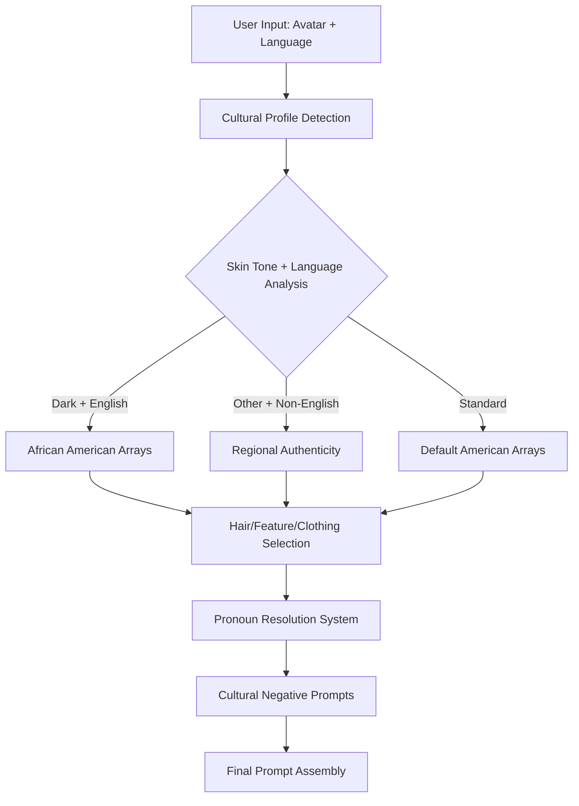

# Cultural Intelligence System Documentation

## Overview

The Cultural Intelligence System ensures authentic and respectful representation across all user demographics through hardcoded cultural arrays, regional authenticity processing, and comprehensive character consistency.

## Core Principles

### Authentic Representation
- **Hardcoded Cultural Arrays**: 500+ combinations for accurate representation
- **Regional Authenticity**: Language-based cultural feature mapping
- **Nuclear Independence**: Zero external dependencies for cultural processing
- **Universal Application**: Consistent across all generation tiers

### Respectful Processing
- **Cultural Sensitivity**: Appropriate negative prompts for content safety
- **Gender Consistency**: Pronoun resolution and character coherence
- **Age Appropriateness**: Content validation for children's stories
- **Safe Content**: Built-in safety filters and cultural awareness

## Cultural Processing Architecture



## Cultural Array System

### African American Representation (Dark + English)

**Comprehensive Cultural Arrays** (150+ combinations):

#### Hair Styles (49 total: 38 boys + 11 girls)
```typescript
// Boys: 38 Hairstyles
const AFRICAN_AMERICAN_BOYS_HAIR = [
  'textured buzz cut', 'detailed fade cut', 'textured taper fade', 
  'detailed high top fade', 'textured low fade', 'detailed crew cut',
  'textured caesar cut', 'detailed curly top fade', 'textured curly high fade',
  'detailed curly low fade', 'textured curly taper fade', 'detailed curly high top',
  'textured curly mohawk', 'detailed curly faux hawk', 'textured curly undercut',
  'detailed fade with curls on top', 'textured crop', 'detailed curly fringe fade',
  'textured twisted top fade', 'detailed undercut design', 'textured hair tattoo',
  'detailed geometric patterns', 'textured mini afro', 'detailed medium afro',
  'textured tapered afro', 'detailed wash and go', 'textured finger coils',
  'detailed two strand twists', 'textured flat twists', 'detailed mini twists',
  'textured locs', 'detailed starter locs', 'textured freeform locs',
  'detailed twisted locs', 'textured side part locs', 'detailed middle part locs',
  'textured ponytail with locs', 'detailed nape area tapered'
];

// Girls: 11 Detailed Hairstyles
const AFRICAN_AMERICAN_GIRLS_HAIR = [
  'wearing a detailed traditional afro hairstyle with natural coily hair texture, spherical volume shape, tight curl pattern definition, authentic Black hair structure, individual strand coils, dimensional texture depth, natural shine and movement',
  
  'wearing detailed, photorealistic separated box braids with rectangular parting, each individual braid clearly distinct, multiple separate braided sections, geometric hair sectioning, individual strand definition per braid, occasionally with colorful strands, professional box braid styling',
  
  'wearing detailed, photorealistic cornrows braided straight back in parallel rows, tight to scalp weaving, visible scalp parts between each row, traditional row braiding style, occasionally with colorful strands',
  
  'wearing detailed, defined twist-out curls with natural curl pattern, bouncy texture, individual curl definition, soft volume, natural hair movement',
  
  'wearing detailed afro puffs hairstyle with two symmetrical hair puffs positioned high on head, natural curly texture, rounded voluminous shape, authentic afro hair structure, defined curl clusters, bouncy texture depth',
  
  // ... 6 additional detailed styles
];
```

#### Facial Features (15 combinations across skin tone spectrum)
```typescript
const AFRICAN_AMERICAN_FACIAL_FEATURES = [
  // Light Tones (5 combinations)
  'light brown skin tone with warm amber eyes, full lips, defined cheekbones, natural nose bridge',
  'caramel skin tone with deep brown eyes, soft full lips, high cheekbones, elegant nose shape',
  'honey complexion with hazel-green eyes, naturally full lips, sculpted cheekbones, refined nose',
  
  // Medium Tones (5 combinations)  
  'medium brown skin tone with golden amber eyes, full lips, strong cheekbones, natural nose bridge',
  'cocoa skin tone with warm honey eyes, naturally full lips, defined cheekbones, elegant nose shape',
  
  // Dark Tones (5 combinations)
  'dark brown skin tone with golden amber eyes, full lips, defined cheekbones, natural nose bridge',
  'ebony skin tone with warm honey eyes, naturally full lips, strong cheekbones, elegant nose shape',
  'deep mahogany complexion with bright amber eyes, full expressive lips, sculpted cheekbones, refined nose',
  
  // ... additional authentic combinations
];
```

#### Clothing Styles (12 contemporary options)
```typescript
const AFRICAN_AMERICAN_CLOTHING = [
  'vibrant colorful casual wear', 'stylish modern youth clothing',
  'trendy cultural fashion', 'bright patterned shirt and comfortable pants',
  'colorful hoodie and jeans', 'modern streetwear style',
  'fashionable casual outfit', 'contemporary youth fashion',
  'stylish comfortable clothing', 'trendy modern casual wear',
  'vibrant youth streetwear', 'fashionable everyday outfit'
];
```

### Regional Authenticity System

**Language-Based Cultural Features** (12+ languages):
```typescript
const REGIONAL_AUTHENTICITY_STRINGS = {
  'zh': 'authentic East Asian features reflecting Chinese heritage',
  'hi': 'authentic South Asian features reflecting Indian heritage',
  'ar': 'authentic Middle Eastern features reflecting Arabic heritage',
  'ja': 'authentic East Asian features reflecting Japanese heritage',
  'ko': 'authentic East Asian features reflecting Korean heritage',
  'fr': 'authentic European features reflecting French heritage',
  'de': 'authentic European features reflecting German heritage',
  'ru': 'authentic Eastern European features reflecting Russian heritage',
  'pt': 'authentic Latin American features reflecting Portuguese heritage',
  'es': 'authentic Latin American features reflecting Spanish heritage',
  'it': 'authentic Mediterranean features reflecting Italian heritage',
  'pl': 'authentic Eastern European features reflecting Polish heritage'
};
```

### Standard American Arrays

**Default Processing** (50+ combinations):
```typescript
const STANDARD_AMERICAN_ARRAYS = {
  skinTones: [
    'fair light complexion', 'warm light skin', 'peachy fair skin',
    'light rosy complexion', 'pale golden skin', 'creamy light skin',
    'fair pink-toned skin', 'light neutral complexion'
  ],
  
  eyeColors: [
    'bright blue eyes', 'warm green eyes', 'hazel eyes', 'light brown eyes',
    'sparkling blue eyes', 'emerald green eyes', 'golden hazel eyes', 'deep blue eyes'
  ],
  
  facialFeatures: [
    'bright sparkling eyes', 'cheerful friendly smile', 'freckled nose and rosy cheeks',
    'expressive animated eyes', 'warm genuine smile', 'lively enthusiastic expression',
    'kind gentle demeanor', 'confident bright smile', 'playful mischievous grin'
  ],
  
  clothing: [
    'casual t-shirt and jeans', 'hoodie and sneakers', 'button-up shirt and khakis',
    'sweater and comfortable pants', 'polo shirt and shorts', 'flannel shirt and jeans',
    // ... 40+ additional modern casual options
  ]
};
```

## Avatar Identity Processing

### Universal Hair Mapping System
**Consistent across all tiers and systems**:

```typescript
class UniversalHairMapper {
  static getHairForAvatar(avatar: UserAvatar, nativeLanguage: string): string {
    // Special handling for African American users
    if (avatar.skinTone === 'dark' && nativeLanguage === 'en') {
      return this.getAfricanAmericanHair(avatar.type);
    }
    
    // Universal mapping for other combinations
    const universalMap = {
      'pale': 'red hair',
      'light': 'blonde hair',
      'medium': 'brown hair', 
      'olive': 'black hair',
      'dark': 'natural textured hair' // For non-English speakers
    };
    
    return universalMap[avatar.skinTone] || 'brown hair';
  }
  
  private static getAfricanAmericanHair(avatarType: string): string {
    if (avatarType === 'boy') {
      return AFRICAN_AMERICAN_BOYS_HAIR[
        Math.floor(Math.random() * AFRICAN_AMERICAN_BOYS_HAIR.length)
      ];
    } else {
      return AFRICAN_AMERICAN_GIRLS_HAIR[
        Math.floor(Math.random() * AFRICAN_AMERICAN_GIRLS_HAIR.length)
      ];
    }
  }
}
```

### Cultural Profile Detection
**Multi-factor analysis**:

```typescript
function detectCulturalProfile(userInfo: UserInfo): CulturalProfile {
  const { avatar, nativeLanguage = 'en' } = userInfo;
  
  // Primary: African American detection
  if (avatar?.skinTone === 'dark' && nativeLanguage === 'en') {
    return {
      type: 'african_american',
      arrays: AFRICAN_AMERICAN_ARRAYS,
      authenticity: 'high_detail_cultural_arrays',
      negativePrompts: AFRICAN_AMERICAN_NEGATIVE_PROMPTS
    };
  }
  
  // Secondary: Regional authenticity
  if (nativeLanguage !== 'en' && REGIONAL_AUTHENTICITY_STRINGS[nativeLanguage]) {
    return {
      type: 'regional_authentic',
      authenticity: REGIONAL_AUTHENTICITY_STRINGS[nativeLanguage],
      arrays: STANDARD_AMERICAN_ARRAYS, // Base arrays with regional overlay
      negativePrompts: STANDARD_NEGATIVE_PROMPTS
    };
  }
  
  // Default: Standard American
  return {
    type: 'standard_american',
    arrays: STANDARD_AMERICAN_ARRAYS,
    authenticity: 'standard_american_features',
    negativePrompts: STANDARD_NEGATIVE_PROMPTS
  };
}
```

## Pronoun Resolution System

### Enhanced Character Consistency
**Tracks pronouns across story context**:

```typescript
class PronounResolutionSystem {
  static resolvePronounsInText(
    text: string, 
    avatarIdentity: AvatarIdentity, 
    sessionId: string
  ): PronouncResolution {
    
    // Step 1: Extract all pronouns from text
    const pronouns = this.extractPronouns(text);
    
    // Step 2: Map to avatar gender
    const genderMap = {
      'boy': ['he', 'him', 'his'],
      'girl': ['she', 'her', 'hers'],
      'neutral': ['they', 'them', 'their']
    };
    
    const expectedPronouns = genderMap[avatarIdentity.type] || genderMap['neutral'];
    
    // Step 3: Build character description
    const characterDescription = this.buildCharacterDescription(
      avatarIdentity, 
      expectedPronouns,
      pronouns
    );
    
    return {
      detectedPronouns: pronouns,
      expectedPronouns: expectedPronouns,
      characterDescription: characterDescription,
      consistency: pronouns.every(p => expectedPronouns.includes(p.toLowerCase())),
      sessionTracking: this.updateSessionPronouns(sessionId, pronouns)
    };
  }
  
  private static extractPronouns(text: string): string[] {
    const pronounRegex = /\b(he|him|his|she|her|hers|they|them|their|theirs)\b/gi;
    return (text.match(pronounRegex) || []).map(p => p.toLowerCase());
  }
  
  private static buildCharacterDescription(
    identity: AvatarIdentity,
    expectedPronouns: string[],
    foundPronouns: string[]
  ): string {
    // Build consistent character description using cultural arrays
    const culturalProfile = this.getCulturalProfile(identity);
    const hair = this.getHairFromArrays(identity, culturalProfile);
    const features = this.getFeaturesFromArrays(identity, culturalProfile);
    
    return `${identity.type} character with ${hair}, ${features}, using ${expectedPronouns.join('/')} pronouns`;
  }
}
```

### Session-Based Consistency
**Tracks character details across pages**:

```typescript
class SessionCharacterTracker {
  private static sessionData = new Map<string, CharacterData>();
  
  static updateCharacterData(
    sessionId: string,
    avatarIdentity: AvatarIdentity,
    resolvedPronouns: string[]
  ): void {
    const existing = this.sessionData.get(sessionId) || {};
    
    this.sessionData.set(sessionId, {
      ...existing,
      avatarIdentity,
      pronouns: resolvedPronouns,
      lastUpdated: Date.now(),
      consistency: this.validateConsistency(existing, avatarIdentity)
    });
  }
  
  static getCharacterConsistency(sessionId: string): CharacterConsistencyData {
    const data = this.sessionData.get(sessionId);
    if (!data) return { isNew: true, needsInitialization: true };
    
    return {
      isNew: false,
      avatar: data.avatarIdentity,
      establishedPronouns: data.pronouns,
      culturalProfile: data.culturalProfile,
      visualDetails: data.visualDetails,
      pageCount: data.pageCount || 0
    };
  }
}
```

## Cultural Negative Prompt System

### Content Safety and Cultural Sensitivity
**Tier-specific negative prompt generation**:

```typescript
class CulturalNegativePrompts {
  static generateNegativePrompt(
    culturalProfile: CulturalProfile,
    avatarIdentity: AvatarIdentity,
    tier: number
  ): string {
    
    // Base safety prompts (all tiers)
    const baseSafety = [
      'inappropriate content', 'unsafe for children', 'violent imagery',
      'scary monsters', 'weapons', 'adult themes', 'suggestive content'
    ];
    
    // Cultural sensitivity prompts
    const culturalSafety = this.getCulturalSafetyPrompts(culturalProfile);
    
    // Quality control prompts (Tier 1 & 2.5 only)
    const qualityControl = tier < 4 ? [
      'blurry image', 'low quality', 'distorted features', 'extra limbs',
      'malformed hands', 'poor anatomy', 'inconsistent lighting'
    ] : [];
    
    // Combine and format
    return [...baseSafety, ...culturalSafety, ...qualityControl].join(', ');
  }
  
  private static getCulturalSafetyPrompts(profile: CulturalProfile): string[] {
    switch (profile.type) {
      case 'african_american':
        return [
          'stereotypical representations', 'caricature features',
          'inappropriate cultural elements', 'offensive styling'
        ];
        
      case 'regional_authentic':
        return [
          'cultural stereotypes', 'inappropriate traditional elements',
          'offensive regional representations'
        ];
        
      default:
        return ['cultural insensitivity', 'inappropriate representations'];
    }
  }
}
```

## Animal Integration System

### Universal Animal Detection
**Context-aware animal handling across all cultures**:

```typescript
class UniversalAnimalSystem {
  // 100+ animals categorized by environment
  static readonly ANIMAL_CATEGORIES = {
    pets: ['dog', 'cat', 'rabbit', 'hamster', 'guinea pig', ...], // 20+ pets
    farm: ['cow', 'pig', 'sheep', 'chicken', 'horse', ...],       // 15+ farm animals  
    wild: ['lion', 'tiger', 'bear', 'elephant', 'wolf', ...],     // 34+ wild animals
    water: ['dolphin', 'whale', 'fish', 'octopus', ...],          // 25+ water animals
    birds: ['eagle', 'owl', 'robin', 'flamingo', ...],            // 15+ birds
    insects: ['butterfly', 'bee', 'ant', 'spider', ...]           // 10+ insects
  };
  
  static detectAnimalsInText(text: string): AnimalDetectionResult {
    const foundAnimals = [];
    const environmentContext = this.detectEnvironmentContext(text);
    
    // Check each category for matches
    Object.entries(this.ANIMAL_CATEGORIES).forEach(([category, animals]) => {
      animals.forEach(animal => {
        if (text.toLowerCase().includes(animal)) {
          foundAnimals.push({
            animal,
            category,
            environmentCompatible: this.isEnvironmentCompatible(animal, environmentContext)
          });
        }
      });
    });
    
    return {
      animals: foundAnimals,
      environmentContext,
      settingRecommendations: this.getSettingRecommendations(foundAnimals, environmentContext)
    };
  }
  
  private static isEnvironmentCompatible(animal: string, environment: string): boolean {
    const compatibilityMap = {
      indoor: ['cat', 'dog', 'rabbit', 'hamster', 'guinea pig', 'fish', 'bird'],
      outdoor: ['cow', 'pig', 'sheep', 'horse', 'lion', 'tiger', 'bear', 'deer'],
      water: ['dolphin', 'whale', 'shark', 'fish', 'octopus', 'seal', 'crab']
    };
    
    return compatibilityMap[environment]?.includes(animal) || false;
  }
  
  static getCulturalAnimalContext(animal: string, culturalProfile: CulturalProfile): string {
    // Animals are universal, but context may vary culturally
    const universalDescriptions = {
      'dog': 'friendly loyal dog companion',
      'cat': 'playful curious cat friend', 
      'lion': 'majestic powerful lion with golden mane',
      'elephant': 'gentle giant elephant with wise eyes'
    };
    
    // Cultural context doesn't change animal appearance significantly
    // Focus on universal positive traits appropriate for children
    return universalDescriptions[animal] || `beautiful ${animal} character`;
  }
}
```

## Quality Assurance & Testing

### Cultural Accuracy Validation
**Automated testing for cultural authenticity**:

```typescript
class CulturalAccuracyValidator {
  static validateCulturalAccuracy(
    generatedPrompt: string,
    expectedCulturalProfile: CulturalProfile,
    avatarIdentity: AvatarIdentity
  ): CulturalAccuracyReport {
    
    const validationResults = {
      hairAccuracy: this.validateHairRepresentation(generatedPrompt, avatarIdentity),
      featureAccuracy: this.validateFeatureRepresentation(generatedPrompt, expectedCulturalProfile),
      clothingAppropriate: this.validateClothingChoices(generatedPrompt, expectedCulturalProfile),
      languageRespectful: this.validateLanguageUse(generatedPrompt),
      overallScore: 0
    };
    
    // Calculate overall accuracy score
    validationResults.overallScore = Object.values(validationResults)
      .filter(v => typeof v === 'number')
      .reduce((sum, score) => sum + score, 0) / 4;
    
    return {
      ...validationResults,
      passed: validationResults.overallScore >= 0.8,
      recommendations: this.getImprovementRecommendations(validationResults)
    };
  }
  
  private static validateHairRepresentation(prompt: string, avatar: AvatarIdentity): number {
    // Check if hair description matches cultural expectations
    if (avatar.skinTone === 'dark' && avatar.culturalProfile === 'african_american') {
      const africanAmericanHairTerms = [
        'textured', 'natural', 'coily', 'braids', 'afro', 'locs', 'twist', 'fade'
      ];
      
      const hasAppropriateTerms = africanAmericanHairTerms.some(term => 
        prompt.toLowerCase().includes(term)
      );
      
      return hasAppropriateTerms ? 1.0 : 0.5;
    }
    
    return 1.0; // Default assume correct for other profiles
  }
}
```

### Regression Testing
**Prevents cultural accuracy regressions**:

```typescript
class CulturalRegressionTests {
  static readonly TEST_CASES = [
    {
      name: 'African American Boy - Dark Skin + English',
      input: {
        avatar: { type: 'boy', skinTone: 'dark' },
        nativeLanguage: 'en',
        pageText: 'A boy playing basketball in the park'
      },
      expected: {
        culturalProfile: 'african_american',
        hairTerms: ['textured', 'fade', 'cut'],
        featureTerms: ['brown', 'complexion', 'eyes'],
        negativePrompts: ['stereotypical', 'inappropriate']
      }
    },
    
    {
      name: 'Chinese Heritage - Mandarin Speaker',
      input: {
        avatar: { type: 'girl', skinTone: 'light' },
        nativeLanguage: 'zh',
        pageText: 'A girl reading a book in the library'
      },
      expected: {
        culturalProfile: 'regional_authentic',
        authenticityString: 'authentic East Asian features reflecting Chinese heritage',
        hairColor: 'blonde', // Universal mapping
        respectfulRepresentation: true
      }
    }
  ];
  
  static async runAllTests(): Promise<TestResults> {
    const results = [];
    
    for (const testCase of this.TEST_CASES) {
      try {
        const result = await this.runSingleTest(testCase);
        results.push({ ...testCase, result, passed: result.success });
      } catch (error) {
        results.push({ ...testCase, result: { error: error.message }, passed: false });
      }
    }
    
    return {
      totalTests: results.length,
      passed: results.filter(r => r.passed).length,
      failed: results.filter(r => !r.passed).length,
      results
    };
  }
}
```

## Performance Optimization

### Cultural Array Caching
**Optimized lookup performance**:

```typescript
class CulturalArrayCache {
  private static cache = new Map<string, CulturalArraySet>();
  
  static getCulturalArrays(
    skinTone: string,
    nativeLanguage: string,
    avatarType: string
  ): CulturalArraySet {
    
    const cacheKey = `${skinTone}-${nativeLanguage}-${avatarType}`;
    
    if (this.cache.has(cacheKey)) {
      return this.cache.get(cacheKey)!;
    }
    
    // Generate arrays for this combination
    const arrays = this.generateCulturalArrays(skinTone, nativeLanguage, avatarType);
    
    // Cache for future use
    this.cache.set(cacheKey, arrays);
    
    return arrays;
  }
  
  static preloadCommonCombinations(): void {
    // Pre-populate cache with most common combinations
    const commonCombinations = [
      ['dark', 'en', 'boy'],
      ['dark', 'en', 'girl'],
      ['light', 'en', 'boy'],
      ['light', 'en', 'girl'],
      ['medium', 'zh', 'boy'],
      ['medium', 'zh', 'girl'],
      ['light', 'es', 'boy'],
      ['light', 'es', 'girl']
    ];
    
    commonCombinations.forEach(([skinTone, language, type]) => {
      this.getCulturalArrays(skinTone, language, type);
    });
  }
}
```

## Integration Points

### Tier 1 & 2.5 Integration
**Shared cultural processing**:

```typescript
// Backend Orchestrator (runware-generate-image)
const avatarIdentity = mapAvatarIdentity(userInfo);
const culturalProfile = detectCulturalProfileForNegatives(avatarIdentity);
const negativePrompt = generateNuclearNegativePrompt(culturalProfile, avatarIdentity);

// AI Enhancement (ai-visual-scene-creator)  
const enhancedData = await processWithCulturalContext(storyText, avatarIdentity);

// Nuclear Fallback (runware-simple-fallback)
const templateData = await processCulturalTemplate(pageText, avatarIdentity);
```

### Frontend Integration
**Seamless cultural awareness**:

```typescript
// SimpleImageService automatically handles cultural processing
const result = await SimpleImageService.generateStoryImage(
  pageText,
  {
    name: 'Aaliyah',
    nativeLanguage: 'en',
    avatar: { type: 'girl', skinTone: 'dark' } // Triggers African American arrays
  },
  difficulty
);

// Cultural processing is transparent to frontend
console.log(`Generated with cultural profile: ${result.metadata?.culturalProfile}`);
```

## Best Practices

### Implementation Guidelines
1. **Always respect cultural data** - never ignore or override cultural processing
2. **Test across cultures** - validate all language/skin tone combinations  
3. **Use hardcoded arrays** - external APIs can fail, cultural data cannot
4. **Validate authenticity** - ensure cultural accuracy through testing
5. **Monitor representation** - track cultural diversity in generations

### Ethical Considerations
1. **Authentic representation** - avoid stereotypes and caricatures
2. **Respectful processing** - cultural features should be dignified
3. **User agency** - allow users to specify their cultural identity
4. **Inclusive design** - support diverse cultural backgrounds
5. **Continuous improvement** - expand cultural arrays based on user feedback

### Performance Guidelines
1. **Cache cultural computations** - expensive to calculate repeatedly
2. **Pre-load common combinations** - improve response times
3. **Optimize array lookups** - use efficient data structures
4. **Minimize API dependencies** - cultural data should be local
5. **Batch cultural processing** - process multiple users efficiently

---

**Last Updated**: December 2024  
**Cultural Intelligence Version**: 2.0  
**Cultural Arrays**: 500+ combinations across 12+ cultural profiles  
**Status**: Production Ready - Comprehensive Cultural Support