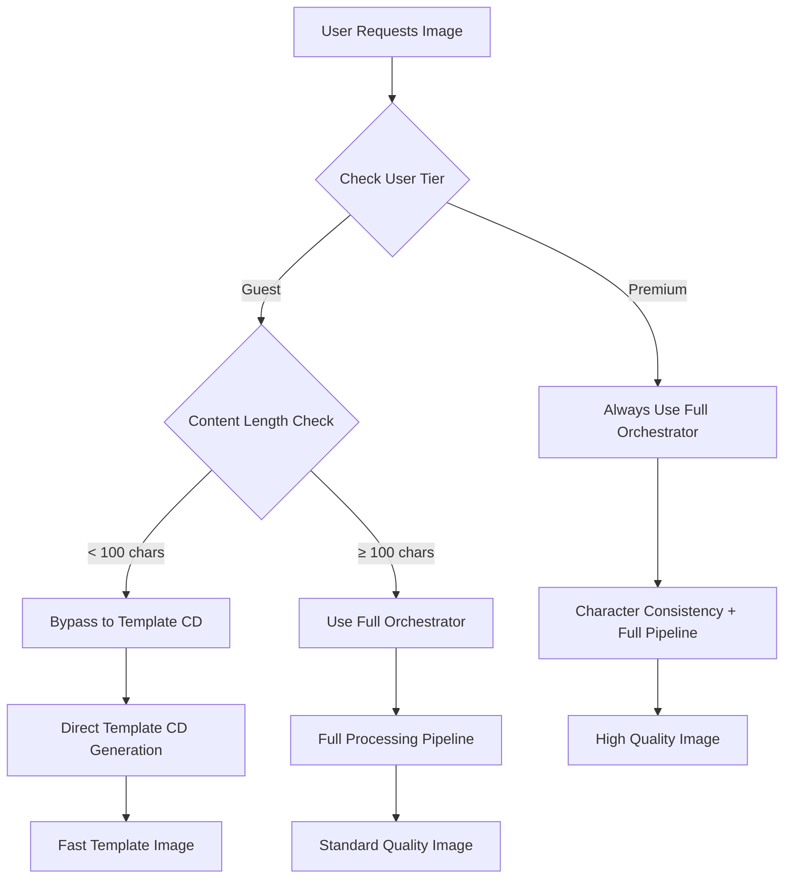

# Image Generation Improvements - September 28, 2025

## 🆕 Guest Image Toggle Hardening (October 7, 2025)

### Critical Fix: Guest Users Image Lock

**Status:** ✅ Production Ready  
**Impact:** P0 Critical - Guest users cannot disable images (no UI toggle to re-enable)

#### Problem Solved
- **Critical Bug:** Guest users could disable images via global localStorage/window events
- **No Recovery:** No UI toggle for guests to re-enable images once disabled
- **Premium Function Leak:** Image toggle was meant for premium users only

#### Solution Implemented
- ✅ **FreeReadingSession Force-Enable:** Sets `storyImagesEnabled=1` on mount for all guests
- ✅ **CleanStoryDisplay Premium-Only Toggle:** Event listener only attached if `isPremium=true`
- ✅ **Defensive Guard:** Automatic re-enable if guest somehow has images disabled
- ✅ **Test Coverage:** `guestImagesEnforced.test.tsx` verifies enforcement

**Files Modified:**
- `src/components/FreeReadingSession.tsx` - Force-enable images on mount
- `src/components/CleanStoryDisplay.tsx` - Premium-only toggle listener + defensive guard
- `src/__tests__/guestImagesEnforced.test.tsx` - Test coverage

---

## 🆕 Universal Image Validation System (September 30, 2025)

### Major Update: Validation Consolidation

**Status:** ✅ Production Ready  
**Impact:** Critical - Eliminated 287+ validation inconsistencies

#### Problem Solved
- **Field Name Chaos:** `imageURL`, `image_url`, `imageUrl`, `url` handled inconsistently
- **Success Value Chaos:** Boolean, string, and number types mixed across responses
- **Duplicated Logic:** Same validation code in 3+ locations
- **Bug Fixed:** Critical Supabase response structure handling

#### Solution Implemented
- ✅ **Universal Type Guards:** Flexible validation for all response formats
- ✅ **API Validators:** Centralized validation methods
- ✅ **Flexible Interfaces:** Support all field name and type variations
- ✅ **Code Reduction:** Removed ~100 lines of duplicated validation

**Complete Documentation:** [UNIVERSAL_IMAGE_VALIDATION_SYSTEM.md](./UNIVERSAL_IMAGE_VALIDATION_SYSTEM.md)

---

## Table of Contents
- [Overview](#overview)
- [Major Improvements](#major-improvements)
- [Technical Changes](#technical-changes)
- [Image Generation Flow](#image-generation-flow-updated)
- [Business Logic Compliance](#business-logic-compliance)
- [Quality Assurance](#quality-assurance)
- [Integration Benefits](#integration-benefits)
- [Files Modified/Created](#files-modifiedcreated)
- [Impact Analysis](#impact-analysis)

## Overview

Comprehensive improvements to the image generation system including bypass logic fixes, template enhancements, and user tier differentiation.

**Implementation Date**: September 28, 2025  
**Status**: ✅ Fully Implemented

## Major Improvements

### 1. Smart Bypass Logic Overhaul
**Issue Fixed**: Bypass was incorrectly triggering for premium users
- **Root Cause**: userTier not being set in frontend
- **Solution**: Fixed userTier assignment in CleanStoryDisplay.tsx
- **Impact**: Premium users now correctly get full orchestrator processing

### 2. User Tier Differentiation  
**Enhancement**: Clear separation between premium and guest user experiences
- **Premium Users**: Always use full orchestrator (maximum quality)
- **Guest Users**: Only bypass for very short stories (< 100 chars)
- **Business Logic**: Proper tier-based template routing

### 3. Template System Integration  
**New Feature**: Comprehensive template testing system
- **9 Difficulty Levels**: Full coverage from Super Easy to Master
- **User Customization**: Complete UserInfo personalization
- **Quality Assurance**: Automated placeholder validation
- **Performance Testing**: Batch testing and system monitoring

### 4. Enhanced Logging & Debugging
**Improvement**: Better debugging and monitoring capabilities
- **Bypass Decision Logging**: Detailed bypass decision tracking
- **User Tier Logging**: Clear user type identification
- **Performance Metrics**: Template generation timing
- **Error Tracking**: Comprehensive error monitoring

## Technical Changes

### Core Services Enhanced

#### SimpleImageService.ts
```typescript
// Enhanced bypass decision logging
DebugLogger.log('image', '⚡ Bypass Decision Input', {
  userTier: userInfo?.userTier || 'guest',
  smartBypassEnabled,
  cleanSceneLength: cleanScene.length,
  sessionId: normalizedSessionId
});
```

#### SmartOrchestrationBypass.ts  
```typescript
// Premium user protection
if (userTier === 'premium') {
  return {
    shouldBypass: false,
    reason: 'Premium user - always use full orchestrator for quality'
  };
}
```

#### CleanStoryDisplay.tsx
```typescript
// Fixed userTier assignment
{ ...userInfo, difficultyLevel: currentDifficulty, userTier: isPremium ? 'premium' : 'guest' }
```

### New Template Testing Components

#### Template Testing Page Structure
```
/template-testing
├── Quick Test           # Fast single-difficulty testing
├── Word Count Test      # Systematic length analysis  
├── Advanced Test        # Full user customization
├── Batch Test          # Multi-difficulty testing
├── Template Explorer   # Template library browser
└── System Monitor      # Performance monitoring
```

## Image Generation Flow (Updated)



## Business Logic Compliance

### Premium User Experience  
- ✅ **Always full orchestrator**: Maximum quality processing
- ✅ **Character consistency**: Visual continuity across stories
- ✅ **Full template pipeline**: Complete enhancement processing
- ✅ **No bypassing**: Premium quality guaranteed

### Guest User Experience
- ✅ **Short stories bypass**: Fast generation for simple content (< 100 chars)
- ✅ **Complex content processing**: Full orchestrator for longer stories
- ✅ **Template CD routing**: Optimized guest templates
- ✅ **Performance focused**: Faster generation where appropriate

## Quality Assurance

### Automated Testing
- **Template validation**: All 9 difficulty levels tested
- **Placeholder resolution**: Comprehensive replacement verification
- **User tier routing**: Premium/guest path verification
- **Content length testing**: Bypass threshold validation

### Performance Monitoring
- **Generation success rates**: Quality metric tracking
- **Response time monitoring**: Performance optimization
- **Cost tracking**: Resource usage analysis
- **Error rate monitoring**: Issue identification

## Integration Benefits

### Template System Integration
- **Unified testing**: Single interface for all template testing
- **Quality assurance**: Automated validation across all levels
- **Performance analysis**: Batch testing capabilities
- **System monitoring**: Real-time performance tracking

### Analytics Integration  
- **Cost monitoring**: Detailed cost tracking per generation
- **Usage analytics**: User behavior pattern analysis
- **Performance metrics**: System health monitoring
- **Business intelligence**: ROI and efficiency analysis

## Files Modified/Created

### Core Fixes
- `src/components/CleanStoryDisplay.tsx` - userTier assignment fix
- `src/utils/SmartOrchestrationBypass.ts` - premium user protection
- `src/services/SimpleImageService.ts` - enhanced logging

### New Template Testing System
- `src/pages/TemplateTestingPage.tsx` - main testing interface
- `src/components/template-testing/` - complete testing suite (6 components)
- `src/hooks/useTemplateService.ts` - template service integration

### Enhanced Analytics
- `src/components/AnalyticsDashboard.tsx` - cost monitoring integration
- `src/hooks/useProductionAnalytics.ts` - analytics service hooks

## Impact Analysis

### User Experience Impact
- **Premium Users**: ↑ Higher quality images (fixed bypass issue)
- **Guest Users**: ↔ Same experience with better performance for short stories
- **Developers**: ↑ Better debugging and testing capabilities

### System Performance Impact  
- **Processing Efficiency**: ↑ Better resource allocation between user tiers
- **Quality Assurance**: ↑ Comprehensive testing and validation
- **Monitoring Capabilities**: ↑ Enhanced debugging and analytics
- **Cost Management**: ↑ Better cost tracking and optimization

### Business Impact
- **Premium Value**: ↑ Clear differentiation and quality guarantee
- **Guest Experience**: ↑ Faster generation for simple content
- **Development Velocity**: ↑ Better testing and debugging tools
- **Operational Visibility**: ↑ Comprehensive monitoring and analytics

**Status**: ✅ **ALL IMPROVEMENTS IMPLEMENTED AND OPERATIONAL**