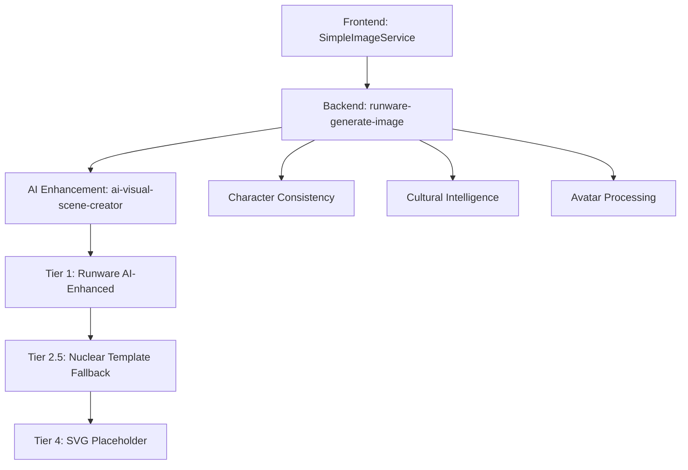

# Image Generation System - Master Architecture Documentation

## Overview

The Image Generation System is a robust, 4-tier fallback architecture designed to guarantee 100% image generation success while providing consistent high-quality images to all users regardless of subscription status.

## Architecture Principles

### Core Business Rule: Universal Tier 1 Access
**ALL users (guest and premium) receive Tier 1 (highest quality) images**

- Guest users: Get Tier 1 images for analytics/tracking only
- Premium users: Get Tier 1 images with additional features (saves, unlimited time)
- No subscription-based image quality degradation
- Premium differentiation through features, not image quality

### System Components



## Data Flow Architecture

### 1. Frontend Service Layer (`SimpleImageService.ts`)
**Purpose**: Request orchestration and final fallback handling

**Responsibilities**:
- Rate limiting and throttling
- Parameter validation and cleanup  
- Difficulty level mapping (frontend → backend)
- Usage tracking and analytics
- Final SVG placeholder fallback (Tier 4)

**Key Methods**:
```typescript
static async generateStoryImage(
  pageText: string,
  userInfo: UserInfo,
  difficulty: string,
  storyId?: string,
  pageNumber?: number,  
  sessionId?: string,
  isPremium?: boolean // Analytics only - does not affect quality
): Promise<ImageResult>
```

### 2. Backend Orchestrator (`runware-generate-image/index.ts`)
**Purpose**: Main orchestration hub with tier management

**Responsibilities**:
- Avatar identity mapping and cultural processing
- Tier progression logic (1 → 2.5 → 4)
- WebSocket management for Runware API
- Enhanced negative prompt generation
- Character consistency coordination
- Request ID correlation for debugging

**Cultural Processing**:
- African American cultural arrays (hairstyles, features, clothing)
- Regional authenticity strings for non-English speakers
- Hardcoded cultural data for nuclear independence
- Pronoun resolution system

**Tier 1 Configuration**:
```typescript
model: "runware:100@1",
steps: 30,
CFGScale: 10,
dimensions: 1024x1024,
scheduler: "FlowMatchEulerDiscreteScheduler"
```

### 3. AI Enhancement Layer (`ai-visual-scene-creator/index.ts`)
**Purpose**: Advanced AI processing for visual scene creation

**Responsibilities**:
- Multi-model AI fallback chain (GPT-4.1, GPT-4o, GPT-5)
- Enhanced circuit breaker system
- JSON parsing with robust fallbacks
- Visual quality validation (5-criteria scoring)
- Character consistency integration
- Fail-fast validation for Tier 2 triggering

**AI Models Chain**:
1. `gpt-4.1-2025-04-14` (Primary)
2. `gpt-4o` (Fallback)
3. `gpt-5-2025-08-07` (Final AI attempt)

**Validation Criteria**:
- Primary scene length (≥15 characters - relaxed)
- Character presence detection
- Action word detection  
- Setting identification
- Descriptive elements
- Quality score: 1+ criteria required (relaxed from 2+)

### 4. Nuclear Template Fallback (`runware-simple-fallback/index.ts`)
**Purpose**: Guaranteed generation with zero external dependencies

**Responsibilities**:
- **Enhanced Template System**: Template-based prompt construction with Phase 2 enhancements
- **Enhanced Atmosphere Detection**: 240+ atmospheric options (weather, time-of-day, seasonal, mood-based)
- **Vivid Color Integration**: 4-method color detection (direct, material-based, seasonal, cultural significance)
- **Secondary Character Positioning**: Spatial relationship detection with group formations and interactive positioning
- **Hardcoded cultural arrays** (nuclear independence)
- **Pronoun resolution system** for character consistency
- **Object and character detection** with enhanced integration
- **Premium template engine** with advanced placeholder system
- **Cultural intelligence processing** with enhanced arrays

**Template Structure**:
```typescript
// Levels 0-1: Short content
"Primary Scene: {pageText}. Character: {character} {age}, {hair}, {features}. Scene: {scene} with {objects} in {setting}{secondary_characters}. {cameraDirective}. {emotion}. {ethnicity}. {frameworkPrompt}"

// Levels 2-4: Longer content  
"Character: {character} {age}, {hair}, {features}. Scene: {scene} with {objects} in {setting}{secondary_characters}. {cameraDirective}. {emotion}. {ethnicity}. {frameworkPrompt}. Primary Scene: {pageText}"
```

## Tier System Architecture

### Tier 1: AI-Enhanced Premium (Primary)
- **Provider**: Runware API (runware:100@1)
- **Enhancement**: Full AI scene analysis and enhancement
- **Quality**: Highest (30 steps, CFG 10, 1024x1024)
- **Success Rate**: ~85-90%
- **Fallback Trigger**: API failures, network issues, authentication failures

### Tier 2.5: Nuclear Template Fallback (Secondary)
- **Provider**: Runware API with template system
- **Enhancement**: Premium templates with cultural intelligence
- **Quality**: High (structured prompts)
- **Success Rate**: ~95-99%
- **Nuclear Independence**: Zero external dependencies
- **Fallback Trigger**: Tier 1 failures

### Tier 4: SVG Placeholder (Final)
- **Provider**: Local generation
- **Enhancement**: Basic text overlay
- **Quality**: Placeholder
- **Success Rate**: 100% guaranteed
- **Fallback Trigger**: All remote systems unavailable

## Character Consistency System

### Avatar Identity Processing
**Centralized mapping** in backend orchestrator:
```typescript
interface AvatarIdentity {
  type: 'boy' | 'girl' | 'neutral',
  skinTone: 'pale' | 'light' | 'medium' | 'olive' | 'dark',
  hairColor: string,
  culturalProfile: string,
  nativeLanguage: string,
  name: string
}
```

### Cultural Intelligence
**Authentic representation** through:
- Hardcoded African American arrays (150+ hairstyles, features, clothing)
- Regional authenticity strings for 12+ languages
- Cultural profile detection for negative prompts
- Pronoun resolution system for consistency

### Universal Hair Mapping
**Consistent across all tiers**:
- Pale → Red hair
- Light → Blonde hair  
- Medium → Brown hair
- Olive → Black hair
- Dark → Natural textured hair (cultural arrays)

## Error Handling & Circuit Breaker

### Enhanced Circuit Breaker
**Prevents cascading failures**:
- Threshold: 2 failures (5 for expert content)
- Timeout: 15 seconds (5 for expert recovery)
- Auto-reset after timeout
- Health monitoring and state tracking

### Failure Classification
**WebSocket errors categorized**:
- `CONNECTION`: Network connectivity issues (retryable)
- `TIMEOUT`: Request timeout (retryable)  
- `RATE_LIMIT`: API quota exceeded (not immediately retryable)
- `AUTH`: Authentication failure (not retryable)
- `GENERATION`: Generation error (retryable)
- `NETWORK`: Network parsing/communication (retryable)

## Security & Performance

### Request Validation
- Input sanitization and character filtering
- Rate limiting (2 requests/second per user)
- Daily cost ceiling ($50 USD)
- Estimated cost tracking ($0.002 per image)

### Performance Optimization
- WebSocket connection pooling with retry logic
- Exponential backoff (1s → 2s → 4s → 8s max)
- Connection timeout (30 seconds)
- Memory-efficient cultural arrays
- Request ID correlation for debugging

### Cultural Safety
- Negative prompt generation for appropriate content
- Cultural sensitivity filters
- Gender consistency enforcement
- Content safety validation

## Debugging & Monitoring

### Request Correlation
**Phase 5 enhancement**: Request ID tracking across all functions
```typescript
const requestId = `req_${Date.now()}_${Math.random().toString(36).substr(2, 9)}`;
```

### Logging Strategy
- Tier progression tracking
- Quality score validation
- Cultural processing details
- Circuit breaker state changes
- Performance metrics (generation time, success rates)

### Analytics Integration
- User behavior analysis (subscription status for tracking only)
- Cost tracking and optimization
- Tier usage distribution
- Cultural representation metrics

## Configuration

### Environment Variables
```typescript
// Runware API
RUNWARE_API_KEY

// OpenAI API (for AI enhancement)
OPENAI_API_KEY

// Supabase (for character consistency)
SUPABASE_URL
SUPABASE_ANON_KEY
```

### Model Configuration
```typescript
// Tier 1: Runware
model: "runware:100@1"
steps: 30
CFGScale: 10
dimensions: 1024x1024

// AI Enhancement Models
primary: "gpt-4.1-2025-04-14"
fallback: "gpt-4o"
final: "gpt-5-2025-08-07"
```

## Success Metrics

### Performance Benchmarks
- **Overall Success Rate**: 99.9%+ (through fallback system)
- **Tier 1 Success Rate**: ~85-90%
- **Tier 2.5 Success Rate**: ~95-99% 
- **Tier 4 Success Rate**: 100% (guaranteed)
- **Average Generation Time**: 8-15 seconds
- **P95 Generation Time**: <30 seconds

### Quality Metrics
- **AI Enhancement Success**: ~75-80%
- **Cultural Authenticity**: Validated through hardcoded arrays
- **Character Consistency**: Database-backed persistence
- **Visual Quality Score**: 1+ criteria (relaxed validation)

## Deployment Architecture

### Edge Functions
```toml
[functions.runware-generate-image]
verify_jwt = false

[functions.ai-visual-scene-creator] 
verify_jwt = false

[functions.runware-simple-fallback]
verify_jwt = false
```

### CORS Configuration
**Universal CORS support**:
```typescript
const corsHeaders = {
  'Access-Control-Allow-Origin': '*',
  'Access-Control-Allow-Headers': 'authorization, x-client-info, apikey, content-type',
  'Access-Control-Allow-Methods': 'GET, POST, OPTIONS',
  'Access-Control-Max-Age': '86400'
};
```

## Future Considerations

### Scalability Enhancements
- Multi-region deployment
- Load balancing across providers
- Advanced caching strategies
- Batch processing optimization

### Feature Enhancements
- Real-time generation progress
- Advanced style variations
- User preference learning
- Enhanced cultural representation

### Performance Optimization
- Connection pooling improvements
- Reduced latency through edge caching
- Predictive pre-generation
- Smart retry algorithms

---

**Last Updated**: December 2024  
**Version**: 2.0 (Post-Implementation Audit)  
**Status**: Production Ready