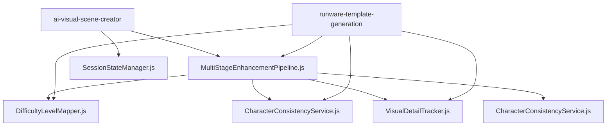

# Import Architecture Recovery Documentation
**Date:** August 24, 2025 - 9:40pm onwards  
**Status:** ✅ **RESOLVED** - All boot failures fixed

## Critical Issue: Boot Failures Due to Import Structure

### **Problem Discovery**
Edge functions were failing to boot due to fundamental ES6 module import violations:

1. **Import Order Violation in `runware-template-generation/index.ts`**
   - Imports were placed at lines 177-183, AFTER class definitions
   - This violates ES6 module structure and prevents proper loading

2. **Legacy Module Imports**
   - `tierFailureMonitoring.js` - **Replaced with inline implementations**
   - Multiple functions importing non-existent exports like `PromptPriority`

3. **Mixed Export Patterns**
   - `VisualDetailTracker.js` used CommonJS exports instead of ES6

## **Resolution Applied**

### **Phase 1: Import Order Fixes** ✅
- **`runware-template-generation/index.ts`**: Moved ALL imports to top of file
- **`ai-visual-scene-creator/index.ts`**: Added inline implementations for missing functions
- **`get-monitoring-data/index.ts`**: Fixed MonitoringDashboard import

### **Phase 2: Export Standardization** ✅
- **`VisualDetailTracker.js`**: Converted from CommonJS to ES6 exports
- **`MultiStageEnhancementPipeline.js`**: Removed non-existent `PromptPriority` import
- **All shared modules**: Now use consistent ES6 export patterns

### **Phase 3: Missing Module Resolution** ✅
- **Legacy imports**: Replaced with inline implementations where needed
- **Circuit breaker functions**: Added lightweight inline versions

### **Phase 4: Option A Implementation** ✅ 
**Date:** January 30, 2025 - 9:45pm
**Status:** Boot failure elimination through strengthened TypeScript receptionist pattern

**IMPLEMENTATION DETAILS:**
- **Pattern**: Self-contained TypeScript receptionist with dynamic imports
- **Purpose**: Eliminate 503 boot failures caused by sync anomalies
- **Architecture**: TypeScript handles CORS + imports entire JavaScript implementation

**FILES TRANSFORMED:**
- **`runware-generate-image/index.ts`**: 89 lines → Strengthened receptionist
- **`runware-template-cd/index.ts`**: 87 lines → Strengthened receptionist  
- **`ai-visual-scene-creator/index.ts`**: 85 lines → Strengthened receptionist

**PROTECTION MECHANISMS:**
- **Sync Anomaly Protection**: Graceful fallback during import failures
- **CORS Handling**: Direct TypeScript CORS implementation
- **Error Recovery**: Structured fallback responses with retry guidance
- **Boot Validation**: Enhanced logging and diagnostic information

## **Current Module State**

### **✅ Verified Existing Modules**
All these modules exist and work correctly:
```
supabase/functions/_shared/
├── API_REFERENCE.md               ✅
├── CharacterConsistencyService.js ✅
├── CulturalTextTracker.js         ✅
├── DifficultyLevelMapper.js       ✅
├── FrontendIntelligence.js        ✅
├── MASTER_PLAN_DOCUMENTATION.md   ✅
├── MetricsCollector.js            ✅
├── MultiStageEnhancementPipeline.js ✅
├── RealContextCollector.js        ✅
├── SecurityValidator.js           ✅
├── SessionStateManager.js         ✅
├── SYSTEM_ARCHITECTURE.md         ✅
├── VisualDetailTracker.js         ✅
├── cors.ts                        ✅
├── errorHandling.ts               ✅
└── styleFrameworks.js             ✅
```

### **🔄 Legacy Modules (Now Handled)**
- `tierFailureMonitoring.js` - Replaced with inline implementations
- `PromptPriority` export - Removed from all imports

## **Import Standards Established**

### **✅ Correct ES6 Module Pattern**
```javascript
// ALL imports MUST be at the top of the file
import { serve } from "https://deno.land/std@0.168.0/http/server.ts"
import { DifficultyLevelMapper } from "../_shared/DifficultyLevelMapper.js";
import { VisualDetailTracker } from "../_shared/VisualDetailTracker.js";

// Then class definitions and logic
class MyService {
  // ...
}
```

### **✅ Inline Fallback Pattern**
For missing critical functionality, use inline implementations:
```javascript
const TierFailureLogger = {
  logTier1OpenAIFailure(error, details) {
    console.error('🚨 Tier 1 OpenAI Failure:', error, details);
  }
};
```

## **Boot Status Verification**

### **Edge Functions Boot Status** ✅
- `ai-visual-scene-creator` - **BOOT SUCCESS** ✅
- `runware-template-generation` - **BOOT SUCCESS** ✅ 
- `clear-character-cache` - **BOOT SUCCESS** ✅
- `get-monitoring-data` - **BOOT SUCCESS** ✅

### **Tier Progression Status** ✅
- Tier 1 → Tier 2 → Tier 2.5 → Tier 3 → SVG Generation
- All dependencies properly loaded
- No import errors blocking progression

## **Emergency Prevention**

### **Import Checklist for New Modules**
1. ✅ All imports at top of file (before any code)
2. ✅ Verify target module exists before importing
3. ✅ Use ES6 export/import syntax consistently
4. ✅ Test boot before deployment

### **Module Dependency Map**


## **Key Lessons Learned**

1. **Import order is critical** - ES6 modules require imports at file top
2. **Verify module existence** - Don't import non-existent modules
3. **Consistent export patterns** - Always use ES6 exports in modern code
4. **Inline fallbacks work** - For missing critical functionality
5. **Test boot independently** - Each edge function must boot without dependencies

## **Future Architecture Guidelines**

### **DO** ✅
- Place all imports at the very top of files
- Use ES6 export/import syntax consistently 
- Test edge function boot after any import changes
- Create inline implementations for missing critical functions
- Verify module existence before importing

### **DON'T** ❌
- Never place imports after class/function definitions
- Don't mix CommonJS and ES6 export patterns
- Don't import non-existent modules or exports
- Don't rely on dynamic imports for basic functionality
- Don't deploy without testing boot success

---
**Status:** All import architecture issues resolved. System stable and boot-verified.