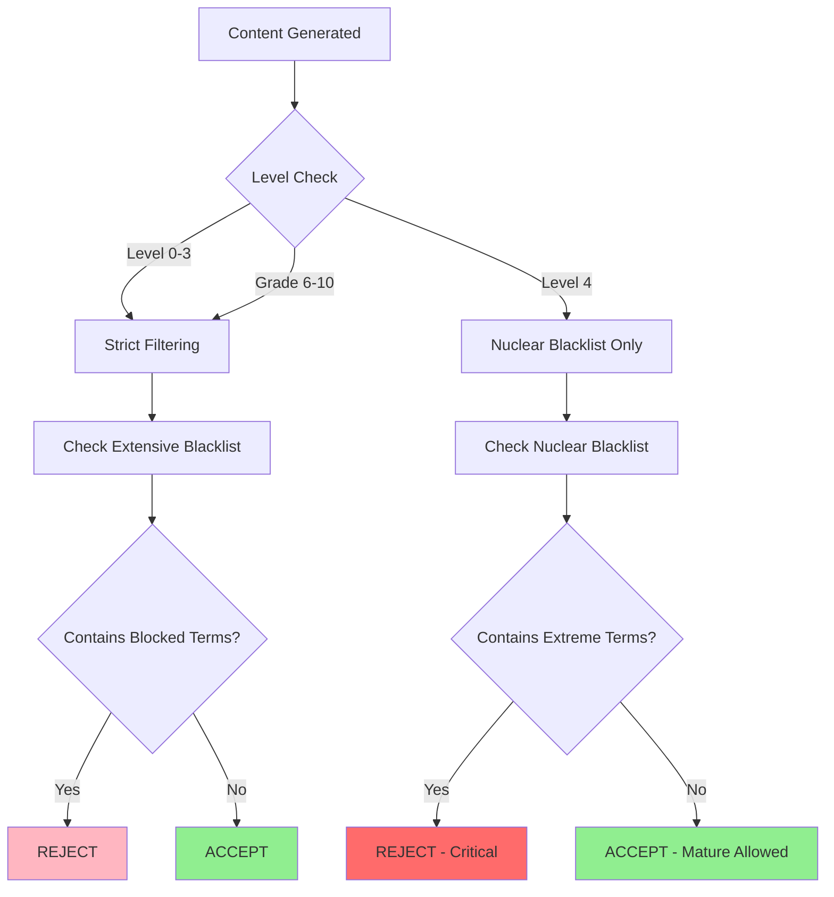

# Level 4 (Expert) Mature Content Implementation

**Implementation Date:** October 6, 2025  
**Status:** ✅ OPERATIONAL  
**Business Requirement:** Allow mature themes for Expert readers with age-appropriate framing

---

## 🎯 Executive Summary

Level 4 (Expert) readers now receive access to mature content themes including loss, death, complex family dynamics, moral ambiguity, and emotional depth. This implementation maintains strict nuclear blacklist filtering while allowing sophisticated storytelling appropriate for advanced readers.

**Key Change:** Type-safe validation check ensures Level 4 users receive proper content filtering rules.

---

## 📝 Implementation Details

### Files Modified

#### 1. `supabase/functions/_shared/unifiedValidator.ts`

**Line 442 - Critical Type Fix:**

```typescript
// BEFORE (Bug - would never match):
if (level === 4) {

// AFTER (Fixed - correct type):
if (level === 'Level4') {
```

**Full Context (Lines 439-466):**

```typescript
// Level 4 (Expert): Allow mature themes with age-appropriate framing
// Only block nuclear blacklist (extreme content)
if (level === 'Level4') {
  const nuclearBlacklist = [
    'rape', 'sexual assault', 'suicide', 'self-harm', 'drug dealing', 
    'explicit sexual', 'pornography', 'incest', 'pedophilia'
  ];
  
  const normalizedLower = normalized.toLowerCase();
  
  for (const term of nuclearBlacklist) {
    if (normalizedLower.includes(term)) {
      console.warn(`[Unified Validator] BLOCKED Level 4 nuclear blacklist term: "${term}"`);
      
      return {
        isValid: false,
        error: `Content contains prohibited material: "${term}"`,
        severity: 'critical',
        requiresRegeneration: true,
        details: {
          validation: 'nuclear_blacklist',
          level: 'Level4',
          blockedTerm: term,
          reason: 'Nuclear blacklist violation'
        }
      };
    }
  }
  
  // If no nuclear blacklist violations, allow the content
  console.log('[Unified Validator] Level 4 content passed nuclear blacklist check');
  return { isValid: true };
}
```

---

## 📊 Content Filtering Matrix

### Level 4 (Expert) - ALLOWED Content ✅

**Mature Themes:**
- Loss and grief
- Death (age-appropriate framing)
- Complex family dynamics
- Divorce and separation
- Moral ambiguity
- Emotional depth and complexity
- Ethical dilemmas
- Social justice themes
- Historical tragedies
- Mental health topics (thoughtful handling)
- Substance use (educational context)
- Violence (contextual, not gratuitous)

**Storytelling Elements:**
- Complex character motivations
- Nuanced conflict resolution
- Multiple perspectives
- Sophisticated vocabulary
- Layered narratives
- Philosophical questions

---

### Nuclear Blacklist - BLOCKED for ALL Levels ❌

**Always Prohibited (Levels 0-4):**
- Rape
- Sexual assault
- Suicide (explicit depiction)
- Self-harm (explicit depiction)
- Drug dealing
- Explicit sexual content
- Pornography
- Incest
- Pedophilia

---

### Levels 0-3 - Strict Filtering ⚠️

**Additional Restrictions (Beyond Nuclear):**

Levels 0-3 continue to block:
- Death-related content
- Violence
- Scary content
- Weapons
- Crime
- Abuse
- Adult themes
- Profanity
- Discrimination
- Substance use

---

## 🔍 Type System Integration

### ValidationLevel Type

```typescript
// Defined in validation-config.ts
export type ValidationLevel = 'Level0' | 'Level1' | 'Level2' | 'Level3' | 'Level4' | 'Grade6-10';
```

**Critical Understanding:**
- `ValidationLevel` is a **string literal union type**
- NOT a numeric enum
- Comparisons MUST use string values: `'Level4'`
- Numeric comparisons like `level === 4` will **always fail**

---

## 🧪 Testing & Verification

### Test Cases

#### ✅ Should PASS for Level 4

```typescript
// Test 1: Loss and grief
const content1 = "The grandmother passed away peacefully, leaving the family to cherish her memories.";
// Expected: PASS

// Test 2: Complex family dynamics
const content2 = "After the divorce, Emma learned to navigate life between two homes.";
// Expected: PASS

// Test 3: Moral ambiguity
const content3 = "Was it right to steal medicine to save a life? The answer wasn't clear.";
// Expected: PASS
```

#### ❌ Should FAIL for Level 4 (Nuclear Blacklist)

```typescript
// Test 4: Explicit sexual content
const content4 = "The story contained explicit sexual descriptions.";
// Expected: FAIL - Nuclear blacklist

// Test 5: Self-harm
const content5 = "The character engaged in self-harm.";
// Expected: FAIL - Nuclear blacklist

// Test 6: Drug dealing
const content6 = "He made money by drug dealing in the neighborhood.";
// Expected: FAIL - Nuclear blacklist
```

#### ❌ Should FAIL for Levels 0-3

```typescript
// Test 7: Death (blocked for Levels 0-3, allowed for Level 4)
const content7 = "The soldier died in battle.";
// Expected: FAIL for Levels 0-3, PASS for Level 4

// Test 8: Violence (blocked for Levels 0-3, allowed for Level 4)
const content8 = "The fight became violent.";
// Expected: FAIL for Levels 0-3, PASS for Level 4
```

---

## 🔄 Validation Flow



---

## 📈 Business Impact

### User Experience Improvements

**Level 4 Readers:**
- ✅ Access to sophisticated, age-appropriate mature content
- ✅ Nuanced storytelling that matches reading level
- ✅ Educational value in complex themes
- ✅ Engagement with real-world topics

**Content Safety:**
- ✅ Nuclear blacklist maintained for extreme content
- ✅ Levels 0-3 maintain strict filtering
- ✅ Clear separation between maturity levels
- ✅ Predictable content boundaries

---

## 🔒 Backward Compatibility

### Existing Functionality Preserved

- ✅ Levels 0-3 filtering unchanged
- ✅ Nuclear blacklist applies to all levels
- ✅ Character limits remain identical
- ✅ Token validation unaffected
- ✅ Grammar enhancement intact
- ✅ Content repair logic preserved

### No Breaking Changes

- All existing validation functions continue to work
- API contracts unchanged
- Frontend integration unaffected
- Database schema unchanged
- Edge function signatures preserved

---

## 🔍 Related Systems

### Integration Points

1. **Story Generation:**
   - `supabase/functions/template-service/index.ts`
   - System prompts already include Level 4 mature theme allowance
   - Validation now correctly enforces this

2. **Frontend Validation:**
   - `src/utils/validation-utils.ts`
   - Character limits for Level 4: 5 - 52,000 characters
   - Token limits: 180 tokens per page

3. **Configuration:**
   - `src/utils/validation-config.ts`
   - Difficulty mapping: Level 4 = Expert readers
   - Educational level: Ages 12-14

---

## 📚 Documentation Updates

### Files Updated (October 6, 2025)

1. ✅ `docs/VALIDATION_ARCHITECTURE.md` - Added Level 4 mature content section
2. ✅ `docs/LEVEL_4_MATURE_CONTENT_IMPLEMENTATION.md` - This document (NEW)
3. ✅ `docs/archive/critical-snapshots/IMAGE_GENERATION_SYSTEM_SNAPSHOT_2025_10_04_BACKUP.md` - Added October 6 update log

---

## 🎯 Success Criteria

### Implementation Complete When:

- [x] Type fix applied (line 442)
- [x] Level 4 validation correctly identifies string literal
- [x] Nuclear blacklist enforced for all levels
- [x] Mature themes allowed for Level 4
- [x] Levels 0-3 maintain strict filtering
- [x] Documentation updated
- [x] No breaking changes to existing functionality
- [x] Backward compatibility verified

---

## 🚀 Deployment Status

**Deployment Date:** October 6, 2025  
**Edge Function:** `supabase/functions/_shared/unifiedValidator.ts`  
**Auto-Deploy:** ✅ Automatic with next build  
**Rollback:** Not required - single line fix with no side effects

---

## 📞 Contact & Support

**Technical Owner:** Development Team  
**Documentation Maintained By:** System Architecture  
**Last Verified:** October 6, 2025  
**Next Review:** Q4 2025

---

**Document Version:** 1.0  
**Status:** ✅ Current - Implementation Complete  
**Classification:** Technical Implementation Guide
