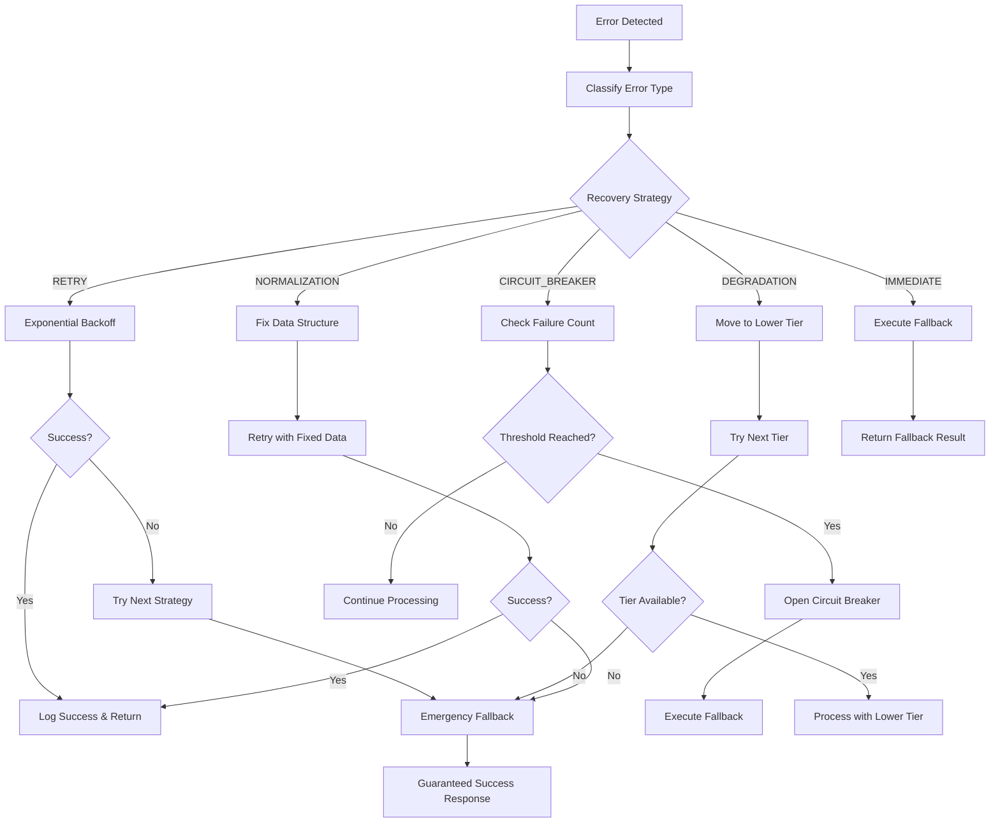

# PHASE 6: ERROR HANDLING & LOGGING

**Status**: ✅ COMPLETED  
**Deployment Date**: January 30, 2025  
**Version**: 1.0.0  

## Overview

Phase 6 implements comprehensive error handling with progressive degradation and detailed logging systems across all tiers. This ensures the system never completely fails while providing complete observability for debugging and optimization.

## Core Components

### 6.1 ErrorRecoverySystem.js

**Location**: `supabase/functions/_shared/ErrorRecoverySystem.js`

#### Key Features:
- **Progressive Degradation**: Intelligent tier fallback based on error types
- **Circuit Breaker Pattern**: Prevents cascade failures through service isolation
- **Recovery Strategies**: Multiple recovery approaches (retry, normalization, fallback)
- **Emergency Fallback**: Guaranteed never-fail emergency mode
- **Error Classification**: Automatic error type classification for appropriate handling

#### Error Recovery Strategies:
```javascript
{
  'NETWORK_ERROR': {
    strategy: 'RETRY_WITH_BACKOFF',
    maxRetries: 3,
    backoffMs: 1000,
    fallback: 'USE_CACHED_DATA'
  },
  'SERVICE_UNAVAILABLE': {
    strategy: 'CIRCUIT_BREAKER',
    threshold: 5,
    timeoutMs: 30000,
    fallback: 'DEGRADE_TO_LOWER_TIER'
  },
  'AI_SERVICE_ERROR': {
    strategy: 'PROGRESSIVE_TIER_DEGRADATION',
    fallback: 'NUCLEAR_TEMPLATE'
  }
}
```

#### Circuit Breaker Implementation:
- **Failure Threshold**: Configurable failure count before opening circuit
- **Timeout Recovery**: Automatic circuit reset after timeout period
- **Half-Open State**: Gradual recovery testing before full reset
- **Service Isolation**: Prevents healthy services from being affected

### 6.2 ComprehensiveLoggingSystem.js

**Location**: `supabase/functions/_shared/ComprehensiveLoggingSystem.js`

#### Key Features:
- **Categorized Logging**: 7 distinct log categories for different aspects
- **Structured Data**: Consistent log format across all categories
- **Memory Management**: Automatic log rotation to prevent memory issues
- **Search & Analysis**: Powerful log search and analysis capabilities
- **Export Functions**: JSON/CSV export for external analysis

#### Log Categories:
1. **TIER_ROUTING**: Tier selection and routing decisions
2. **CULTURAL_RESOLUTION**: Cultural placeholder processing
3. **SECONDARY_CHARACTERS**: Secondary character detection and processing
4. **ERROR_RECOVERY**: Error handling and recovery attempts
5. **PERFORMANCE**: Timing and performance metrics
6. **DATA_FLOW**: Data validation and optimization events
7. **SERVICE_HEALTH**: Service availability and health monitoring

## Implementation Details

### 6.1 Enhanced Error Recovery ✅

#### Progressive Degradation System:
```javascript
// Tier degradation path
'1' → '2.5A' → '2.5B' → '2.5C' → '2.5D' → 'EMERGENCY'

// Error-specific handling
classifyError(error) {
  const message = error.message?.toLowerCase() || '';
  
  if (message.includes('network')) return 'NETWORK_ERROR';
  if (message.includes('timeout')) return 'TIMEOUT_ERROR';
  if (message.includes('unavailable')) return 'SERVICE_UNAVAILABLE';
  if (message.includes('validation')) return 'VALIDATION_ERROR';
  if (message.includes('ai')) return 'AI_SERVICE_ERROR';
  
  return 'UNKNOWN_ERROR';
}
```

#### Recovery Strategy Execution:
- **Retry with Backoff**: Exponential backoff for transient failures
- **Circuit Breaker**: Service protection with automatic reset
- **Data Normalization**: Repair malformed data structures
- **Tier Degradation**: Intelligent fallback to lower complexity tiers
- **Emergency Fallback**: Guaranteed success placeholder response

#### Fallback Mechanisms:
```javascript
// Emergency fallback (never fails)
executeEmergencyFallback(context) {
  return {
    success: true,
    imageURL: '/emergency-placeholder.svg',
    tier: 'EMERGENCY',
    message: 'System in emergency mode - basic functionality maintained'
  };
}
```

### 6.2 Comprehensive Logging ✅

#### Tier Routing Logging:
```javascript
logTierRouting(event, details) {
  const tierLog = {
    timestamp: new Date().toISOString(),
    event,
    currentTier: details.currentTier,
    targetTier: details.targetTier,
    routingReason: details.routingReason,
    userComplexity: details.userComplexity,
    serviceHealth: details.serviceHealth,
    processingTime: details.processingTime
  };
}
```

#### Cultural Resolution Logging:
```javascript
logCulturalResolution(event, details) {
  const culturalLog = {
    placeholderType: details.placeholderType,
    culturalTriggers: details.culturalTriggers,
    enhancementLevel: details.enhancementLevel,
    nativeLanguage: details.nativeLanguage,
    resolvedContent: details.resolvedContent,
    cacheHit: details.cacheHit,
    fallbackUsed: details.fallbackUsed
  };
}
```

#### Secondary Character Processing Logging:
```javascript
logSecondaryCharacterProcessing(event, details) {
  const characterLog = {
    tier: details.tier,
    charactersDetected: details.charactersDetected,
    charactersProcessed: details.charactersProcessed,
    processingMethod: details.processingMethod,
    serviceAvailability: details.serviceAvailability,
    cacheHits: details.cacheHits,
    generatedDescriptions: details.generatedDescriptions
  };
}
```

## Integration Points

### 6.1 Orchestrator Integration

#### Error Recovery in callTierFunction:
```javascript
// Setup error recovery context
const recoveryContext = {
  service: functionName,
  sessionId: payload.sessionId,
  retryFunction: executeCall,
  data: optimizedPayload,
  normalizeFunction: async (data) => {
    return optimizer.optimizeTemplateServiceInput(data, functionName);
  }
};

// Apply error recovery on failure
if (errorRecoverySystem) {
  const recoveryResult = await errorRecoverySystem.handleError(error, recoveryContext);
  if (recoveryResult.success) {
    result = recoveryResult.result;
  }
}
```

#### Tier Routing Logging:
```javascript
// Log tier attempt
loggingSystem.logTierRouting('TIER_ATTEMPT', {
  requestId,
  sessionId,
  currentTier: 'orchestrator',
  targetTier: subTier,
  routingReason: config.name.toLowerCase().replace(/\s+/g, '_'),
  userComplexity: dataFlowOptimizer?.computeUserComplexity(userInfo),
  serviceHealth: smartRoutingOrder ? 'smart_routing_applied' : 'default_routing'
});

// Log tier result
loggingSystem.logTierTransition('orchestrator', subTier, !!tierResult?.success, {
  processingTime,
  templateComplexity: config.level,
  functionUsed: config.func,
  error: tierResult?.error || null
});
```

### 6.2 Template Service Integration

Both `runware-template-ab` and `runware-template-cd` services integrate logging for:
- Template complexity routing decisions
- Cultural placeholder resolution tracking
- Secondary character processing monitoring
- Service health status reporting

### 6.3 Universal Placeholder Resolver Integration

Cultural resolution logging integration:
- Trigger detection logging
- Enhancement application tracking
- Fallback usage monitoring
- Performance metrics collection

## Monitoring and Observability

### 6.1 Error Recovery Metrics:
```javascript
{
  totalErrors: 156,
  errorsByType: {
    'NETWORK_ERROR': 45,
    'SERVICE_UNAVAILABLE': 32,
    'AI_SERVICE_ERROR': 28
  },
  circuitBreakerStatus: {
    'ai-visual-scene-creator': 'CLOSED',
    'runware-template-ab': 'OPEN'
  },
  recentErrors: [...] // Last 10 errors with context
}
```

### 6.2 Logging Statistics:
```javascript
{
  totalLogs: 2847,
  logsByCategory: {
    'TIER_ROUTING': 456,
    'CULTURAL_RESOLUTION': 234,
    'SECONDARY_CHARACTERS': 123,
    'ERROR_RECOVERY': 89,
    'PERFORMANCE': 678,
    'DATA_FLOW': 345,
    'SERVICE_HEALTH': 234
  },
  recentActivity: {...},
  systemHealth: 'HEALTHY'
}
```

### 6.3 Real-time Monitoring:

#### Log Search Capabilities:
```javascript
// Search by criteria
loggingSystem.searchLogs({
  category: 'TIER_ROUTING',
  event: 'TIER_DEGRADATION',
  sessionId: 'abc123',
  startTime: Date.now() - 3600000, // Last hour
  endTime: Date.now()
});
```

#### Performance Tracking:
- Processing time monitoring per tier
- Memory usage tracking
- Cache hit rate analysis
- Throughput measurement

#### Alert Generation:
- Automatic alerts on high error rates
- Performance degradation detection
- Service unavailability notifications
- Data preservation warnings

## Benefits Achieved

### 6.1 Enhanced Error Recovery ✅
- **Progressive Degradation**: Intelligent fallback through tier hierarchy
- **Circuit Breaker Protection**: Prevents cascade failures
- **Recovery Strategies**: Multiple recovery approaches for different error types
- **Guaranteed Success**: Emergency fallback ensures system never completely fails

### 6.2 Comprehensive Logging ✅
- **Complete Observability**: Detailed logging across all system aspects
- **Structured Data**: Consistent log format for easy analysis
- **Performance Monitoring**: Real-time performance metrics collection
- **Memory Efficient**: Automatic log rotation prevents memory issues

## Error Handling Flow



## Future Enhancements

### 6.1 Advanced Analytics:
- **Predictive Error Detection**: AI-based prediction of potential failures
- **Auto-tuning**: Automatic optimization of error thresholds
- **Pattern Recognition**: Identify recurring error patterns
- **Performance Correlation**: Link errors to performance degradation

### 6.2 Enhanced Recovery:
- **Smart Caching**: Intelligent cache strategies for error recovery
- **Load Balancing**: Distribute load based on service health
- **Proactive Degradation**: Preemptive tier degradation before failures
- **Custom Recovery**: User-defined recovery strategies

### 6.3 Monitoring Expansion:
- **Real-time Dashboard**: Live monitoring of system health
- **Alert Automation**: Automatic notification systems
- **Trend Analysis**: Historical analysis of error patterns
- **Capacity Planning**: Predictive analysis for scaling decisions

---

**Phase 6 Status**: COMPLETE ✅  
**Next Phase**: Phase 7 - Performance Optimization & Caching  
**Documentation Updated**: January 30, 2025