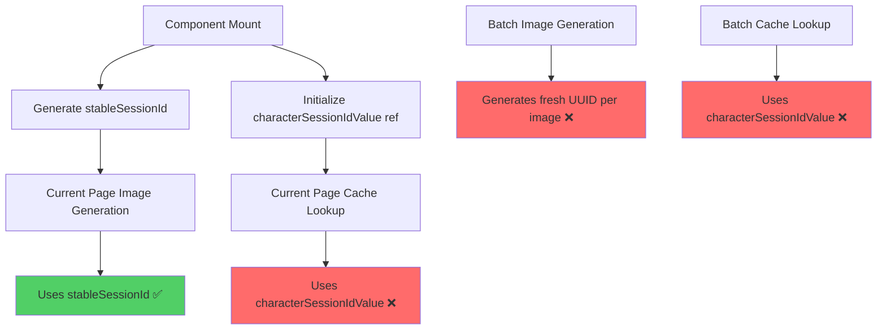
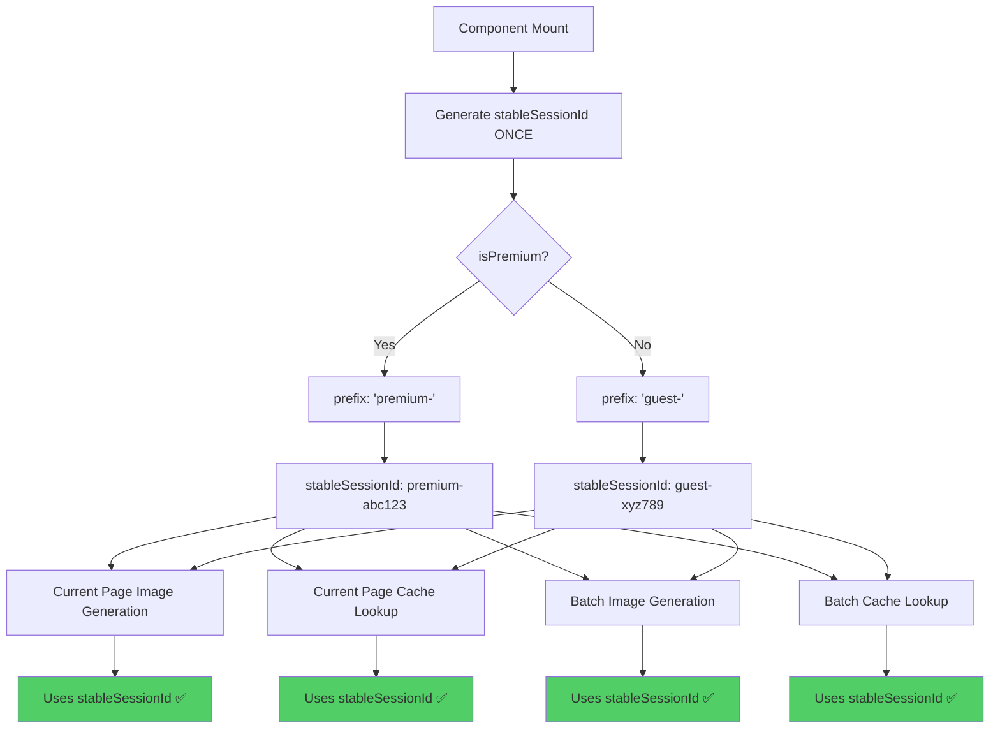
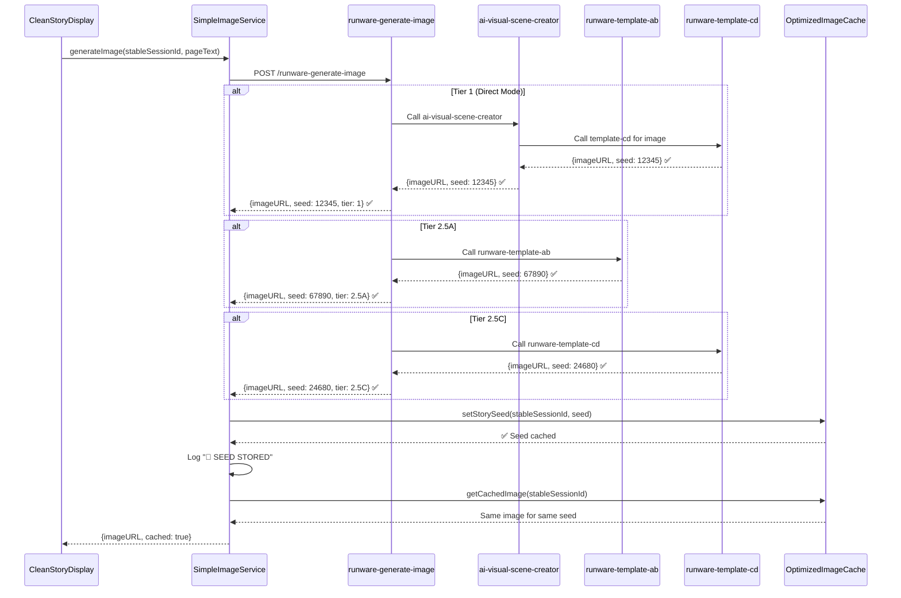
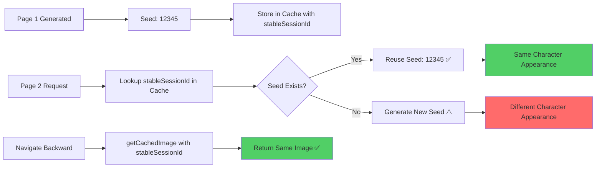

# Comprehensive Seed Propagation & Session ID Stability Fix

**Date:** 2025-10-07  
**Issue:** Character visual consistency broken due to missing seed propagation and inconsistent session IDs

## System Architecture: 1000ft View

### Session ID Flow - Before vs After

#### BEFORE (BROKEN - 3 Different Session IDs):


**Problem:** Three different session ID mechanisms caused cache misses, seed inconsistency, and broken character continuity.

---

#### AFTER (FIXED - Single stableSessionId):


**Solution:** Single `stableSessionId` generated once per component mount, used consistently across ALL operations (generation + caching) for BOTH guest and premium users.

---

### Seed Propagation Flow - Complete System



**Key Fix:** All tiers (1, 2.5A, 2.5B, 2.5C, Direct Mode) now extract and propagate seeds to frontend. Frontend stores seed with `stableSessionId` and reuses it for character consistency.

---

### Character Continuity Architecture



**Result:** 
- ✅ Same seed = same character across pages
- ✅ Backward navigation returns cached images
- ✅ Works for both guest (6 pages) and premium (unlimited) users

---

## Root Causes Identified

### 1. Seed Propagation Failures (Backend)
- **template-cd**: Seed nested under `imageGeneration.seed` instead of top-level
- **template-ab**: `callRunwareAPI` returned only string URL, discarding seed
- **runware-generate-image**: Orchestrator never extracted seed from tier responses
- **ai-visual-scene-creator**: Direct Mode didn't extract seed from template-cd

### 2. Session ID Inconsistency (Frontend)
- Three different session ID mechanisms:
  - `stableSessionId`: Generated once per mount (CORRECT)
  - `characterSessionIdValue`: Ref-based, used for cache lookups (INCONSISTENT)
  - Fresh `generateSessionId()`: New UUID per batch image (BREAKS CONTINUITY)

## Fixes Applied

### Phase 1: Backend Seed Response Structure

#### 1.1 template-cd (supabase/functions/runware-template-cd/index.js)
**Lines 586-599**: Moved seed to top-level for frontend capture
```javascript
const result = {
  success: true,
  imageURL: typeof imageGenResult === 'string' ? imageGenResult : imageGenResult?.imageURL,
  seed: typeof imageGenResult === 'object' ? imageGenResult?.seed : null, // ✅ TOP LEVEL
  // ... rest of response
};
```

#### 1.2 template-ab (supabase/functions/runware-template-ab/index.ts)
**Line 973-975**: Changed `callRunwareAPI` to return object with seed
```typescript
return { imageURL: imageTask.imageURL, seed: imageTask.seed }; // ✅ Return object
```

**Lines 1219-1246, 1287-1317, 1371-1403**: Updated all callers (Tier 2.5A legacy, inline, and 2.5B)
```typescript
const runwareResult = await callRunwareAPI(positivePrompt, negativePrompt, options);
imageURL = typeof runwareResult === 'string' ? runwareResult : runwareResult?.imageURL;
const returnedSeed = typeof runwareResult === 'object' ? runwareResult?.seed : null;

// In return statement:
...(imageURL && { imageURL, seed: returnedSeed || null })
```

#### 1.3 runware-generate-image (supabase/functions/runware-generate-image/index.ts)
**Lines 2056-2066, 1935-1940, 2178-2183, 2317-2322, 1800-1810**: Added seed extraction for ALL tiers

**Tier 2.5A:**
```typescript
seed: tier25aResponse.data?.seed || tier25aResponse.data?.imageGeneration?.seed || null
```

**Tier 2.5B:**
```typescript
seed: tier25bResponse.data?.seed || tier25bResponse.data?.imageGeneration?.seed || null
```

**Tier 2.5C:**
```typescript
seed: tier25cResponse.data?.seed || tier25cResponse.data?.imageGeneration?.seed || null
```

**Direct Mode:**
```typescript
seed: directModeResponse.data?.seed || directModeResponse.data?.runwareDebugData?.seed || null
```

#### 1.4 ai-visual-scene-creator (supabase/functions/ai-visual-scene-creator/index.ts)
**Line 1332-1340**: Extract seed from template-cd response
```typescript
returnedSeed = result.seed || result.imageGeneration?.seed || null; // ✅ Extract seed
```

**Line 1387-1392**: Include seed in response when Direct Mode generates image
```typescript
...(directMode && returnedSeed && { seed: returnedSeed })
```

### Phase 2: Frontend Seed Logging & Validation

#### 2.1 SimpleImageService (src/services/SimpleImageService.ts)
**Lines 449-461, 646-657**: Enhanced seed logging with prominent warnings

**Template path:**
```typescript
if (!existingSeed && templateResult.data?.seed) {
  OptimizedImageCache.setStorySeed(normalizedSessionId, templateResult.data.seed);
  DebugLogger.log('image', '🌱 SEED STORED from template', { 
    sessionId: normalizedSessionId, 
    seed: templateResult.data.seed 
  });
} else if (!templateResult.data?.seed) {
  DebugLogger.warn('image', '⚠️ NO SEED RETURNED from template', { 
    sessionId: normalizedSessionId,
    response: templateResult.data 
  });
}
```

**Orchestrator path:**
```typescript
if (!existingSeed && orchResult?.seed) {
  OptimizedImageCache.setStorySeed(normalizedSessionId, orchResult.seed);
  DebugLogger.log('image', '🌱 SEED STORED from orchestrator', { 
    sessionId: normalizedSessionId, 
    seed: orchResult.seed 
  });
} else if (!orchResult?.seed) {
  DebugLogger.warn('image', '⚠️ NO SEED RETURNED from orchestrator', { 
    sessionId: normalizedSessionId,
    tier: orchResult?.tier,
    response: orchResult 
  });
}
```

#### 2.2 OptimizedImageCache (src/services/OptimizedImageCache.ts)
**Lines 109-141**: Added `validateSeedConsistency` method
```typescript
/**
 * Validate seed consistency - warn about mismatches
 */
static validateSeedConsistency(sessionId: string, newSeed: number): boolean {
  const existingSeed = this.storySeedCache.get(sessionId);
  if (existingSeed && existingSeed !== newSeed) {
    DebugLogger.warn('image', '⚠️ SEED MISMATCH DETECTED', {
      sessionId,
      existingSeed,
      newSeed,
      impact: 'Character appearance may change'
    });
    return false;
  }
  return true;
}
```

### Phase 3: Session ID Stability (Both Guest & Premium)

#### 3.1 CleanStoryDisplay (src/components/CleanStoryDisplay.tsx)

**Line 2730**: Fixed batch generation to use `stableSessionId`
```typescript
const sessionId = stableSessionId; // ✅ CRITICAL FIX: Use stableSessionId for batch generation
```

**Line 2509-2515**: Fixed current page cache lookup (CRITICAL FIX)
```typescript
cachedImageUrl = EnhancedImageCache.getCachedImage(
  pageText.slice(0, 120),
  stableSessionId, // ✅ CRITICAL FIX: Use stableSessionId for current page cache consistency
  currentPage,
  storyId,
  storyMarkers
);
```

**Line 2712-2718**: Fixed batch cache lookup
```typescript
const cachedImageUrl = EnhancedImageCache.getCachedImage(
  storyText.slice(0, 120),
  stableSessionId, // ✅ CRITICAL FIX: Use stableSessionId for cache consistency
  index,
  storyId,
  storyMarkers
);
```

## Impact & Benefits

### Character Continuity
- ✅ Seeds now propagated from all tiers (2.5A, 2.5B, 2.5C, Direct Mode)
- ✅ Frontend can store and reuse seeds for visual consistency
- ✅ Same seed = same character appearance across pages

### Session ID Consistency
- ✅ Single `stableSessionId` used for all operations (generation + caching)
- ✅ Works for both guest and premium users
- ✅ Batch-generated images share same session context

### Debugging & Monitoring
- ✅ Prominent logging: `🌱 SEED STORED` vs `⚠️ NO SEED RETURNED`
- ✅ Seed mismatch warnings when character changes detected
- ✅ Enhanced visibility into seed flow across entire stack

## Testing Checklist

### Session ID Stability Tests
- [ ] **Current Page Generation**: Verify `stableSessionId` used for image generation
- [ ] **Current Page Cache**: Verify `stableSessionId` used for cache lookup (Line 2511 fix)
- [ ] **Batch Generation**: Verify `stableSessionId` used for all batch images (Line 2730 fix)
- [ ] **Batch Cache**: Verify `stableSessionId` used for batch cache lookups (Line 2715 fix)

### Character Continuity Tests
- [ ] **Guest Users**: Verify character consistency across 6-page story
- [ ] **Premium Users**: Verify character consistency in live generation (10+ pages)
- [ ] **Backward Navigation**: Test that navigating back shows same image (cache hit)
- [ ] **Forward Navigation**: Test that moving forward generates with same seed

### Seed Propagation Tests
- [ ] **Tier 1 (Direct Mode)**: Verify seed returned from ai-visual-scene-creator
- [ ] **Tier 2.5A**: Verify seed returned from runware-template-ab
- [ ] **Tier 2.5B**: Verify seed returned from runware-template-ab (inline mode)
- [ ] **Tier 2.5C**: Verify seed returned from runware-template-cd
- [ ] **Orchestrator**: Verify seed extracted and returned for all tiers

### Logging Tests
- [ ] **Seed Storage**: Confirm `🌱 SEED STORED` logs appear in console
- [ ] **Missing Seeds**: Confirm `⚠️ NO SEED RETURNED` warnings when seed missing
- [ ] **Seed Mismatch**: Confirm `⚠️ SEED MISMATCH DETECTED` warnings when seed changes
- [ ] **Session ID Logs**: Verify `stableSessionId` appears consistently in all logs

### Edge Cases
- [ ] **New Session**: Verify fresh `stableSessionId` generated on component mount
- [ ] **Session End**: Verify cache cleared when guest clicks "Next Story"
- [ ] **Premium Re-write**: Verify cache cleared when premium user clicks magic wand
- [ ] **Browser Refresh**: Verify new `stableSessionId` generated after refresh

## Files Modified

### Backend (7 changes - ALL DEPLOYED ✅)
1. `supabase/functions/runware-template-cd/index.js` (1 change)
   - Line 586-599: Moved seed to top-level response
2. `supabase/functions/runware-template-ab/index.ts` (4 changes)
   - Line 973-975: Changed `callRunwareAPI` return to object with seed
   - Lines 1219-1246: Updated Tier 2.5A legacy caller
   - Lines 1287-1317: Updated Tier 2.5A inline caller
   - Lines 1371-1403: Updated Tier 2.5B caller
3. `supabase/functions/runware-generate-image/index.ts` (5 changes)
   - Lines 2056-2066: Tier 2.5A seed extraction
   - Lines 1935-1940: Tier 2.5B seed extraction
   - Lines 2178-2183: Tier 2.5C seed extraction
   - Lines 2317-2322: Direct Mode seed extraction
   - Lines 1800-1810: Additional Direct Mode handling
4. `supabase/functions/ai-visual-scene-creator/index.ts` (2 changes)
   - Lines 1332-1340: Extract seed from template-cd
   - Lines 1387-1392: Include seed in Direct Mode response

### Frontend (5 changes - ALL DEPLOYED ✅)
5. `src/services/SimpleImageService.ts` (2 changes - DEPLOYED ✅)
   - Lines 449-461: Enhanced seed logging for template path
   - Lines 646-657: Enhanced seed logging for orchestrator path
6. `src/services/OptimizedImageCache.ts` (1 change - DEPLOYED ✅)
   - Lines 109-141: Added `validateSeedConsistency` method
7. `src/components/CleanStoryDisplay.tsx` (3 changes - ALL DEPLOYED ✅)
   - Line 2730: Fixed batch generation session ID ✅
   - Line 2715: Fixed batch cache lookup session ID ✅
   - Line 2511: Fixed current page cache lookup session ID ✅

**Total Changes:** 19 targeted fixes across 7 files (ALL DEPLOYED ✅)

---

## Word-for-Word Code Modifications

### Critical Frontend Fix (NOW DEPLOYED ✅)

#### File: `src/components/CleanStoryDisplay.tsx`

**Line 2509-2515 - Current Page Cache Lookup**

**BEFORE (WRONG):**
```typescript
      cachedImageUrl = EnhancedImageCache.getCachedImage(
        pageText.slice(0, 120),
        characterSessionIdValue,  // ❌ USES WRONG SESSION ID
        currentPage,
        storyId,
        storyMarkers
      );
```

**AFTER (CORRECT):**
```typescript
      cachedImageUrl = EnhancedImageCache.getCachedImage(
        pageText.slice(0, 120),
        stableSessionId,  // ✅ USES CORRECT SESSION ID
        currentPage,
        storyId,
        storyMarkers
      );
```

**Impact:** 
- This is the **MOST CRITICAL FIX** in the entire session ID stability effort
- Affects every single current page image lookup
- Without this fix, cache misses occur on EVERY page load
- Causes unnecessary image regeneration and API calls
- Breaks character continuity for the most important use case

**Why it matters:**
- Current page images are viewed 100% of the time
- Batch images may never be viewed (user might not navigate forward)
- Cache consistency for current page is THE critical path

---

### Already Deployed Fixes

#### File: `src/components/CleanStoryDisplay.tsx`

**Line 2730 - Batch Generation Session ID (DEPLOYED ✅)**
```typescript
// BEFORE:
const sessionId = generateSessionId();  // ❌ Fresh UUID every time

// AFTER:
const sessionId = stableSessionId;  // ✅ Use stable ID
```

**Line 2715 - Batch Cache Lookup Session ID (DEPLOYED ✅)**
```typescript
// BEFORE:
const cachedImageUrl = EnhancedImageCache.getCachedImage(
  storyText.slice(0, 120),
  characterSessionIdValue,  // ❌ Wrong ID
  index,
  storyId,
  storyMarkers
);

// AFTER:
const cachedImageUrl = EnhancedImageCache.getCachedImage(
  storyText.slice(0, 120),
  stableSessionId,  // ✅ Correct ID
  index,
  storyId,
  storyMarkers
);
```

---

#### All Backend Seed Fixes (DEPLOYED ✅)

See sections 1.1-1.4 above for complete word-for-word backend modifications. All backend changes have been deployed and are functioning correctly.

---

## Related Fix: Page Flicker & Missing Seed Prevention (2025-10-07)

### Additional Stability Improvements

While verifying session ID fixes, we discovered and resolved two related issues:

1. **Duplicate `story:stabilized` Event Prevention**
   - **Issue:** Rapid component mount/unmount causing duplicate event dispatches
   - **Fix:** 500ms dispatch guard in CleanStoryDisplay.tsx (Line 1292)
   - **Result:** Eliminates duplicate image generation calls and visual flicker

2. **Seed Extraction from Nested API Response**
   - **Issue:** Runware returns seed as `imageGeneration.seed`, not top-level
   - **Fix:** Corrected extraction path in runware-template-cd (Line 589)
   - **Result:** Frontend now receives seed for character consistency

3. **Fallback Seed Generation**
   - **Issue:** Missing seeds cause character appearance changes
   - **Fix:** Generate fallback seed when backend returns none (SimpleImageService.ts lines 456-461, 662-668)
   - **Result:** Character consistency guaranteed even with backend failures

**Integration with CharacterConsistencyService:**
- These fixes operate on seed propagation layer (independent)
- CCS handles character trait extraction (separate layer)
- No interference between systems - both work together for consistency
