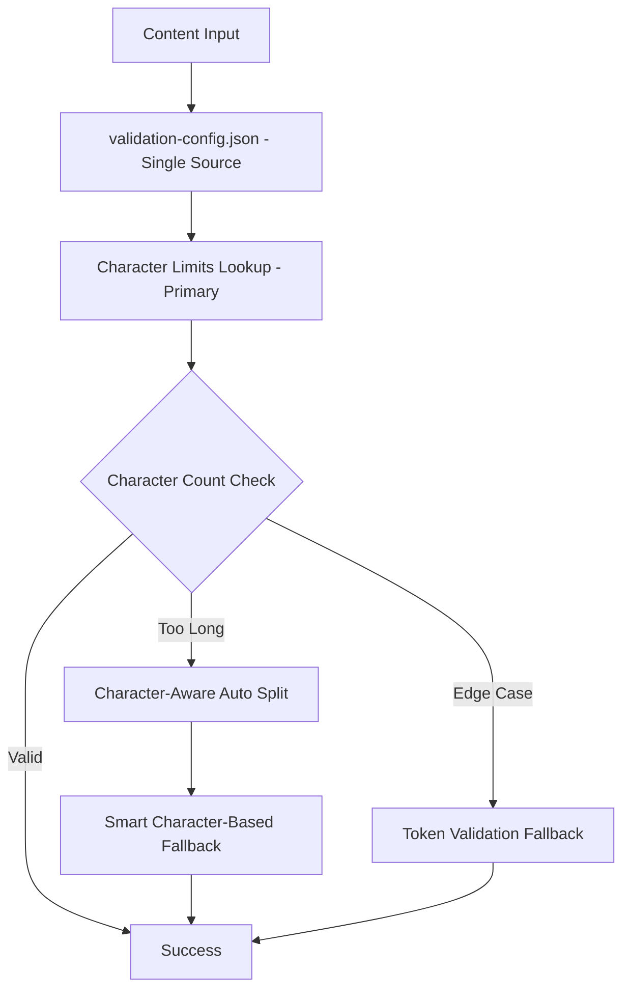

# Shared Validation Architecture - Character-Based Single Source of Truth

## Overview

The shared validation architecture provides **character-based validation** as the primary method, with `validation-config.json` as the **FINAL SINGLE SOURCE OF TRUTH**. This eliminates code duplication and ensures consistent validation logic across frontend (TypeScript) and backend (Deno) environments.

## Architecture Components

### 1. Single Source of Truth (`supabase/functions/_shared/validation-config.json`)

**FINAL SINGLE SOURCE OF TRUTH** containing data-driven validation rules:
- **Character Limits (Primary)**: Based on real AI story analysis with creativity buffers
- **Token Limits (Secondary)**: Fallback compatibility for legacy systems
- **Difficulty Mapping**: Maps difficulty strings to validation levels  
- **Page Expectations**: Expected page counts for each validation level
- **Validation Thresholds**: Common thresholds and ratios used across the system

#### Data-Driven Character Limits
```json
{
  "_comment": "FINAL SINGLE SOURCE OF TRUTH - All validation limits defined here",
  "_methodology": "Character limits based on real AI story analysis with creativity-based buffers",
  
  "characterThresholds": {
    "Level0": { "maxChars": 480 },     // 400 base × 1.2 buffer (PreK-K)
    "Level1": { "maxChars": 2400 },    // 2,000 base × 1.2 buffer (1st grade)
    "Level2": { "maxChars": 5250 },    // 3,500 base × 1.5 buffer (2nd-3rd)
    "Level3": { "maxChars": 30000 },   // 20,000 base × 1.5 buffer (Jordan story ref)
    "Level4": { "maxChars": 52000 },   // 26,000 base × 2.0 buffer (expert)
    "Grade6-10": { "maxChars": 67500 } // 27,000 base × 2.5 buffer (maximum creativity)
  }
}
```

### 2. Shared Utilities (`supabase/functions/_shared/validation-utils.ts`)

Portable validation functions prioritizing character-based validation:
- `estimateCharacterCount()`: **Primary validation method** - direct, reliable character counting
- `getCharacterLimitsForLevel()`: Loads character limits from single source of truth
- `mapDifficultyToLevel()`: Converts difficulties to validation levels
- `validateCharacterLimits()`: **Primary validator** using character thresholds
- `autoSplitContent()`: Character-aware content splitting
- `parseIntoPages()`: Character-based pagination with *** marker detection
- `estimateTokenCount()`: Secondary/fallback token estimation for compatibility

### 3. Frontend Integration (`src/utils/unifiedValidator.ts`)

**Character-first validation approach**:
- **Primary**: Character limit validation using shared utilities
- **Secondary**: Token validation as fallback for compatibility
- Maintains rich frontend features (content security, caching, vocabulary)
- Preserves existing API while prioritizing character validation

```typescript
// Character validation takes priority
const characterResult = validateCharacterLimits(content, level);
if (characterResult.isValid) {
  return { decision: 'ACCEPT', validity: true };
}

// Token validation as fallback only
const tokenResult = validateTokenLimits(content, level);
```

### 4. Backend Integration (`supabase/functions/generate-adaptive-story/streamlined-handler.ts`)

**Character-based processing**:
- Uses `sharedGetCharacterLimitsForLevel()` for consistent limits
- Character-aware content splitting with `sharedParseIntoPages()`
- Primary validation through character counts, not token estimation
- Maintains *** directive as primary with character-aware smart fallback

## Key Benefits

### Single Source of Truth
- **All validation rules defined in one JSON config file**
- Changes to validation logic only need to be made in validation-config.json
- Eliminates synchronization issues between frontend and backend
- **Character limits as primary method** with comprehensive documentation

### Data-Driven Reliability  
- **Based on analysis of real AI-generated stories** (e.g., Jordan story: 20,283 characters)
- Character counting more reliable than token estimation across AI models
- **Creativity-based buffer system** accounts for AI variation by sophistication level
- **Proper educational progression**: Grade 6-10 > Level 4 (fixed backwards logic)

### Consistent Character-Based Validation
- Both frontend and backend use identical character-based algorithms
- Expert levels (Grade 6-10) reliably accommodate highest creativity with 67,500 character limits
- Smart fallback ensures validation consistency when edge cases occur

### Performance Optimization
- **Direct character counting faster than token estimation**
- Character-based utilities optimized for each environment
- Efficient character-aware splitting algorithm
- Sub-10-second generation with responsive UI

### Maintainability
- No code duplication between frontend and backend
- **Single point of configuration changes** in validation-config.json
- Clear methodology documentation with creativity buffer explanations
- Portable utilities that work in any JavaScript environment

## Character Limit Methodology

### Real Story Analysis
- **Jordan Story Reference**: 20,283 characters → fits Level3 (30,000 limit) ✓
- **Base Limits**: Derived from actual AI story character analysis
- **No Theoretical Calculations**: All limits based on real data

### Creativity-Based Buffer System
- **Level 0-1**: 1.2x buffer (basic stories, minimal creativity)
- **Level 2-3**: 1.5x buffer (detailed narratives, moderate creativity)
- **Level 4**: 2.0x buffer (complex stories, high creativity)
- **Grade 6-10**: 2.5x buffer (most sophisticated content, maximum creativity)

### Educational Progression Logic
**Proper Sequence**: Level0 < Level1 < Level2 < Level3 < Level4 < Grade6-10
- **Fixed**: Grade 6-10 now **higher** than Level 4 (was illogically lower)
- **Logic**: Advanced grades need more sophisticated content with higher character limits

## Usage Examples

### Backend Story Generation (Character-Based)
```typescript
import { getCharacterLimitsForLevel, parseIntoPages } from '../_shared/validation-utils.ts';

const maxChars = getCharacterLimitsForLevel(validationLevel);
const pages = parseIntoPages(storyText, validationLevel); // Character-aware splitting
```

### Frontend Validation (Character-First)
```typescript
import { estimateCharacterCount, validateCharacterLimits } from '../../supabase/functions/_shared/validation-utils';

const charCount = estimateCharacterCount(content);
const isValid = validateCharacterLimits(content, level);
```

## Migration Benefits

### What Changed
- **Primary Validation**: Character limits now primary, token limits secondary
- **Single Source**: All limits defined in validation-config.json with comprehensive comments
- **Data-Driven**: Limits based on real AI story analysis, not theoretical calculations
- **Fixed Progression**: Grade 6-10 properly higher than Level 4

### What Stayed the Same
- **Frontend API**: All existing validation interfaces preserved
- **Business Logic**: Guest/premium user flows unchanged  
- **Content Security**: Advanced frontend features maintained
- **Backward Compatibility**: Token validation maintained as fallback

### Expected Improvements
- **Reliability**: Character counting more consistent than token estimation
- **Accuracy**: Validation based on actual AI-generated content data
- **Consistency**: Identical character-based validation across environments
- **Maintainability**: Single source of truth with clear methodology documentation

## Validation Flow



## Testing & Validation

The character-based architecture ensures:
- **Data-Driven Limits**: All thresholds based on real AI story analysis
- **Consistent Character Validation**: Identical character-based validation frontend and backend
- **Proper Educational Progression**: Grade 6-10 > Level 4 > Level 3 > Level 2 > Level 1 > Level 0
- **Single Source Reliability**: One place to update all validation limits
- **Performance**: Direct character counting faster than token estimation

## Future Enhancements

The character-based architecture provides a foundation for:
- Advanced vocabulary integration based on character complexity analysis
- Multi-language validation rules with character-based thresholds
- Real-time character-based validation feedback
- A/B testing of character limit parameters
- Analytics on character-based validation success rates