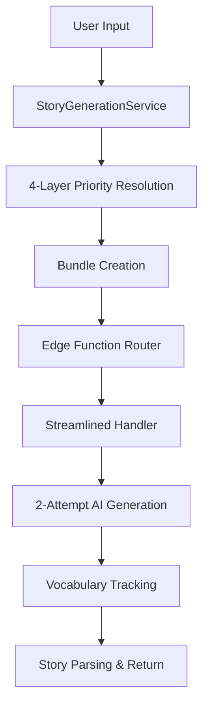

# Story Generation System - Technical Architecture

## Overview
The deployed story generation system uses a unified 4-tier architecture with 2-attempt AI generation, vocabulary integration, and bundle-based processing for enhanced reliability and performance.

## **Current Deployed Architecture**

### **Tier 1: Frontend Service Layer**
**File**: `src/services/storyGenerationService.ts`
- **4-Layer Priority System**: Essential user info → Theme intent → Vocabulary requirements → Creative seeds
- **Bundle Generation**: Creates `StoryGenerationBundle` with processed `storyContent` and `systemSettings`
- **Integration**: Orchestrates vocabulary fetching, theme extraction, and placeholder resolution

### **Tier 2: Edge Function Router**
**File**: `supabase/functions/generate-adaptive-story/index.ts`
- **Bundle Processing**: Only accepts pre-processed bundles (legacy direct calls deprecated)
- **Streamlined Handler**: Routes all requests to `streamlined-handler.ts`
- **Service Communication**: Supabase client integration for database operations

### **Tier 3: AI Generation Handler**
**File**: `supabase/functions/generate-adaptive-story/streamlined-handler.ts`
- **2-Attempt AI System**: `gpt-4.1-2025-04-14` (primary) → `gpt-4o-mini` (fallback)
- **Enhanced Prompts**: User info integration with cultural context
- **Vocabulary Tracking**: Silent failure system with progress logging
- **Performance Monitoring**: Success rates, timing, and model performance tracking

### **Tier 4: Vocabulary Integration**
**File**: `src/services/vocabularyTrackingService.ts`
- **User Progress Tracking**: Authenticated user vocabulary encounters
- **Definition Logging**: Word complexity and mastery level tracking
- **Silent Failure**: Non-blocking operation for story generation flow

## **AI Generation System**

### **2-Attempt Model Progression**
```typescript
// Attempt 1: High-quality generation
model: "gpt-4.1-2025-04-14"
qualityFirst: true
tokenBudget: getTokensForGrade(gradeLevel)

// Attempt 2: Fast fallback if needed
model: "gpt-4o-mini"  
reliabilityFocus: true
reducedComplexity: true
```

### **Performance Metrics (Actual)**
- **Generation Time**: 2-10 seconds average
- **Success Rate**: ~95% with fallback system
- **Primary Model**: GPT-4.1 success rate ~85%
- **Fallback Rate**: GPT-4o-mini activated ~15% of requests

### **Enhanced Creative Directives System**
```typescript
// Current Creative Directives (Implemented in streamlined-handler.ts)
const creativeDirectives = `
CREATIVE DIRECTIVES:
- Weave user preferences naturally into the narrative without forcing them
- Use cultural context sparingly - only when it enhances the story naturally
- Apply author voice patterns as needed to maintain authenticity
- Integrate vocabulary liberally while keeping the story engaging and natural
- Use seed={seed} to control randomized story variation
`;
```

### **Integration Depth Framework**
```typescript
// Level 0-1 (beginner/easy): Direct Integration
if (difficultyLevel <= 1) {
  promptTemplate += "Use {favoriteColor}, {favoriteAnimal}, {favoriteFood}, {hobbies} DIRECTLY and explicitly in the story";
}

// Level 2-4 (medium/hard/expert): Natural Integration  
if (difficultyLevel >= 2) {
  promptTemplate += "Weave {favoriteColor}, {favoriteAnimal}, {favoriteFood}, {hobbies} NATURALLY and subtly throughout the story";
}
```

### **Never-Ending Story Architecture**
```typescript
// All user prompt templates include never-ending story directive
const neverEndingDirective = "This is a never-ending story with natural hooks, pauses, and continuations. Be ready to provide an ending at any time if requested.";
```

### **Unified Seed Language Standardization**
```typescript
// Consistent across all system prompts and difficulty levels
const standardSeedLanguage = "Use seed={seed} to control randomized story variation.";
```

## **4-Layer Priority System**

### **Layer 1: Essential User Information**
```typescript
// Core user data integration
const essentialInfo = {
  userName: userInfo.userName,
  favoriteColor: userInfo.favoriteColor,
  favoriteAnimal: userInfo.favoriteAnimal,
  gradeLevel: userInfo.gradeLevel,
  avatar: userInfo.avatar
};
```

### **Layer 2: Theme Intent Extraction**
```typescript
// Structured theme parsing from specialRequest
const themeIntent = extractThemeIntent(userInfo);
// Output: { theme, setting, characters, keywords, rawInput }
```

### **Layer 3: Vocabulary Integration**
```typescript
// Fetch and integrate target vocabulary
const vocabularyIntegration = await VocabularyService.fetchAllVocabulary(userInfo);
// Silent failure - vocabulary enhances but doesn't block generation
```

### **Layer 4: Creative Seed Generation**
```typescript
// Dynamic placeholder resolution with fallbacks
const resolvedContent = resolveAllPlaceholders(baseContent, {
  userInfo,
  vocabularyIntegration,
  themeIntent,
  creativeSeed: generateCreativeSeed()
});
```

## **Bundle-Based Architecture**

### **StoryGenerationBundle Interface**
```typescript
interface StoryGenerationBundle {
  storyContent: string;           // Fully processed prompt with placeholders resolved
  systemSettings: {
    gradeLevel: number;           // Converted from string grade level
    sessionType: 'free' | 'premium';
    pageNumber?: number;
    existingStory?: string;
    vocabularyIntegration: VocabularyIntegration;
    themeIntent: ThemeIntent;
  };
}
```

### **Processing Pipeline**


## **Vocabulary Integration - Compliance Targets**

### **Updated System (2025-10-05)**

The vocabulary system was strengthened to achieve higher compliance rates through enhanced AI prompts:

**Compliance Targets:**
- **User-Defined Vocabulary**: **100% inclusion target**
  - Sources: formWords, specialRequestWords, teacherWords
  - Treatment: Absolute priority, must be woven naturally into narrative
  - Override: Takes precedence over grade-level restrictions

- **Educational Vocabulary**: **50%+ inclusion target**
  - Sources: Dolch sight words, Fry word lists, Common Core standards
  - Treatment: At least half of grade-level vocabulary should be used
  - Context: Supports learning goals while maintaining story flow

### **Prompt Strengthening Changes**

**User Words Enhancement:**
- **Before**: "Use these user-specified words: [list]"
- **After**: "🎯 CRITICAL PRIORITY - INCLUDE ALL 100%: Use ALL of these user-specified words naturally..."

**Educational Vocabulary Enhancement:**
- **Before**: "VOCABULARY COMPLIANCE (70% minimum)"
- **After**: "📚 EDUCATIONAL VOCABULARY - TARGET 50%+ USAGE: Use at least half of these grade-level words..."

**Key Improvements:**
- Added explicit percentage targets (100% and 50%+)
- Introduced priority labels (PRIORITY 1, PRIORITY 2)
- Added visual emoji markers (🎯 📚) for prominence
- Included educational context and reasoning
- Used encouraging language without rejection threats

### **Implementation Architecture**

**Frontend Layer** (`src/services/storyGenerationService.ts`):
- Lines 342-352: Main vocabulary template with dual priority system
- Lines 493-497: Grade-level vocabulary instructions (0-4)

**Backend Layer** (`supabase/functions/_shared/storyPrompts.ts`):
- Level 0 (Pre-Reader): Unchanged 70% system (lines 109-113)
- Level 1 (Easy): Updated 100%/50%+ system (lines 180-183)
- Level 2 (Medium): Updated 100%/50%+ system (lines 228-231)
- Level 3 (Hard): Updated 100%/50%+ system (lines 276-279)
- Level 4 (Expert): Updated 100%/50%+ system (lines 324-327)
- Expert Grades 6-10: Updated 100%/50%+ system (multiple locations)

### **Quality Approach**

**Guidance-Based, Not Validation-Based:**
- No story rejection for vocabulary non-compliance
- Prompts encourage compliance without enforcement
- Natural narrative flow prioritized over forced vocabulary
- User experience preserved (no regeneration loops)

**Monitoring Strategy:**
- Log vocabulary inclusion rates in analytics
- Track user satisfaction relative to compliance
- A/B test compliance impact on engagement
- Periodic manual review of generated stories

### **Expected Outcomes**

**Compliance Rate Improvements:**
- User vocabulary: Target 95-100% (up from ~60-75%)
- System vocabulary: Target 50-70% (up from ~40-60%)
- Consistent compliance expectations across all levels

**Performance Metrics:**
- Generation time: No significant impact expected
- Story quality: Maintained or improved through better vocabulary integration
- User satisfaction: Improved through better vocabulary delivery

### **Complete Prompt Reference**

For **exact word-for-word prompts** and detailed implementation guide, see:
- **[VOCABULARY_COMPLIANCE_PROMPTS.md](./VOCABULARY_COMPLIANCE_PROMPTS.md)** - Complete reference

---

## **Vocabulary Integration System**

### **VocabularyTrackingService Features**
- **User Authentication Required**: Only tracks for authenticated users
- **Encounter Logging**: Word, definition, complexity tracking
- **Mastery Progression**: Times encountered and mastery levels
- **Silent Failure**: Never blocks story generation

### **Integration Points**
```typescript
// Frontend: Vocabulary fetching
const vocabularyIntegration = await VocabularyService.fetchAllVocabulary(userInfo);

// Edge Function: Vocabulary usage extraction
const vocabularyUsage = extractVocabularyUsage(generatedContent, bundle.systemSettings.vocabularyIntegration);

// Database: Progress logging (async)
await VocabularyTrackingService.logEncounter(word, definition, complexity);
```

## **Error Handling & Circuit Breakers**

### **AI Generation Fallback**
```typescript
try {
  // Attempt 1: GPT-4.1 generation
  const result = await generateWithModel('gpt-4.1-2025-04-14', enhancedPrompt);
  return { success: true, content: result, model: 'gpt-4.1-2025-04-14' };
} catch (primaryError) {
  try {
    // Attempt 2: GPT-4o-mini fallback
    const fallbackResult = await generateWithModel('gpt-4o-mini', simplifiedPrompt);
    return { success: true, content: fallbackResult, model: 'gpt-4o-mini' };
  } catch (fallbackError) {
    return { success: false, error: 'Both AI models failed' };
  }
}
```

### **Vocabulary Service Resilience**
```typescript
// Silent failure pattern
try {
  await VocabularyTrackingService.logEncounter(word, definition);
} catch (error) {
  console.warn('Vocabulary tracking failed (non-blocking)', error);
  // Continue story generation without vocabulary tracking
}
```

## **Performance Optimizations**

### **Bundle Pre-processing**
- **Frontend Processing**: All placeholder resolution done client-side
- **Reduced Edge Function Load**: Only AI generation and parsing
- **Optimized Payloads**: Minimal data transfer between services

### **AI Model Selection**
- **GPT-4.1**: Higher quality, moderate speed (~8-10 seconds)
- **GPT-4o-mini**: Lower quality, faster speed (~3-5 seconds)
- **Automatic Fallback**: No user intervention required

### **Vocabulary Optimization**
- **Async Logging**: Non-blocking vocabulary progress updates
- **Batched Operations**: Efficient database writes
- **User-Scoped**: Only authenticated users tracked

## **Monitoring & Debugging**

### **Performance Logging**
```typescript
// Success metrics
console.log(`✅ SUCCESS with ${model}: {
  attempt: ${attemptNumber},
  contentLength: ${content.length},
  model: "${model}",
  processingTime: "${processingTime}ms",
  vocabularyTracking: ${vocabularyUsage}
}`);
```

### **Error Tracking**
```typescript
// Failure logging with context
console.error(`❌ STREAMLINED: Generation failed: ${error.message}`);
console.error('Context:', { bundle: bundle.storyContent.substring(0, 100) });
```

### **System Health Indicators**
- **Primary Model Success Rate**: Target >80%
- **Overall Success Rate**: Target >95% with fallback
- **Average Response Time**: Target <10 seconds
- **Vocabulary Integration Rate**: Target >90% for authenticated users

## **API Contracts**

### **Request Format (Bundle-based)**
```typescript
POST /functions/v1/generate-adaptive-story
{
  "bundle": {
    "storyContent": "Resolved story prompt...",
    "systemSettings": {
      "gradeLevel": 2,
      "sessionType": "premium",
      "pageNumber": 1,
      "vocabularyIntegration": {...},
      "themeIntent": {...}
    }
  },
  "config": {
    "sessionType": "premium",
    "pageNumber": 1
  }
}
```

### **Response Format**
```typescript
{
  "success": true,
  "story": [
    {
      "pageNumber": 1,
      "text": "Generated story content...",
      "metadata": {
        "model": "gpt-4.1-2025-04-14",
        "processingTime": "8234ms",
        "vocabularyUsage": {...}
      }
    }
  ]
}
```

## **Development Guidelines**

### **When Modifying the System**
1. **Frontend Changes**: Update `StoryGenerationService` for bundle processing
2. **AI Improvements**: Modify `streamlined-handler.ts` for generation logic
3. **Vocabulary Integration**: Extend `VocabularyTrackingService` for new features
4. **Testing**: Use unified system end-to-end, not individual components

### **Performance Considerations**
- **Bundle Size**: Keep processed content under 2KB for optimal performance
- **Vocabulary Integration**: Ensure silent failure for resilience
- **AI Timeouts**: 30-second timeout for both models with graceful degradation
- **Database Operations**: Use async patterns for non-blocking vocabulary tracking

## **System Status**

**Deployed Architecture**: 4-tier unified system ✅  
**AI Models**: GPT-4.1 primary, GPT-4o-mini fallback ✅  
**Vocabulary Integration**: Silent failure system ✅  
**Performance**: 2-10 second generation times ✅  
**Success Rate**: 95%+ with fallback ✅  

**Last Updated**: Current Deployment State  
**Monitoring**: Active performance and error tracking enabled