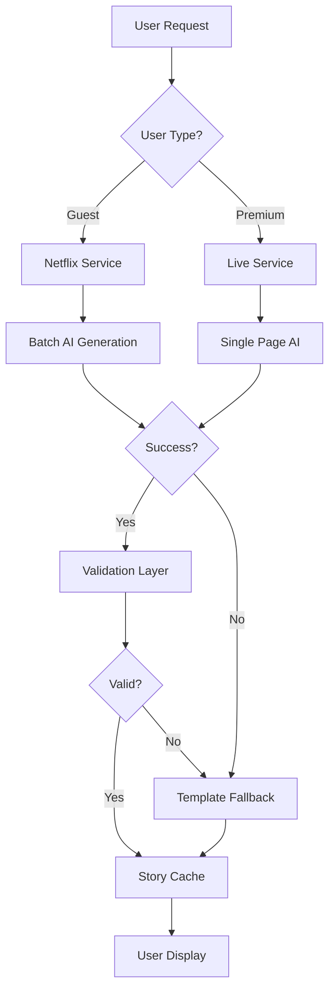
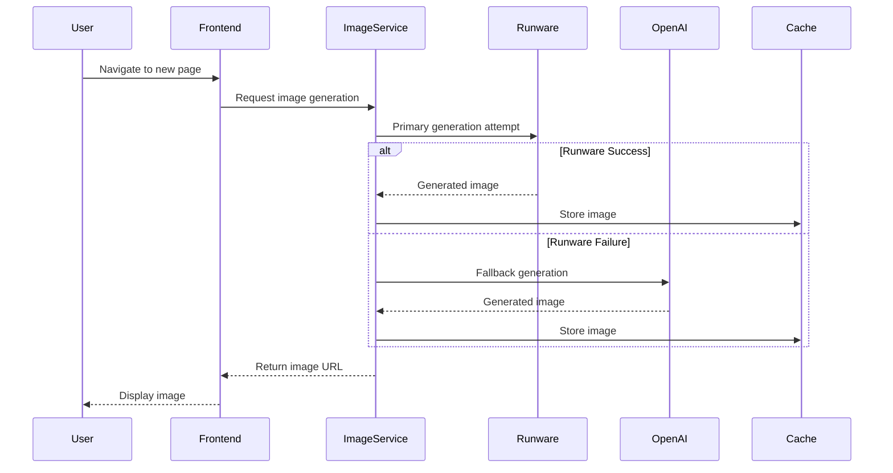
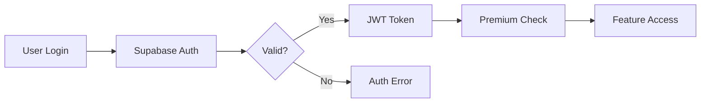

# System Architecture Documentation

## 📋 Overview

Time2Read is a multi-tier story generation platform with sophisticated AI integration, image generation, and monitoring systems. The architecture supports distinct user experiences for guests and premium users while maintaining high performance and reliability.

**🚨 CRITICAL**: Emergency edge function throttling active due to quota exceeded (2.98M invocations).

## 🏗️ Frontend Architecture

### Component Hierarchy
```
App.tsx
├── AuthWrapper
│   ├── GuestExperience
│   │   ├── FloatingTimer (20 min, non-dismissible)
│   │   ├── StoryContainer (6-page limit)
│   │   └── NextStoryButton (artificial cutoff)
│   └── AuthenticatedApp
│       ├── FloatingTimer (dismissible)
│       ├── StoryContainer (unlimited)
│       ├── StoryLibrary
│       └── MagicWandRewrite
```

### State Management
- **React Query**: Data fetching, caching, background updates
- **Local State**: Component-specific state via useState/useReducer
- **Session Storage**: Story progress, user preferences
- **Cache Management**: Image caching for navigation consistency

### Routing Structure
```
/ (Index) → AuthWrapper
├── /auth → Authentication pages
├── /pricing → Premium upgrade flow
├── /library → Story library (premium only)
├── /profile → User profile management
└── /admin → Administrative tools
```

## 🔄 Story Generation Pipeline

### Service Architecture

#### 1. Netflix-Style Service (Guest Users)
**File**: `src/services/NetflixStyleStoryService.ts`
- **Purpose**: Batch generation for 6-page guest experience
- **AI Call**: Single request generating 10-12+ pages
- **Validation**: Full story validation with guest token limits
- **Fallback**: Template service if AI generation fails
- **Cache**: All pages cached, only 6 visible to user

#### 2. Live Generation Service (Premium Users)
**File**: `src/services/storyGenerationService.ts`
- **Purpose**: Page-by-page real-time generation
- **AI Call**: Individual page requests as user progresses
- **Validation**: Per-page validation with premium token limits
- **Fallback**: Emergency content generation
- **Cache**: Progressive caching as pages are generated

#### 3. Template Service (Universal Fallback)
**File**: `supabase/functions/template-service/`
- **Purpose**: Bulletproof fallback for both user types
- **Content**: Pre-written, curated stories by difficulty
- **Independence**: No external AI dependencies
- **Reliability**: 100% success rate, instant response

### Story Flow Diagram



## 🖼️ Image Generation Architecture

### Dual Provider System
1. **Primary**: Runware Flux (configured in `appConfig.ts`)
   - Models: Flux Schnell, Flux Dev
   - High performance, cost-effective
   - 3-tier fallback system

2. **Secondary**: OpenAI DALL-E 3
   - Premium quality images
   - Reliable fallback option
   - Higher cost, lower throughput

### Image Generation Flow


### Character Consistency System
- **Avatar Identity**: Maintained across story pages
- **Secondary Elements**: Animals, objects tracked for consistency  
- **Visual Details**: Appearance continuity management
- **Prompt Engineering**: Dynamic character descriptions

## 🚨 Monitoring & Debugging System

### Emergency Throttling Architecture
Due to edge function quota burn (2.98M invocations), implemented:

#### Auto-Refresh Control
```typescript
// Emergency defaults - all monitoring disabled by default
const { autoRefresh = false, refreshInterval = 300000 } = options;
```

#### Monitoring Components
1. **AdvancedSystemStatus**: Manual refresh, optional 2min live updates
2. **SecurityDashboard**: Manual refresh, optional 1min live updates  
3. **CacheInspectorPanel**: Manual refresh, optional 30sec live updates
4. **UnifiedDebugMonitor**: Manual refresh only, no auto-polling
5. **BackendTierChecker**: Manual refresh only, single mount check
6. **useAdvancedMonitoring**: Manual refresh, optional 5min live updates

#### Visibility State Detection
```typescript
useEffect(() => {
  if (!autoRefresh || document.visibilityState !== 'visible') return;
  const interval = setInterval(refreshData, refreshInterval);
  return () => clearInterval(interval);
}, [autoRefresh, refreshInterval]);
```

### Performance Monitoring
- **SecurityMonitor**: Event logging with filtering and rate limiting
- **PerformanceMonitor**: Operation timing and duration tracking
- **UserActivityMonitor**: Privacy-conscious user interaction tracking
- **MetricsCollector**: Aggregated performance data collection

## 🗄️ Database Architecture

### Supabase Integration
- **Authentication**: User management, session handling
- **Database**: PostgreSQL with Row Level Security (RLS)
- **Edge Functions**: 47 deployed functions for various services
- **Storage**: Image and file management with policy controls

### Key Database Tables
```sql
-- User profiles and preferences
profiles (id, user_id, display_name, preferences)

-- Story data and progress  
stories (id, user_id, content, progress, created_at)

-- Vocabulary tracking and progress
vocabulary_progress (id, user_id, word, learned_at)

-- Session and usage analytics
user_sessions (id, user_id, duration, pages_viewed)
```

### Edge Function Categories
1. **Story Generation**: `generate-adaptive-story`, `process-story-content`
2. **Image Generation**: `runware-generate-image`, `dalle-generate-image`
3. **User Management**: `check-premium-status`, `update-user-profile`
4. **Analytics**: `track-user-activity`, `get-usage-stats`
5. **Monitoring**: `get-monitoring-data`, `system-health-check`

## 🔧 Configuration Management

### Configuration Files

#### 1. `src/config/appConfig.ts`
- Centralized application configuration
- Image provider settings (Runware/DALL-E)
- Feature flags and experimental settings
- Performance and timeout configurations

#### 2. `src/constants/app.ts`
- Application-wide constants
- Session timing and UI duration settings
- Rate limiting and storage configurations
- Language and difficulty level definitions

#### 3. `supabase/config.toml`
- Edge function deployment configuration
- Authentication and security settings
- Function-specific JWT verification settings

### Environment Management
- **Development**: Relaxed limits, verbose logging, debug features
- **Staging**: Production-like limits, moderate logging
- **Production**: Strict limits, essential logging only

## 🔐 Security Architecture

### Authentication Flow


### Content Safety
- **AI Safeguards**: Content filtering in generation prompts
- **Template Curation**: Pre-reviewed fallback content
- **User Reporting**: Inappropriate content flagging system
- **Automated Scanning**: Real-time content analysis

### Data Protection
- **Child Privacy**: COPPA compliance, minimal data collection
- **Encryption**: Data at rest and in transit
- **Access Control**: RLS policies, function-level security
- **Audit Logging**: Security event tracking

## 📊 Performance Optimization

### Caching Strategy
- **Story Content**: Browser storage for page content
- **Images**: CDN caching with fallback URLs
- **API Responses**: React Query caching with invalidation
- **Static Assets**: Aggressive browser caching

### Load Balancing
- **Edge Functions**: Auto-scaling across regions
- **Image Generation**: Multi-provider load distribution
- **Database**: Connection pooling and read replicas
- **CDN**: Global content distribution

### Performance Metrics
```json
{
  "storyGeneration": "2-5 seconds per page",
  "imageGeneration": "3-8 seconds per image", 
  "cacheHitRate": ">80% for navigation",
  "uptime": "99.9% availability target",
  "edgeFunctionUsage": "<1M monthly (post-throttling)"
}
```

## 🚀 Deployment Architecture

### Build Pipeline
1. **Code Changes**: Committed to repository
2. **Automatic Build**: Triggered on commit
3. **Edge Function Deploy**: Supabase function deployment
4. **Static Asset Build**: Vite production build
5. **CDN Deploy**: Assets distributed globally

### Monitoring Post-Deploy
- **Health Checks**: Automated system verification
- **Usage Monitoring**: Edge function quota tracking
- **Error Tracking**: Real-time error detection
- **Performance Metrics**: Response time monitoring

### Rollback Procedures
- **Version Control**: Git-based rollback capability
- **Function Revert**: Previous edge function deployment
- **Database Migrations**: Reversible schema changes
- **Cache Invalidation**: Force refresh of cached content

---

**Last Updated**: January 2025  
**Version**: 3.0 (Emergency Throttling Edition)  
**Architecture Status**: Stable ✅