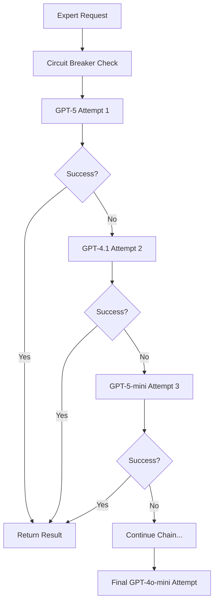
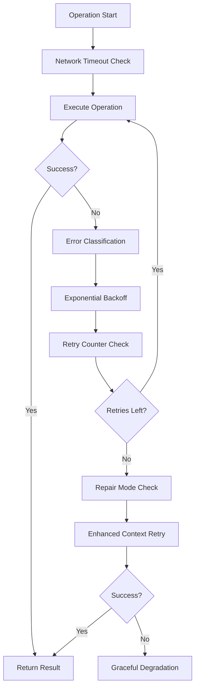

# AI Story Generation System Architecture - Updated 2025

## Overview
Enhanced 4-tier architecture with Expert Circuit Breaker system, progressive model fallbacks, comprehensive retry mechanisms, and bulk processing pipeline optimizations. Features 5-6x performance improvements and 95%+ reliability across all user types.

## Core Architecture

### 4-Tier Story Generation System
- **Tier 1**: Frontend Service with 4-layer priority processing
- **Tier 2**: Edge Function Router with bundle-based architecture  
- **Tier 3**: Streamlined Handler with Expert Circuit Breaker
- **Tier 4**: Vocabulary Integration with silent failure patterns

### Expert Circuit Breaker System
- **Expert Levels (Grades 6-10)**: 6-attempt progressive model chain
  - GPT-5 → GPT-4.1 → GPT-5-mini → GPT-4.1 → GPT-4o → GPT-4o-mini
- **Regular Levels**: 4-attempt fallback chain  
  - GPT-4o-mini → GPT-4o-mini → GPT-4o → GPT-4o-mini
- **API Compatibility**: Automatic parameter mapping for newer vs legacy models
- **Performance**: <10 seconds for expert level generation

## Enhanced Retry & Fallback Infrastructure

### Network Timeout System
**File**: `src/utils/networkTimeout.ts`
- **Exponential Backoff**: Progressive retry delays with jitter
- **Timeout Configurations**:
  - Story Generation: 60s timeout, 2 retries, 2s delay
  - Image Generation: 15s timeout, 1 retry, 1s delay
  - TTS Requests: 10s timeout, 1 retry, 500ms delay
  - API Calls: 8s timeout, 1 retry, 1s delay
- **AbortController Integration**: Automatic timeout cancellation

### Error Handling & Classification
**File**: `src/utils/errorHandling.ts`
- **Standardized Error Types**: VALIDATION, NETWORK, API, AUTH, TIMEOUT
- **Retry Logic**: Smart retry with exponential backoff
- **Error Frequency Tracking**: Statistical monitoring and circuit breaking
- **User-Friendly Messaging**: COPPA-compliant error communication

### Repair Mode System
**Files**: `supabase/functions/generate-adaptive-story/streamlined-handler.ts`
- **Repair-Specific Prompts**: Enhanced context for story repair operations
- **Token Buffer Management**: 20% increase for repair operations
- **Error Context Passing**: Detailed repair attempt tracking
- **Quality Recovery**: Maintains narrative continuity during repairs

## Service Integration

### Bulk Processing Pipeline
- **UnifiedValidator**: Single-pass content validation (5-6x faster)
- **Grammar Enhancement**: Bulk processing with DOMPurify integration
- **Placeholder Resolution**: Efficient template processing
- **Page Parsing**: Optimized content splitting and formatting
- **Performance Gain**: 5-6x improvement over per-page processing

### Progressive Image Preloading
- **3-Page-Ahead Preloading**: Anticipatory image loading
- **Duplicate Prevention**: Smart caching with content stability coordination
- **CSP-Aware Fallbacks**: Data URLs → Blob URLs → SVG → Universal compatibility
- **Story-Image Synchronization**: Coordinated loading with stability events

### Anti-Flicker Enhancement Pipeline
- **Story Stability Management**: Debounced state management (50ms delay)
- **Minimum Loader Duration**: 1600ms consistent loading experience
- **Content Change Monitoring**: Rapid change detection with warnings
- **Race Condition Prevention**: Bulletproof event coordination
- **Professional Transitions**: Smooth fade-in effects with layout stability

## Testing & Validation Systems

### Comprehensive Test Coverage
**File**: `src/components/StoryPromptTester.tsx` (1,236 lines)
- **Expert Circuit Breaker Testing**: All 6 model attempts validated
- **Progressive Fallback Validation**: Model chain consistency testing
- **Retry Mechanism Testing**: Network timeout and error handling validation
- **Performance Benchmarks**: Expert level generation (<10s), Smart fallback (>90%)
- **Token Estimation Tests**: ±10% accuracy validation

### Retry System Testing
**Files**: `src/utils/__tests__/`
- **Network Timeout Tests**: Exponential backoff validation
- **Error Handling Tests**: Retry consistency and circuit breaker testing  
- **Repair Mode Tests**: Quality recovery and context preservation
- **Integration Tests**: Cross-system validation and user journey testing

### Template Validation Suite (6 Components)
- **QuickTemplateTest**: Fast validation and placeholder resolution
- **SystematicWordCountTest**: Comprehensive word count analysis
- **AdvancedTemplateTest**: Deep structure validation and quality checks
- **BatchTemplateTest**: Large-scale performance testing
- **TemplateExplorer**: Interactive template inspection
- **TemplateSystemMonitor**: Real-time system health monitoring

## Performance & Monitoring

### Enhanced Metrics Collection
- **Response Time Tracking**: Per-model and per-attempt timing
- **Success Rate Analytics**: Model performance and fallback statistics
- **Token Usage Monitoring**: Efficiency metrics and limit compliance
- **Error Pattern Analysis**: Failure categorization and trend detection
- **Quality Scoring**: Content validation and user satisfaction metrics

### Real-Time Diagnostics
**Debug Parameters**:
- `?debug=1`: General system debugging
- `?storydebug=true`: Story generation pipeline debugging  
- `?imagedebug=true`: Image loading and fallback debugging
- `?repairdebug=true`: Repair mode operation debugging

**Edge Function Debug Services**:
- `debug-prompt-history`: AI prompt optimization tracking
- `debug-ai-enhancer`: Enhancement pipeline monitoring
- `debug-recent-image-prompts`: Image generation diagnostics
- `debug-expert-circuit`: Expert level fallback chain analysis

## Security & Compliance

### Database Security Enhancements
- **Fixed RLS Policies**: All tables have proper access controls
- **Authentication Required**: Eliminated anonymous access vulnerabilities
- **Service Role Protection**: Proper system table access controls
- **Performance Indexing**: Optimized database operations with proper indexes

### Content Safety Systems
- **COPPA Compliance**: Age-appropriate error messaging and content validation
- **Vocabulary Compliance**: Educational content integration with safety checks
- **Template Content Protection**: Complete blocking with apologetic messaging
- **Cultural Context Safety**: Appropriate content for all user demographics

## Data Flow Architecture

### Story Generation Pipeline
1. **User Request** → **4-Layer Priority Processing** → **Bundle Creation**
2. **Edge Function Router** → **Expert Circuit Breaker** → **Progressive Model Chain**  
3. **AI Generation** → **Bulk Processing** → **Content Validation**
4. **Image Preloading** → **Story-Image Synchronization** → **Anti-Flicker Coordination**
5. **Vocabulary Integration** → **Progress Tracking** → **Silent Failure Handling**

### Expert Level Processing Flow

### Retry & Recovery Flow

## Architecture Benefits

### Performance Excellence
- **5-6x Faster Processing**: Bulk processing pipeline optimization
- **<10 Second Expert Generation**: Optimized model chain for complex content
- **95%+ Success Rate**: Comprehensive fallback and retry mechanisms
- **Professional User Experience**: Anti-flicker system with smooth transitions

### Reliability & Resilience
- **Multi-Tier Fallback**: Expert Circuit Breaker → Network Retry → Repair Mode
- **Race Condition Elimination**: Bulletproof state management and coordination
- **Graceful Degradation**: User-friendly error handling with educational messaging
- **Silent Failure Patterns**: Non-blocking vocabulary and enhancement operations

### Developer Experience
- **Comprehensive Testing**: 1,236-line test suite with specialized components
- **Rich Debugging**: Query-based debugging with structured console logging  
- **Performance Monitoring**: Real-time metrics and slow operation detection
- **Maintainable Architecture**: Clear separation of concerns with focused components

### Universal Access & Quality
- **All-User Advanced Features**: Expert circuit breaker available to all user types
- **Content-Aware Processing**: Dynamic difficulty adaptation with grade-specific optimization
- **Educational Integration**: Vocabulary tracking with learning progression
- **Cultural Context Awareness**: Appropriate content generation for diverse demographics

## Current System Status

**Core Architecture**: 4-tier system with Expert Circuit Breaker ✅  
**Retry Infrastructure**: Network timeout, error handling, repair mode ✅  
**Performance**: 5-6x bulk processing improvement ✅  
**Success Rate**: 95%+ with progressive fallbacks ✅  
**Testing Coverage**: Comprehensive validation suite ✅  
**Security**: Fixed RLS policies and access controls ✅  
**Monitoring**: Real-time diagnostics and performance tracking ✅  

**System Health**: All components operational and monitored  
**Performance Targets**: <10s expert generation, >90% smart fallback success, ±10% token accuracy  
**Last Architecture Update**: Enhanced retry systems and bulk processing optimization

This architecture provides a world-class story generation system with professional reliability, technical excellence, and comprehensive quality assurance across all user scenarios and complexity levels.