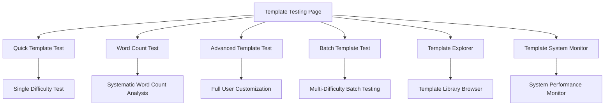

# Template Testing System Documentation - January 25, 2025

## Overview

Comprehensive testing suite for the template system with 9 difficulty levels, user customization, batch testing, and system monitoring capabilities.

**Location**: `/template-testing`  
**Implementation Date**: January 25, 2025  
**Status**: ✅ Fully Operational

## System Architecture

### Core Components



## Testing Modules

### 1. Quick Template Test
**Component**: `QuickTemplateTest.tsx`
- **Purpose**: Fast single-difficulty template testing
- **Features**: 
  - Instant template generation
  - Basic user info form
  - Real-time results display
  - Placeholder validation
- **Use Case**: Rapid template verification

### 2. Systematic Word Count Test  
**Component**: `SystematicWordCountTest.tsx`
- **Purpose**: Analyze word count patterns across difficulty levels
- **Features**:
  - Tests all 9 difficulty levels systematically
  - Word count tracking and analysis
  - Statistical comparison between levels
  - Template length validation
- **Use Case**: Quality assurance for template length requirements

### 3. Advanced Template Test
**Component**: `AdvancedTemplateTest.tsx`  
- **Purpose**: Full user customization testing
- **Features**:
  - Complete UserInfo form
  - All avatar types and skin tones
  - Learning goals and preferences
  - Cultural representation testing
  - Placeholder resolution validation
- **Use Case**: Personalization and cultural authenticity testing

### 4. Batch Template Test
**Component**: `BatchTemplateTest.tsx`
- **Purpose**: Multi-difficulty batch processing  
- **Features**:
  - Test multiple difficulty levels simultaneously
  - Parallel execution with progress tracking
  - Comparative analysis between levels
  - Bulk template validation
- **Use Case**: Performance testing and quality comparison

### 5. Template Explorer
**Component**: `TemplateExplorer.tsx`
- **Purpose**: Browse and explore all templates
- **Features**:
  - Template library viewer
  - Search and filter capabilities
  - Template content preview
  - Metadata display (difficulty, length, features)
- **Use Case**: Template discovery and content review

### 6. Template System Monitor
**Component**: `TemplateSystemMonitor.tsx`
- **Purpose**: Real-time system performance monitoring
- **Features**:
  - Template generation metrics
  - Success/failure rates
  - Performance timing analysis
  - System health indicators
- **Use Case**: System performance monitoring and debugging

## Technical Implementation

### Shared Components

#### StoryResultDisplay
**Component**: `StoryResultDisplay.tsx`
- **Purpose**: Standardized template result display
- **Features**:
  - Formatted story text display
  - Metadata information (difficulty, word count, etc.)
  - Placeholder validation results
  - Error display and debugging info

### Hooks Integration

#### useTemplateService  
**Hook**: `useTemplateService.ts`
- **Purpose**: Template generation service integration
- **Features**:
  - Async template generation
  - Loading state management
  - Error handling
  - Result caching

### Navigation Integration

```typescript
// App.tsx routing
<Route path="/template-testing" element={<TemplateTemplatingPage />} />

// Navigation links
// From /prompt-testing → /template-testing
// From /template-testing → /prompt-testing  
```

## Difficulty Level Coverage

The system tests all 9 difficulty levels:

| Level | Frontend Label | Backend Mapping | Word Count Range | Features |
|-------|---------------|-----------------|------------------|----------|
| 1 | Super Easy | kindergarten | 50-100 | Basic vocabulary |
| 2 | Beginner | beginner | 100-150 | Simple sentences |
| 3 | Easy | easy | 150-250 | Short paragraphs |
| 4 | Medium | medium | 250-400 | Complex sentences |
| 5 | Challenging | challenging | 400-600 | Advanced vocabulary |
| 6 | Hard | hard | 600-800 | Complex narratives |
| 7 | Expert | expert | 800-1000+ | Grade-level appropriate |
| 8 | Advanced | advanced | 1000+ | Academic language |
| 9 | Master | master | 1200+ | Advanced concepts |

## Testing Capabilities

### User Information Testing
- **Name personalization**: Custom character names
- **Age/Grade targeting**: Age-appropriate content
- **Cultural representation**: Avatar types and skin tones  
- **Language preferences**: Native language settings
- **Personal interests**: Hobbies, colors, animals, foods
- **Learning goals**: Educational objective alignment

### Template Quality Testing
- **Placeholder resolution**: All {{placeholders}} properly replaced
- **Content validation**: Story coherence and flow
- **Length requirements**: Word count targets met
- **Cultural authenticity**: Appropriate representation
- **Educational value**: Age and grade level alignment

### System Performance Testing  
- **Generation speed**: Template processing time
- **Success rates**: Template generation reliability
- **Error handling**: Graceful failure management
- **Resource usage**: System performance impact

## Integration Points

### Backend Services
- **Template Service**: Core template generation
- **Difficulty Mapping**: Frontend↔Backend level conversion
- **Placeholder Validation**: Content quality assurance
- **Cultural Services**: Authentic representation

### Frontend Components
- **Unified Debug Monitor**: System-wide debugging
- **Analytics Dashboard**: Performance metrics  
- **Story Display**: Standardized content presentation
- **Error Boundaries**: Graceful error handling

## File Structure

```
src/
├── pages/
│   └── TemplateTestingPage.tsx          # Main testing page
├── components/template-testing/
│   ├── QuickTemplateTest.tsx            # Fast single test
│   ├── SystematicWordCountTest.tsx      # Word count analysis
│   ├── AdvancedTemplateTest.tsx         # Full customization
│   ├── BatchTemplateTest.tsx            # Multi-difficulty testing
│   ├── TemplateExplorer.tsx             # Template browser
│   ├── TemplateSystemMonitor.tsx        # Performance monitor
│   └── StoryResultDisplay.tsx           # Shared result display
└── hooks/
    └── useTemplateService.ts            # Template service hook
```

## Usage Examples

### Quick Testing
1. Navigate to `/template-testing`
2. Select "Quick Test" tab
3. Choose difficulty level
4. Click "Generate Template"
5. Review results and validation

### Batch Analysis
1. Select "Batch Test" tab  
2. Choose multiple difficulty levels
3. Click "Run Batch Test"
4. Compare results across levels
5. Analyze performance metrics

### System Monitoring
1. Select "System Monitor" tab
2. Enable real-time monitoring
3. Generate templates to see metrics
4. Monitor success rates and timing
5. Debug performance issues

## Quality Assurance

### Automated Validation
- ✅ Placeholder replacement verification
- ✅ Word count target compliance
- ✅ Cultural representation accuracy
- ✅ Age-appropriate content filtering
- ✅ Template structure validation

### Manual Testing Guidelines
- Test all difficulty levels regularly
- Verify cultural authenticity 
- Check placeholder resolution
- Validate educational alignment
- Monitor system performance

**Status**: ✅ **PRODUCTION READY - FULL FEATURE SET IMPLEMENTED**