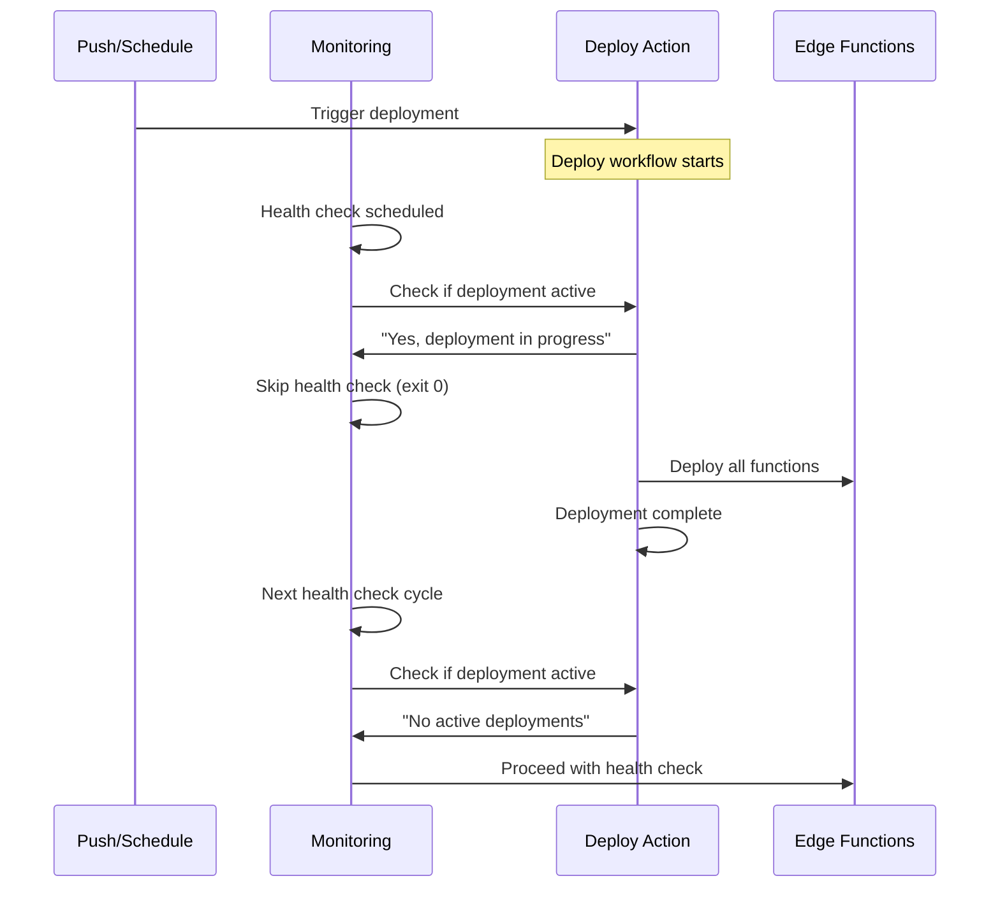

# Edge Function Deployment Race Condition Fix

## Problem Statement

The edge function deployment system was experiencing race conditions when multiple GitHub Actions workflows tried to deploy functions simultaneously:

- **Main deployment workflow** (`deploy-functions.yml`) 
- **4 monitoring workflows** triggering targeted redeployments
- **Push-triggered deployments**
- **Warm-up triggered redeployments**

This caused:
- Incomplete deployments
- Supabase API rate limiting 
- Function deployment failures
- Inconsistent function states

## Solution Implementation

### ✅ Phase 1: Unified Concurrency Control

All deployment-related workflows now use the **same concurrency group**: `supabase-edge-functions`

```yaml
concurrency:
  group: supabase-edge-functions
  cancel-in-progress: false
```

**Files Modified:**
- `.github/workflows/deploy-functions.yml`
- `.github/workflows/monitor-runware-generate.yml`
- `.github/workflows/monitor-ai-visual.yml`
- `.github/workflows/monitor-template-ab.yml`
- `.github/workflows/monitor-template-cd.yml`

### ✅ Phase 3: Unified Queue (No Cancellations)

All triggers now share a single queue so runs never cancel; they execute in order.

```yaml
concurrency:
  group: supabase-edge-functions
  cancel-in-progress: false
```

**How it works:**
- All triggers (push, manual, scheduled) queue behind any in-progress run
- No runs are cancelled; predictable, FIFO execution
- Clear status reporting indicates queued behavior

### ✅ Phase 2: Smart Deployment Coordination

Monitoring workflows now check for active deployments before triggering redeployments:

```bash
# Check if deployment is already running
ACTIVE_DEPLOYMENTS=$(curl -s \
  -H "Accept: application/vnd.github.v3+json" \
  -H "Authorization: token $GITHUB_TOKEN" \
  "https://api.github.com/repos/$GITHUB_REPOSITORY/actions/runs?status=in_progress&workflow_id=deploy-functions.yml" \
  | jq -r '.workflow_runs | length')

if [ "$ACTIVE_DEPLOYMENTS" -gt 0 ]; then
  echo "⏳ Found $ACTIVE_DEPLOYMENTS active deployment(s) - skipping health check to avoid interference"
  exit 0
fi
```

## How It Works

### Smart Deployment Queue System

1. **Single Queue for All Triggers**:
   - Concurrency group: `supabase-edge-functions`
   - `cancel-in-progress: false` (no cancellations)
   - FIFO execution across push, manual, and scheduled runs

2. **Cross-Trigger Protection**:
   - Single group naturally prevents overlapping runs
   - Monitoring workflows still skip when a deployment is active

3. **Enhanced Status Reporting**:
   - Logs show "Queued" behavior and never "Cancel previous"

### Workflow Coordination



## Benefits

✅ **No deployment cancellations — all runs queue**  
✅ **Predictable FIFO execution across push/manual/scheduled**  
✅ **Cross-trigger protection via single queue**  
✅ **Enhanced deployment status reporting**  
✅ **Smart conflict detection and coordination**  
✅ **Monitoring workflows coordinate intelligently**  
✅ **Failed functions still get redeployed (queued properly)**

## Testing

The fix has been implemented and will be tested with the next push. Monitoring workflows will:
- Detect active deployments and skip health checks
- Queue redeployments properly behind main deployments
- Provide clear logging about deployment coordination

## Monitoring

Watch for these log messages to confirm the fix is working:

**In monitoring workflows:**
```
🔄 Checking for active deployments...
⏳ Found 1 active deployment(s) - skipping health check to avoid interference
✅ Deployment coordination: Allowing active deployment to complete
```

**In deploy workflow:**
```
🚀 SMART DEPLOYMENT COORDINATION
  Trigger: push
  Concurrency Group: supabase-edge-functions
  Cancel Previous: false
  Strategy: Queue deployment (no cancellations)

📊 DEPLOYMENT STATUS REPORT
  Repository: user/repo
  Commit: a1b2c3d4
  Actor: username
  Run ID: 123456789
  Mode: Push deployment (queued)
```