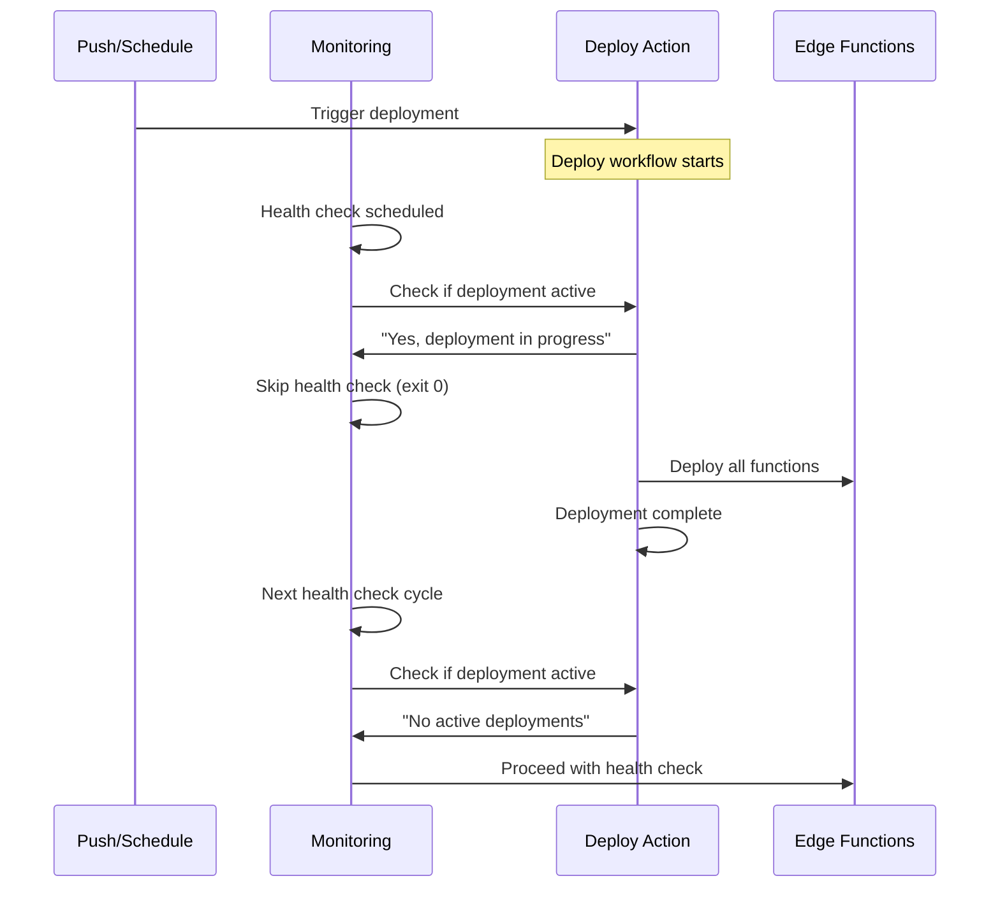

# Edge Function Deployment Race Condition Fix

## Problem Statement

The edge function deployment system was experiencing race conditions when multiple GitHub Actions workflows tried to deploy functions simultaneously:

- **Main deployment workflow** (`deploy-functions.yml`) 
- **4 monitoring workflows** triggering targeted redeployments
- **Push-triggered deployments**
- **Warm-up triggered redeployments**

This caused:
- Incomplete deployments
- Supabase API rate limiting 
- Function deployment failures
- Inconsistent function states

## Solution Implementation

### ✅ Phase 1: Unified Concurrency Control

All deployment-related workflows now use the **same concurrency group**: `supabase-edge-functions`

```yaml
concurrency:
  group: supabase-edge-functions
  cancel-in-progress: false
```

**Files Modified:**
- `.github/workflows/deploy-functions.yml`
- `.github/workflows/monitor-runware-generate.yml`
- `.github/workflows/monitor-ai-visual.yml`
- `.github/workflows/monitor-template-ab.yml`
- `.github/workflows/monitor-template-cd.yml`

### ✅ Phase 3: Smart Deployment Queuing

**NEW FEATURE**: Dynamic concurrency strategy that prevents cancellations while ensuring proper coordination:

```yaml
# Smart concurrency control - different strategies based on trigger type
concurrency:
  group: supabase-edge-functions-${{ github.event_name == 'push' && 'push' || 'queue' }}
  cancel-in-progress: ${{ github.event_name == 'push' && 'true' || 'false' }}
```

**How it works:**
- **Push deployments**: Use separate `supabase-edge-functions-push` group with `cancel-in-progress: true`
- **Manual/Scheduled**: Use `supabase-edge-functions-queue` group with `cancel-in-progress: false`
- **Smart coordination**: Automatic conflict detection between different trigger types
- **Status reporting**: Clear visibility into deployment strategy and queue status

### ✅ Phase 2: Smart Deployment Coordination

Monitoring workflows now check for active deployments before triggering redeployments:

```bash
# Check if deployment is already running
ACTIVE_DEPLOYMENTS=$(curl -s \
  -H "Accept: application/vnd.github.v3+json" \
  -H "Authorization: token $GITHUB_TOKEN" \
  "https://api.github.com/repos/$GITHUB_REPOSITORY/actions/runs?status=in_progress&workflow_id=deploy-functions.yml" \
  | jq -r '.workflow_runs | length')

if [ "$ACTIVE_DEPLOYMENTS" -gt 0 ]; then
  echo "⏳ Found $ACTIVE_DEPLOYMENTS active deployment(s) - skipping health check to avoid interference"
  exit 0
fi
```

## How It Works

### Smart Deployment Queue System

1. **Push Deployments (Rapid Succession)**:
   - Use `supabase-edge-functions-push` concurrency group
   - `cancel-in-progress: true` - cancels older pending deployments
   - Perfect for rapid commits where latest version should win

2. **Manual/Scheduled Deployments**:
   - Use `supabase-edge-functions-queue` concurrency group  
   - `cancel-in-progress: false` - proper queuing without cancellation
   - Ensures scheduled deployments and manual triggers run to completion

3. **Cross-Trigger Protection**: 
   - Different groups prevent interference between push and scheduled deployments
   - Smart conflict detection warns about concurrent deployments
   - Automatic coordination handles edge cases gracefully

4. **Enhanced Status Reporting**:
   - Clear visibility into which strategy is being used
   - Deployment queue status and conflict detection
   - Detailed logging for troubleshooting

### Workflow Coordination



## Benefits

✅ **No deployment cancellations in rapid succession**  
✅ **Push deployments cancel older pending (latest wins)**  
✅ **Manual/scheduled deployments queue properly**  
✅ **Cross-trigger type protection**  
✅ **Enhanced deployment status reporting**  
✅ **Smart conflict detection and coordination**  
✅ **Monitoring workflows coordinate intelligently**  
✅ **Failed functions still get redeployed (queued properly)**

## Testing

The fix has been implemented and will be tested with the next push. Monitoring workflows will:
- Detect active deployments and skip health checks
- Queue redeployments properly behind main deployments
- Provide clear logging about deployment coordination

## Monitoring

Watch for these log messages to confirm the fix is working:

**In monitoring workflows:**
```
🔄 Checking for active deployments...
⏳ Found 1 active deployment(s) - skipping health check to avoid interference
✅ Deployment coordination: Allowing active deployment to complete
```

**In deploy workflow:**
```
🚀 SMART DEPLOYMENT COORDINATION
  Trigger: push
  Concurrency Group: supabase-edge-functions-push
  Cancel Previous: true
  Strategy: Cancel older pending deployments

📊 DEPLOYMENT STATUS REPORT
  Repository: user/repo
  Commit: a1b2c3d4
  Actor: username
  Run ID: 123456789
  Mode: Fast deployment (cancels pending)
```