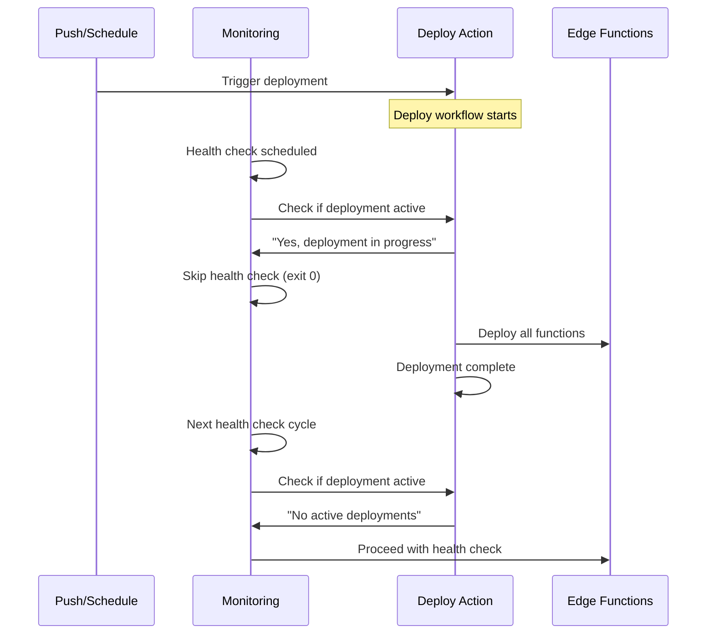

# Edge Function Deployment Race Condition Fix

## Problem Statement

The edge function deployment system was experiencing race conditions when multiple GitHub Actions workflows tried to deploy functions simultaneously:

- **Main deployment workflow** (`deploy-functions.yml`) 
- **4 monitoring workflows** triggering targeted redeployments
- **Push-triggered deployments**
- **Warm-up triggered redeployments**

This caused:
- Incomplete deployments
- Supabase API rate limiting 
- Function deployment failures
- Inconsistent function states

## Solution Implementation

### ✅ Phase 1: Unified Concurrency Control

All deployment-related workflows now use the **same concurrency group**: `supabase-edge-functions`

```yaml
concurrency:
  group: supabase-edge-functions
  cancel-in-progress: false
```

**Files Modified:**
- `.github/workflows/deploy-functions.yml`
- `.github/workflows/monitor-runware-generate.yml`
- `.github/workflows/monitor-ai-visual.yml`
- `.github/workflows/monitor-template-ab.yml`
- `.github/workflows/monitor-template-cd.yml`

### ✅ Phase 2: Smart Deployment Coordination

Monitoring workflows now check for active deployments before triggering redeployments:

```bash
# Check if deployment is already running
ACTIVE_DEPLOYMENTS=$(curl -s \
  -H "Accept: application/vnd.github.v3+json" \
  -H "Authorization: token $GITHUB_TOKEN" \
  "https://api.github.com/repos/$GITHUB_REPOSITORY/actions/runs?status=in_progress&workflow_id=deploy-functions.yml" \
  | jq -r '.workflow_runs | length')

if [ "$ACTIVE_DEPLOYMENTS" -gt 0 ]; then
  echo "⏳ Found $ACTIVE_DEPLOYMENTS active deployment(s) - skipping health check to avoid interference"
  exit 0
fi
```

## How It Works

### Deployment Queue System

1. **Only ONE deployment can run at a time** - GitHub Actions enforces this via concurrency groups
2. **Monitoring workflows detect active deployments** and skip health checks to avoid interference
3. **Deployments are queued automatically** - no race conditions possible
4. **Failed functions get redeployed after current deployment completes**

### Workflow Coordination



## Benefits

✅ **No more deployment race conditions**  
✅ **Reliable edge function deployments**  
✅ **Proper deployment queuing**  
✅ **No API rate limiting conflicts**  
✅ **Monitoring workflows coordinate intelligently**  
✅ **Failed functions still get redeployed (just queued properly)**  

## Testing

The fix has been implemented and will be tested with the next push. Monitoring workflows will:
- Detect active deployments and skip health checks
- Queue redeployments properly behind main deployments
- Provide clear logging about deployment coordination

## Monitoring

Watch for these log messages to confirm the fix is working:

**In monitoring workflows:**
```
🔄 Checking for active deployments...
⏳ Found 1 active deployment(s) - skipping health check to avoid interference
✅ Deployment coordination: Allowing active deployment to complete
```

**In deploy workflow:**
```
🏁 RACE CONDITION PROTECTION: All workflows now use unified concurrency group 'supabase-edge-functions'
✅ Only ONE deployment-related action can run at a time - no more function deployment conflicts
```