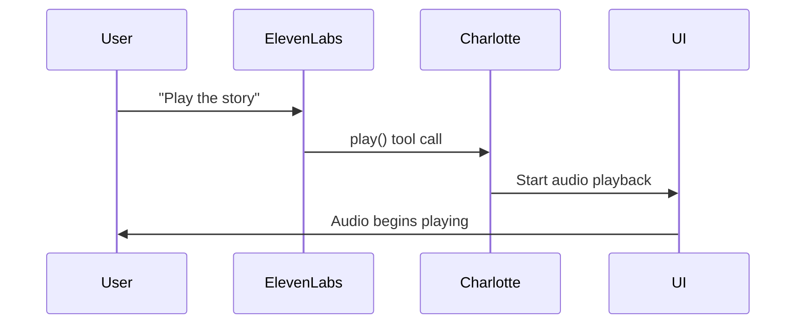
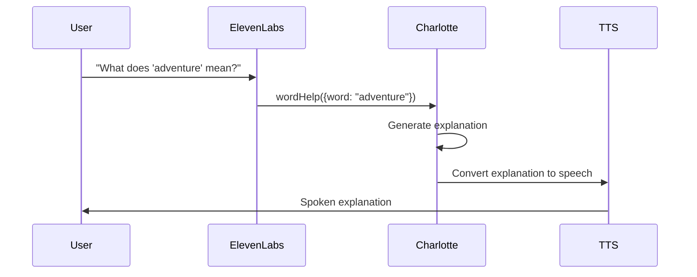

# Charlotte Voice Commands Architecture

This document describes the voice command system integrated with CharlotteVoiceService and the ElevenLabs Conversational AI agent.

## Overview

The Charlotte Voice Commands system provides natural language control over audio playback, navigation, and vocabulary assistance through ElevenLabs Conversational AI integration.

## Architecture Components

### 1. CharlotteVoiceService Integration
CharlotteVoiceService serves as the bridge between voice commands and audio functionality:

```javascript
// Voice command handling in CharlotteVoiceService
class CharlotteVoiceService {
  handleVoiceCommand(command, parameters) {
    switch (command) {
      case 'play':
        return this.playTextWithSynchronization(parameters.text);
      case 'pause':
        return this.pauseAudio();
      case 'stop':
        return this.stopAudio();
      case 'next':
        return this.navigateNext();
      case 'previous':
        return this.navigatePrevious();
      case 'wordHelp':
        return this.explainWord(parameters.word);
    }
  }
}
```

### 2. ElevenLabs Agent Configuration
The voice commands are powered by an ElevenLabs Conversational AI agent configured with specific tools:

#### Required Agent Tools

**1. play**
- **Description:** Start or resume audio playback
- **Parameters:** None
- **Returns:** Playback status confirmation

**2. stop**  
- **Description:** Stop audio playback completely
- **Parameters:** None
- **Returns:** Stop confirmation

**3. pause**
- **Description:** Pause current audio playback
- **Parameters:** None  
- **Returns:** Pause confirmation

**4. next**
- **Description:** Navigate to next page or section
- **Parameters:** None
- **Returns:** Navigation confirmation

**5. previous**
- **Description:** Navigate to previous page or section  
- **Parameters:** None
- **Returns:** Navigation confirmation

**6. wordHelp**
- **Description:** Get pronunciation help or explanation for a word
- **Parameters:** 
  - `word` (string): The word to help with
- **Returns:** Word explanation or pronunciation guide

### 3. Voice Command Categories

#### Navigation Commands
```javascript
const navigationCommands = {
  'play': ['play', 'start', 'begin', 'resume'],
  'pause': ['pause', 'hold on', 'wait'],
  'stop': ['stop', 'end', 'quit'],
  'next': ['next', 'continue', 'forward', 'next page'],
  'previous': ['back', 'previous', 'go back', 'last page']
};
```

#### Reading Commands
```javascript
const readingCommands = {
  'repeat': ['repeat', 'say that again', 'read again'],
  'slower': ['slower', 'slow down', 'read slower'],
  'faster': ['faster', 'speed up', 'read faster'],
  'spell *': ['spell [word]', 'how do you spell [word]']
};
```

#### Vocabulary Commands
```javascript
const vocabularyCommands = {
  'define *': ['what does [word] mean', 'define [word]', 'explain [word]'],
  'pronounce *': ['how do you say [word]', 'pronounce [word]'],
  'syllables *': ['break down [word]', 'syllables in [word]']
};
```

## Implementation

### 1. ElevenLabs Agent Setup

**Step 1: Create Agent**
1. Go to ElevenLabs Dashboard
2. Create new Conversational AI agent
3. Configure agent with appropriate voice and settings

**Step 2: Add Required Tools**
Add each of the 6 required tools with their descriptions and parameters:

```json
{
  "tools": [
    {
      "name": "play",
      "description": "Start or resume audio playbook",
      "parameters": {}
    },
    {
      "name": "stop", 
      "description": "Stop audio playback completely",
      "parameters": {}
    },
    {
      "name": "pause",
      "description": "Pause current audio playback", 
      "parameters": {}
    },
    {
      "name": "next",
      "description": "Navigate to next page or section",
      "parameters": {}
    },
    {
      "name": "previous", 
      "description": "Navigate to previous page or section",
      "parameters": {}
    },
    {
      "name": "wordHelp",
      "description": "Get pronunciation help or explanation for a word",
      "parameters": {
        "word": {
          "type": "string",
          "description": "The word to help with"
        }
      }
    }
  ]
}
```

### 2. Component Integration

**useAudioControls Integration:**
```javascript
const MyStoryComponent = () => {
  const { 
    playAudio, 
    pauseAudio, 
    stopAudio, 
    nextPage, 
    previousPage 
  } = useAudioControls({
    text: storyText,
    enableVoiceCommands: true,
    agentId: "your-elevenlabs-agent-id"
  });

  // Voice commands are automatically handled by useAudioControls
  // No additional setup required
};
```

**Direct CharlotteVoiceService Integration:**
```javascript
import { charlotteVoiceService } from '@/services/audio/CharlotteVoiceService';

// Initialize voice command handling
charlotteVoiceService.enableVoiceCommands({
  agentId: 'your-elevenlabs-agent-id',
  clientTools: {
    play: () => charlotteVoiceService.resumeAudio(),
    stop: () => charlotteVoiceService.stopAudio(),
    pause: () => charlotteVoiceService.pauseAudio(),
    next: () => navigation.nextPage(),
    previous: () => navigation.previousPage(),
    wordHelp: (params) => charlotteVoiceService.explainWord(params.word)
  }
});
```

### 3. Event-Driven Communication

The system uses custom events for communication between voice commands and components:

```javascript
// Listen for voice command events
document.addEventListener('voice:command', (event) => {
  const { command, parameters } = event.detail;
  
  switch (command) {
    case 'play':
      charlotteVoiceService.playAudio();
      break;
    case 'wordHelp':
      charlotteVoiceService.explainWord(parameters.word);
      break;
  }
});

// Dispatch voice status updates
document.dispatchEvent(new CustomEvent('voice:status', {
  detail: { 
    isListening: true,
    isConnected: true,
    agentId: 'agent-id'
  }
}));
```

## Voice Command Flow

### 1. User Voice Input


### 2. Word Help Request


## Configuration Options

### Agent Prompt Configuration
```javascript
const agentConfig = {
  prompt: `You are Charlotte, a helpful reading assistant. You can:
  - Control story playback (play, pause, stop)
  - Navigate between pages (next, previous) 
  - Help with difficult words (definitions, pronunciation)
  
  Always be encouraging and supportive. Keep responses brief and child-friendly.`,
  
  firstMessage: "Hi! I'm Charlotte. I can help you read and understand the story. Just ask me to play, pause, or explain any words you don't know!",
  
  language: "en"
};
```

### Voice Selection
```javascript
const voiceConfig = {
  // Use Charlotte voice for consistency
  voiceId: "XB0fDUnXU5powFXDhCwa", // Charlotte voice ID
  
  // Alternative voices for different contexts
  storyVoice: "9BWtsMINqrJLrRacOk9x", // Aria
  helperVoice: "XB0fDUnXU5powFXDhCwa"  // Charlotte
};
```

## Testing Voice Commands

### 1. Manual Testing
Use the VoiceSetupGuide component to test each command:

```javascript
// Test each voice command manually
const testCommands = [
  "Play the story",
  "Pause please", 
  "Go to next page",
  "What does 'magnificent' mean?",
  "How do you pronounce 'through'?"
];

testCommands.forEach(command => {
  console.log(`Testing: ${command}`);
  // Speak command and verify response
});
```

### 2. Automated Testing
```javascript
// Test voice command integration
describe('Voice Commands', () => {
  test('play command starts audio', async () => {
    const mockPlay = jest.fn();
    charlotteVoiceService.playAudio = mockPlay;
    
    // Simulate voice command
    document.dispatchEvent(new CustomEvent('voice:command', {
      detail: { command: 'play' }
    }));
    
    expect(mockPlay).toHaveBeenCalled();
  });
});
```

### 3. Debug Monitoring
```javascript
// Use UnifiedDebugMonitor for voice command debugging
const debugMonitor = new UnifiedDebugMonitor({
  enableVoiceCommandDebugging: true
});

// Monitor voice command events
debugMonitor.onVoiceCommand((command, result) => {
  console.log(`Voice Command: ${command}`, result);
});
```

## Troubleshooting

### Common Issues

**1. Voice Commands Not Recognized**
- Verify ElevenLabs agent has all 6 required tools configured
- Check microphone permissions in browser
- Ensure agent ID is correctly configured

**2. Commands Work But Actions Don't Execute**
- Verify clientTools are properly mapped to CharlotteVoiceService methods
- Check for JavaScript errors in console
- Ensure useAudioControls is properly initialized

**3. Inconsistent Voice Recognition**
- Check background noise levels
- Verify microphone quality and positioning
- Test with different voice command phrasings

### Debug Steps
1. Check browser console for voice command events
2. Verify ElevenLabs agent configuration in dashboard
3. Test each tool individually in ElevenLabs interface
4. Monitor UnifiedDebugMonitor for voice command status
5. Verify CharlotteVoiceService method responses

## Best Practices

### 1. User Experience
- Provide clear instructions on available voice commands
- Give audio feedback when commands are recognized
- Handle command failures gracefully with helpful messages

### 2. Performance
- Cache frequently used voice responses
- Minimize latency between command recognition and execution
- Optimize for mobile device performance

### 3. Accessibility
- Provide keyboard alternatives to all voice commands
- Ensure voice commands work across different accents and speech patterns
- Include visual indicators for voice command status

## Future Enhancements

### Planned Features
- Multi-language voice command support
- Custom wake word configuration
- Voice command learning and adaptation
- Integration with additional TTS providers
- Advanced vocabulary assistance with visual aids

### Extensibility
The voice command system is designed to be extensible:

```javascript
// Add custom voice commands
charlotteVoiceService.addVoiceCommand('bookmark', {
  description: 'Bookmark the current page',
  handler: (params) => bookmarkService.addBookmark(params.page)
});
```

This architecture provides a comprehensive, user-friendly voice control system that enhances the reading experience while maintaining flexibility for future improvements.